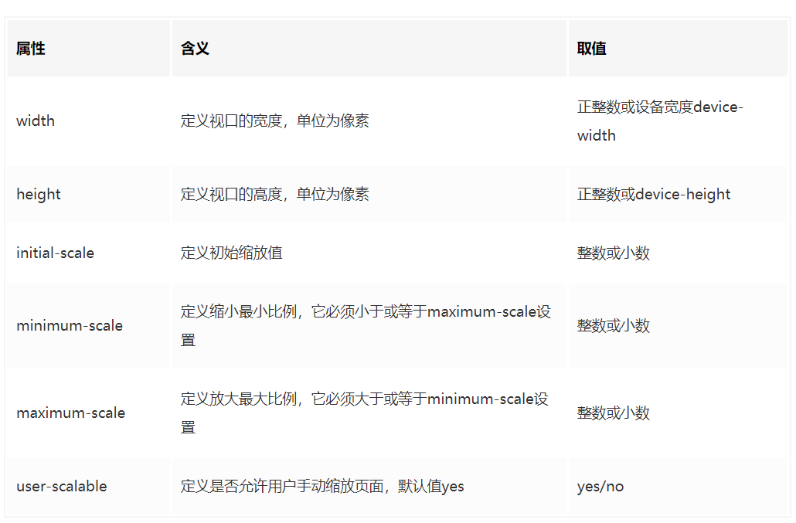
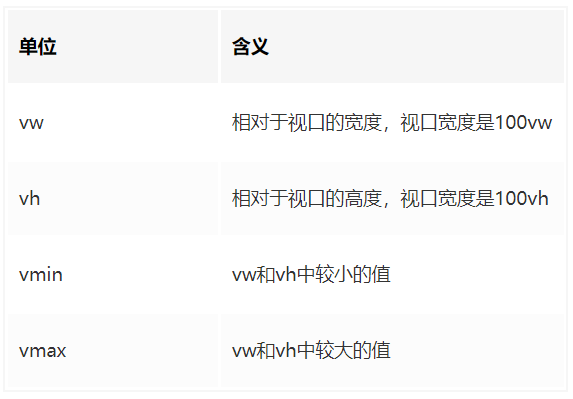

<!-- TOC -->

- [响应式布局的解决方案](#响应式布局的解决方案)
- [移动端项目需要注意的 4 个问题](#移动端项目需要注意的-4-个问题)
  - [meta 中设置 viewport](#meta-中设置-viewport)
  - [CSS 样式统一问题](#css-样式统一问题)
  - [一像素边框问题](#一像素边框问题)
  - [300 毫秒点击延迟问题](#300-毫秒点击延迟问题)

<!-- /TOC -->

### 响应式布局的解决方案

> [拿到一份设计稿，我该如何进行移动端开发](https://juejin.im/post/5d736747e51d4561ff66688c?utm_source=gold_browser_extension#heading-7)

#### viewport

通常viewport是指视窗、视口，浏览器上(也可能是一个app中的webview)用来显示网页的那部分区域。在移动端和pc端视口是不同的，pc端的视口是浏览器窗口区域，而在移动端有三个不同的视口概念：布局视口、视觉视口、理想视口

- 布局视口：在浏览器窗口css的布局区域，布局视口的宽度限制css布局的宽。为了能在移动设备上正常显示那些为pc端浏览器设计的网站，移动设备上的浏览器都会把自己默认的viewport设为980px或其他值，一般都比移动端浏览器可视区域大很多，所以就会出现浏览器出现横向滚动条的情况
- 视觉视口：用户通过屏幕看到的页面区域，通过缩放查看显示内容的区域，在移动端缩放不会改变布局视口的宽度，当缩小的时候，屏幕覆盖的css像素变多，视觉视口变大，当放大的时候，屏幕覆盖的css像素变少，视觉视口变小。
- 理想视口：一般来讲，这个视口其实不是真是存在的，它对设备来说是一个最理想布局视口尺寸，在用户不进行手动缩放的情况下，可以将页面理想地展示。那么所谓的理想宽度就是浏览器（屏幕）的宽度了




css像素：代码中使用的逻辑像素，衡量页面上的内容大小

设备像素：即物理像素，控制设备显示的单位，与设备、硬件有关

设备独立像素：与设备无关的逻辑像素，不同于设备像素（物理像素），不是真实存在的。

设备像素比：定义设备像素与设备独立像素比的关系window.devicePixelRatio）设备像素比=物理像素/设备独立像素

分辨率：指的是屏幕上垂直和水平的总物理像素

#### 几种适配方案

1. css3 媒体查询

   通过媒体查询的方式，编写适应不同分辨率设备的的css样式

   优点：

   - 方法简单，只需修改css文件
   - 调整屏幕宽度时不用刷新页面就可以响应页面布局

   缺点：

   - 代码量大，不方便维护
   - 不能够完全适配所有的屏幕尺寸，需要编写多套css样式

2. 百分比布局 （margin padding 的百分比都是基于父元素的宽度）

   优点：

   - 宽度自适应，在不同的分辨率下都能达到适配

   缺点：

   - 百分比的值不好计算
   - 需要确定父级的大小，因为要根据父级的大小进行计算
   - 各个属性中如果使用百分比，相对父元素的属性并不是唯一的
   - 高度不好设置，一般需要固定高度

3. rem （通过控制根元素的 font-size）

   rem单位：rem是一个只相对于浏览器的根元素（HTML元素）的font-size的来确定的单位。默认情况下，html元素的font-size为12px

   通过rem来实现适配：rem单位都是相对于根元素html的font-size来决定大小的,根元素的font-size相当于提供了一个基准，当页面的宽度发生变化时，只需要改变font-size的值，那么以rem为固定单位的元素的大小也会发生响应的变化。需要先动态设置html根元素的font-size,再计算出其他页面元素以rem为固定单位的值

   优点：

   - rem单位是根据根元素font-size决定大小，只要改变font-size的值，以rem为固定单位的元素大小也会发生响应式的改变

   缺点：

   - 必须通过一段js代码控制font-size的大小
   - 控制font-size的js代码必须放在在页面第一次加载完成之前，并且放在引入的css样式代码之前。

4. vw、vh
   vw 相对于视窗的宽度，视窗宽度是 100vw
   vh 相对于视窗的高度，视窗高度是 100vh

   

   postcss-px-to-viewport

### 移动端项目需要注意的 4 个问题

#### meta 中设置 viewport

阻止用户手滑放大或缩小页面，需要在 index.html 中添加 meta 元素,设置 viewport。

```html
<meta
  name="viewport"
  content="width=device-width,initial-scale=1.0,minimum-scale=1.0,maximum-scale=1.0,user-scalable=no"
/>
```

#### CSS 样式统一问题

我们需要重置页面样式，因为在不同的手机浏览器上，默认的 css 样式不是统一的。 解决方法：使用 reset.css 重置所有元素的默认样式

#### 一像素边框问题

有的手机分辨率比较高，是 2 倍屏或 3 倍屏，手机上的浏览器就会把 CSS 中的 1 像素值展示为 2 个或 3 个物理宽度 解决方法： 添加一个 border.css 库，将利用**scroll 缩放的原理**将边框重置。当我们需要使用一像素边框时只需要在标签上添加对应类名，如设置底部一像素边框就在标签上加入"border-bottom"的 class 名

#### 300 毫秒点击延迟问题

在移动端开发中，某些机型上使用 click 事件会延迟 300ms 才执行，这样影响了用户体验。 解决方法： 引入[fastclick.js](https://www.jianshu.com/p/05b142d84780)。

[移动端滚动穿透问题](https://github.com/pod4g/tool/wiki/%E7%A7%BB%E5%8A%A8%E7%AB%AF%E6%BB%9A%E5%8A%A8%E7%A9%BF%E9%80%8F%E9%97%AE%E9%A2%98)

[移动端小问题](http://www.alloyteam.com/2015/06/yi-dong-web-wen-ti-xiao-jie/)
