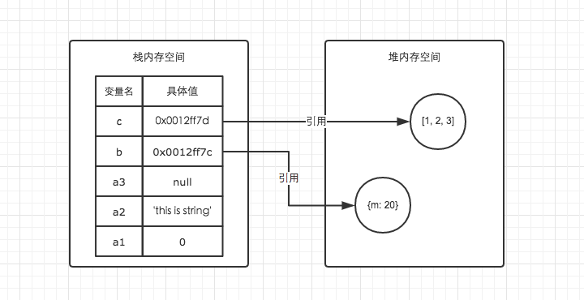

<!-- TOC -->

- [JS 基础](#js-基础)
  - [[变量](变量类型和类型转换。md)](#变量变量类型和类型转换md)
  - [[this](this.md)](#thisthismd)
  - [[函数](函数。md)](#函数函数md)
  - [[对象](对象。md)](#对象对象md)
  - [[原型链与继承](原型链与继承。md)](#原型链与继承原型链与继承md)
  - [[正则](正则。md)](#正则正则md)
  - [[事件队列](事件队列。md)](#事件队列事件队列md)
  - [[DOM](DOM.md)](#domdommd)
  - [[BOM](BOM.md)](#bombommd)
  - [常见问题](#常见问题)
    - [eval 是做什么的](#eval-是做什么的)
    - [['1', '2', '3'].map(parseInt) 答案是多少](#1-2-3mapparseint-答案是多少)
    - [[严格模式的限制](https://developer.mozilla.org/zh-CN/docs/Web/JavaScript/Reference/Strict_mode/Transitioning_to_strict_mode)](#严格模式的限制httpsdevelopermozillaorgzh-cndocswebjavascriptreferencestrict_modetransitioning_to_strict_mode)
    - [Ajax](#ajax)
    - [操作系统中的堆和栈是怎么分配的，js](#操作系统中的堆和栈是怎么分配的js)
    - [Javascript 垃圾回收方法](#javascript-垃圾回收方法)
    - [哪些操作会造成内存泄漏](#哪些操作会造成内存泄漏)
    - [setTimeout、setInterval](#settimeoutsetinterval)
    - [cookie，localStorage，sessionStorage，indexDB](#cookielocalstoragesessionstorageindexdb)

<!-- /TOC -->

# JS 基础

## [变量](变量类型和类型转换。md)

## [this](this.md)

## [函数](函数。md)

## [对象](对象。md)

## [原型链与继承](原型链与继承。md)

## [正则](正则。md)

## [事件队列](事件队列。md)

## [DOM](DOM.md)

## [BOM](BOM.md)

## 常见问题

### eval 是做什么的

eval 的功能是把对应的字符串解析成 JS 代码并运行

 - eval 不安全，若有用户输入会有被攻击风险
 - 非常耗性能（先解析成 js 语句，再执行）

### ['1', '2', '3'].map(parseInt) 答案是多少

答案 [1, NaN, NaN]

map 会给函数传递 3 个参数： (elem, index, arry)

parseInt 接收两个参数 (sting, radix)，其中 radix 代表进制。省略 radix 或 radix = 0，则数字将以十进制解析

因此，map 遍历 ["1", "2", "3"]，相应 parseInt 接收参数如下

```js
parseInt('1', 0);  // 1
parseInt('2', 1);  // NaN
parseInt('3', 2);  // NaN
```

### [严格模式的限制](https://developer.mozilla.org/zh-CN/docs/Web/JavaScript/Reference/Strict_mode/Transitioning_to_strict_mode)
 
 - 变量必须声明后再使用
 - 函数的参数不能有同名属性，否则报错
 - 不能使用 with 语句
 - 不能对只读属性赋值，否则报错
 - 不能使用前缀 0 表示八进制数，否则报错
 - 不能删除不可删除的属性，否则报错
 - 不能删除变量 delete prop，会报错，只能删除属性 delete global[prop]
 - eval 不会在它的外层作用域引入变量
 - eval 和 arguments 不能被重新赋值
 - arguments 不会自动反映函数参数的变化
 - 不能使用 arguments.callee
 - 不能使用 arguments.caller
 - 禁止 this 指向全局对象
 - 不能使用 fn.caller 和 fn.arguments 获取函数调用的堆栈
 - 增加了保留字（比如 protected、static 和 interface）

### Ajax
Asynchronous Javascript And XML 异步传输 +js+xml

 - 创建 XMLHttpRequest 对象，也就是创建一个异步调用对象
 - 建一个新的 HTTP 请求，并指定该 HTTP 请求的方法、URL 及验证信息
 - 设置响应 HTTP 请求状态变化的函数
 - 发送 HTTP 请求
 - 获取异步调用返回的数据

```js
function ajax(url, handler){
  var xhr;
  xhr = new XMLHttpRequest();

  xhr.onreadystatechange = function() {
    if(xhr.readyState == 4 && xhr.status == 200) {
      handler(xhr.responseXML);
    }
  }
  xhr.open('GET', url, true);
  xhr.send();
}
```
### 操作系统中的堆和栈是怎么分配的，js

栈区（stack）— 由编译器自动分配释放 ，存放函数的参数值，局部变量的值等，一般速度较快，存储地址是连续且有限容量，会出现溢出其操作方式类似于数据结构中的栈。  

堆区（heap） — 一般由程序员分配释放， 若程序员不释放，程序结束时可能由 OS 回收 。堆是向高地址扩展的数据结构，是不连续的内存区域

  

| 栈内存                 | 堆内存                       |
| ---------------------- | ---------------------------- |
| 存储基础数据类型       | 存储引用数据类型             |
| 按值访问               | 按引用访问                   |
| 存储的值大小固定       | 存储的值大小不定，可动态调整 |
| 由系统自动分配内存空间 | 由程序员通过代码进行分配     |
| 主要用来执行程序       | 主要用来存放对象             |
| 空间小，运行效率高     | 空间大，但是运行效率相对较低 |
| 先进后出，后进先出     | 无序存储，可根据引用直接获取 |

### Javascript 垃圾回收方法

标记清除（mark and sweep）

 - 这是 JavaScript 最常见的垃圾回收方式，当变量进入执行环境的时候，比如函数中声明一个变量，垃圾回收器将其标记为“进入环境”，当变量离开环境的时候（函数执行结束）将其标记为“离开环境”
 - 垃圾回收器会在运行的时候给存储在内存中的所有变量加上标记，然后去掉环境中的变量以及被环境中变量所引用的变量（闭包），在这些完成之后仍存在标记的就是要删除的变量了

引用计数 (reference counting)

 - 在低版本 IE 中经常会出现内存泄露，很多时候就是因为其采用引用计数方式进行垃圾回收。引用计数的策略是跟踪记录每个值被使用的次数，当声明了一个 变量并将一个引用类型赋值给该变量的时候这个值的引用次数就加 1，如果该变量的值变成了另外一个，则这个值得引用次数减 1，当这个值的引用次数变为 0 的时 候，说明没有变量在使用，这个值没法被访问了，因此可以将其占用的空间回收，这样垃圾回收器会在运行的时候清理掉引用次数为 0 的值占用的空间

> 参考链接 [内存管理 -MDN](https://developer.mozilla.org/zh-CN/docs/Web/JavaScript/Memory_Management)

V8 将内存分为两类：新生代内存空间和老生代内存空间。

  - 新生代内存空间：主要用来存放存活时间较短的对象。
  - 老生代内存空间：主要用来存放存活时间较长的对象。
  这两者通过不同的算法，对内存进行管理操作。

分代内存  
默认情况下，32 位系统新生代内存大小为 16MB，老生代内存大小为 700MB，64 位系统下，新生代内存大小为 32MB，老生代内存大小为 1.4GB。

### 哪些操作会造成内存泄漏

 - JavaScript 内存泄露指对象在不需要使用它时仍然存在，导致占用的内存不能使用或回收
 - 未使用 var 声明的全局变量
 - 闭包函数 (Closures)
 - 循环引用（两个对象相互引用)
 - 控制台日志 (console.log)
 - 移除存在绑定事件的 DOM 元素 (IE)

> 使用 Chrome 的 Timeline（新版本 Performance）进行内存标记，可视化查看内存的变化情况，找出异常点。

### setTimeout、setInterval
常见的定时器函数有 `setTimeout`、`setInterval`、`requestAnimationFrame`，但 setTimeout、setInterval 并不是到了哪个时间就执行，**而是到了那个时间把任务加入到异步事件队列中**。

因为 JS 是单线程执行的，如果某些同步代码影响了性能，就会导致 setTimeout 不会按期执行。

而 setInterval 可能经过了很多同步代码的阻塞，导致不正确了，可以使用 setTimeout 每次获取 Date 值，计算距离下一次期望执行的时间还有多久来动态的调整。

[requestAnimationFrame](https://developer.mozilla.org/zh-CN/docs/Web/API/Window/requestAnimationFrame) 自带函数节流功能，基本可以保证在 16.6 毫秒内只执行一次（不掉帧的情况下），并且该函数的延时效果是精确的，没有其他定时器时间不准的问题

### cookie，localStorage，sessionStorage，indexDB

|     特性     |                   cookie                   |       localStorage       | sessionStorage |         indexDB          |
| :----------: | :----------------------------------------: | :----------------------: | :------------: | :----------------------: |
| 数据生命周期 |     一般由服务器生成，可以设置过期时间     | 除非被清理，否则一直存在 | 页面关闭就清理 | 除非被清理，否则一直存在 |
| 数据存储大小 |                     4K                     |            5M            |       5M       |           无限           |
| 与服务端通信 | 每次都会携带在 header 中，对于请求性能影响 |          不参与          |     不参与     |          不参与          |

从上表可以看到，`cookie` 已经不建议用于存储。如果没有大量数据存储需求的话，可以使用 `localStorage` 和 `sessionStorage` 。对于不怎么改变的数据尽量使用 `localStorage` 存储，否则可以用 `sessionStorage` 存储。

对于 `cookie`，我们还需要注意安全性。

|   属性    |                              作用                              |
| :-------: | :------------------------------------------------------------: |
|   value   | 如果用于保存用户登录态，应该将该值加密，不能使用明文的用户标识 |
| http-only |             不能通过 JS 访问 Cookie，减少 XSS 攻击             |
|  secure   |                只能在协议为 HTTPS 的请求中携带                 |
| same-site |     规定浏览器不能在跨域请求中携带 Cookie，减少 CSRF 攻击      |