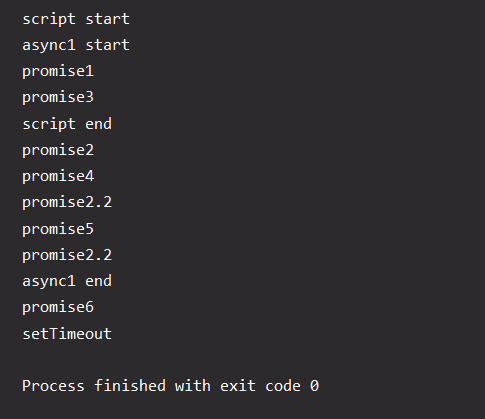
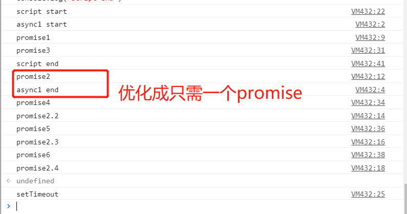

[TOC]


### promise、async/await在任务队列中的执行顺序

> https://blog.csdn.net/u014465934/article/details/99766790

1.setTimeout、setImmediate、nextTick、Promise.next情况下

我们先记住几条结论：
1.有process和setImmediate就考虑是在nodejs环境下
2.微任务中nextTick队列在Promise.next前
3.宏任务中setTimeout在setImmediate前
4.所有可执行的微任务（包括nextTick和then）执行完毕之后，执行宏任务，注意宏任务队列并不是全部执行，执行全部的setTimeout队列中所有任务，再去执行对应产生的微任务，再去执行setImmediate，再去执行setImmediate产生的微任务。

2.async/await执行顺序

我们先记住几条结论：
1.遇见await左侧先执行，右侧时候要跳出函数，等外部任务执行完再跳回
2.awati可以看成.then是一个微任务，放入微任务队列，和其他微任务一样，顺序执行
3.执行微任务时，产生微任务顺序放入当前微任务队列，顺序执行
4.遇见函数前面有async，awiat返回时，放入到Promise.then微任务队列中，然后执行微任务队列，如果前面没有async，await返回时候直接执行，下次遇见await时候，再跳出执行微任务队列

async起什么作用：
async函数返回的是一个Promise对象，如果在函数return一个直接量，async会把这个直接量通过Promise.resolve()封装成Promise对象。

await到底在等啥：
await在等async函数，但要清楚，它等的实际是一个返回值。注意到 await 不仅仅用于等 Promise 对象，它可以等任意表达式的结果，所以，await 后面实际是可以接普通函数调用或者直接量的。

await做了什么处理：
await后面的函数会先执行一遍，然后就会跳出整个async函数来执行后面js栈的代码。等本轮事件循环执行完之后又会跳回到async函数中等待await。后面表达式的返回值，如果返回值为非Promise则继续执行async函数后面的代码，否则将返回的Promise放入Promise队列（Promise的Job Queue）。

### await 执行时序的问题

> https://juejin.im/post/5c3cc981f265da616a47e028#heading-10
>
> https://v8.js.cn/blog/fast-async/
>
> https://hongfanqie.github.io/tasks-microtasks-queues-and-schedules/

```js
async function async1() {
	console.log('async1 start');
	await async2();
	console.log('async1 end');
}

async function async2() {
	new Promise(function(resolve) {
		console.log('promise1');
		resolve();
	}).then(function() {
		console.log('promise2');
	}).then(function() {
		console.log('promise2.2');
	}).then(function() {
		console.log('promise2.3');
	}).then(function() {
		console.log('promise2.4');
	})
}

console.log('script start');

setTimeout(function() {
	console.log('setTimeout');
}, 0)

async1();

new Promise(function(resolve) {
	console.log('promise3');
	resolve();
}).then(function() {
	console.log('promise4');
}).then(function() {
	console.log('promise5');
}).then(function() {
	console.log('promise6');
})

console.log('script end')
```

node10/ chrome71中输出顺序




`await v` 的最初的执行步骤是：

1. 对于一个对象 `o`，如果 `o.then` 是一个 `function`，那么 `o` 就可以被称为 `thenable` 对
2. 对于 `new Promise(resolve => resolve(thenable))`，即“在 Promise 中 resolve 一个 thenable 对象”，需要先将 thenable 转化为 Promsie，然后立即调用 thenable 的 then 方法，并且 **这个过程需要作为一个 job 加入微任务队列，以保证对 then 方法的解析发生在其他上下文代码的解析之后**
3. **正是由于规范中对 thenable 的处理需要在一个微任务中完成，从而导致了第一个 Promise 的后续回调被延后了1个时序**

```js
async function async1__() {
	console.log('async1 start')
	let P = async2()
	return new Promise((resolve) => {
		Promise.resolve().then(() => {
			P.then(resolve)
		})
	}).then(() => {
		console.log('async1 end')
	})
}
```

### 如果在 Promise 中 resolve 一个 Promise 实例呢？

1. 由于 Promise 实例是一个对象，其原型上有 then 方法，所以这也是一个 thenable 对象。
2. 同样的，浏览器会创建一个 PromiseResolveThenableJob 去处理这个 Promise 实例，**这是一个微任务**。
3. 在 PromiseResolveThenableJob 执行中，执行了 `Promise.prototype.then`，而这时 Promise 如果已经是 resolved 状态 ，then 的执行会再一次创建了一个微任务

**最终结果就是：额外创建了两个Job，表现上就是后续代码被推迟了2个时序**

#### Await 规范的更新

Chrome 73 中的输出



在 Chrome71 之前的某个版本，nodejs 中有个 bug，这个 bug 的表现就是对 await 进行了激进优化，所谓激进优化，就是没有按照 TC39 规范的要求执行。V8 团队修复了这个 bug。不过，从这个 bug 中 V8 团队得到了启发，发现这个 bug 中的激进优化竟然可以带来性能提升，所以向 TC39 提交了改进方案，并会在下个版本中执行这个优化……

上文中提到的译文[《「译」更快的 async 函数和 promises》](https://juejin.im/post/5beea5f5f265da61590b40cd)，说的就是这个优化的由来。

文章中的“激进优化”，是指 `await v` 在语义上将等价于 `Promise.resolve(v)`，而不再是现在的 `new Promise(resolve => resolve(v))`，所以在未来的 Chrome73 中，题中的代码可做如下等价转换：

```js
async function async1__() {
	console.log('async1 start')
	let P = async2()
    // 直接resolve P 
	return Promise.resolve(P).then(() => {
		console.log('async1 end')
	})
}
```

