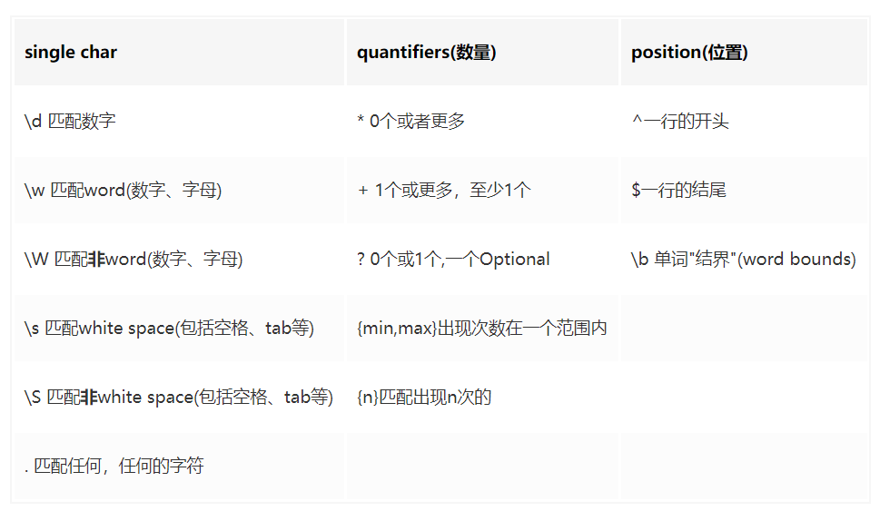
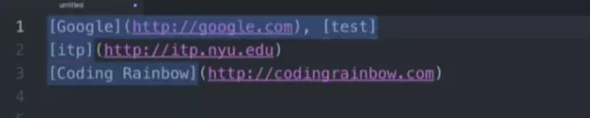
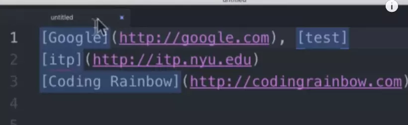
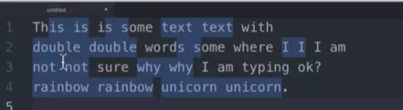
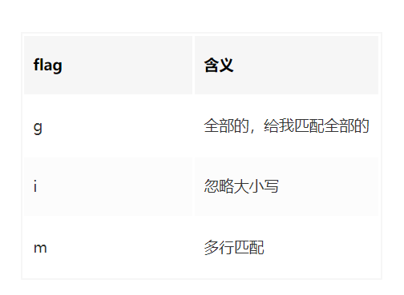

<!-- TOC -->

- [正则表达式](#正则表达式)
  - [创建正则表达式](#创建正则表达式)
  - [特殊字符](#特殊字符)
  - [使用正则表达式的方法](#使用正则表达式的方法)
  - [练习](#练习)

<!-- /TOC -->

# 正则表达式

> https://juejin.im/post/5b5db5b8e51d4519155720d2



### 创建正则表达式

1. 使用一个正则表达式字面量

```js
const regex = /^[a-zA-Z]+[0-9]*\W?_$/gi
```

2. 调用 RegExp 对象的构造函数

```js
const regex = new RegExp(pattern, [, flags])
```

### 特殊字符

- ^ 匹配输入的开始
- \$ 匹配输入的结束
- \* 0 次或多次 {0，}
- \+ 1 次或多次 {1，}
- ?
  - 0 次或者 1 次 {0,1}。
  - 用于先行断言
  - 如果紧跟在任何量词 \*、 +、? 或 {} 的后面，将会使量词变为非贪婪
    - 对 "123abc" 用 /\d+/ 将会返回 "123"，
    - 用 /\d+?/,那么就只会匹配到 "1"。
- . 匹配除换行符之外的任何单个字符
- (x) 匹配 'x' 并且记住匹配项
- (?:x) 匹配 'x' 但是不记住匹配项
- x(?=y) 配'x'仅仅当'x'后面跟着'y'.这种叫做正向肯定查找。
- x(?!y) 匹配'x'仅仅当'x'后面不跟着'y',这个叫做正向否定查找。
- x|y 匹配‘x’或者‘y’。
- {n} 重复 n 次
- {n, m} 匹配至少 n 次，最多 m 次
- [xyz] 代表 x 或 y 或 z，不需要特殊转义
- [^xyz] 不是 x 或 y 或 z
- \d 数字
- \D 非数字
- \s 空白字符，包括空格、制表符、换页符和换行符。
- \S 非空白字符
- \w 单词字符（字母、数字或者下划线） [A-Za-z0-9_]
- \W 非单字字符。[^a-za-z0-9_]
- \3 表示第三个分组
- \b 词的边界
  - /\bm/匹配“moon”中得‘m’；
- \B 非单词边界

###  []的特殊语法

**在[]中，特殊字符不需要转义，可以直接使用，比如[.()],但是在外面，是需要转义的\( \.等**

1. -连接符是第一个字符时

比如`[-.]`的含义是连字符`-`或者点符`.`。 但是，如果当连字符不是第一个字符时，比如`[a-z]`，这就表示是从字母a到字符z。

1. []中的^

`^`在之前介绍中，是表示一行开头，但是在`[]`中，有着不同的含义。 `[ab]` 表示a或者b `[^ab]` 啥都行，只要不是a或b(anythings except a and b)，相当于取反

### []和()

除了使用`[]`表示或逻辑,`()`也是可以的。用法是`(a|b)`表示a或者b

总结：

1、`[]`的作用，用英文表达就是"alternation",表达一个或的逻辑；

2、`/[-.(]/` 在符号中的连字符`-`放在第一位表示连字符本身，如果放在中间，表示"从..到.."，比如`[a-z]`表示a-z

3、`[.)]` 括号中的特殊符号不需要转义，就表示其本身

4、`[^ab]` 括号中的`^`表示非，anythings except `a` and `b

5、`(a|b)`也可表示选择，但是它有更强大的功能....

### 分组捕获(capturing groups)

什么是分组捕获，现在回到之前电话号码的例子

```
212-555-1234
915-412-1333

//我想要保留区号，把后面的电话号码变为通用性的
👇👇👇👇👇👇👇👇👇👇👇👇

212-xxx-xxxx
915-xxx-xxxx
复制代码
```

按照之前的做法`\d{3}-\d{3}-\d{4}`,这种匹配的方式，是将整个电话号码作为一个组(group)匹配起来。 我们把`212-555-1234`这样的叫`Group0`。

这个时候，如果我们加了一个括号`\d{3}-(\d{3})-\d{4}`，那么匹配到的`555`就叫`Group1`。 以此类推，如果有两个小括号`\d{3}-(\d{3})-(\d{4})`那么分组就是下面的情况：

```
212-555-1234   Group0
555            Group1
1234           Group2
```

### 选择分组

现在组已经分好，那么如何选择已经匹配的分组？

这里有两种方法，第一种使用`$`符号，比如`$1` 代表`555`,`$2`代表`1234`；第二种，使用`\`,比如`\1`代表`555`。两种的使用场景不一样，先讲`$`

1. 现在有一个名单列表，但是姓和名称是反的，我需要把他交换过来

```
shiffina, Daniel
shifafl, Daniell
shquer, Danny
...
复制代码
```

实现方法:

```
reg: (\w+),\s(\w+)

replace: $2 $1
复制代码
```

注意：`$0` 是所有匹配到的，所以第一个加括号的是`$1`

1. 匹配markdown中的link标签，并替换为html标签

```
[google](http://google.com)
[itp](http://itp.nyu.edu)
[Coding Rainbow](http://codingrainbow.com)
复制代码
```

解析： 这道题有些坑，需要慢慢来。

看到这个，第一个想考虑匹配`[google]`这个东西，立马想到正则表达式`\[.*\]`。 这个是巨大的坑，在当前来看，它的确能正确匹配到上面的三条。 但是如果文本是这样的： 




看到了，第一行的内容会全部匹配下来，而不能区分`[google]`和`[test]`。 之所以这样，**是因为.是贪婪的，他表示所有，所有能匹配到的，所以当然也包括了]，一直到这一行的最后一个]，它才停止。**

所以为了让它能正确匹配，需要去掉这种贪婪的属性。这里用到`？` 。 当`?`放在了`quantifiers`符号后，表示去掉贪婪属性，匹配到终止条件，即可停下。

`\[.*?\]`这样子，就可以将`[google]`和`[test]`分开,效果如下： 




接下来完成所有内容：

```
reg: \[(.*?)\]\((http.*?)\)

replace: <a href="$2">$1</a>
```

### 使用`\`选择器

`$`选择符是在替换的时候进行的标志或选择，但是如果在正则表达式本身，就要使用`\`选择了。比如以下的场景

```
This is is a a dog , I think think this is is really
a a good good dog. Don't you you thinks so so ?
复制代码
```

我们想要匹配比如`is is` `so so`这样连续的序列，就用到了下面的表达方式: `(\w+)\s\1`

效果: 




嗯，差不多达到效果，但是有一些小的bug。比如第一句话`This is is a` 这个就匹配不准确，会把第一个This的后面字母匹配进去。 **这就用到第一节说的字符结界 \b了**，就变成了`\b(\w+)\s\1\b`




### 使用正则表达式的方法

- exec 一个在字符串中执行查找匹配的 RegExp 方法，它返回一个数组（未匹配到则返回 null）。
- test 一个在字符串中测试是否匹配的 RegExp 方法，它返回 true 或 false。
- match 一个在字符串中执行查找匹配的 String 方法，它返回一个数组或者在未匹配到时返回 null。
- search 一个在字符串中测试匹配的 String 方法，它返回匹配到的位置索引，或者在失败时返回-1。
- replace 一个在字符串中执行查找匹配的 String 方法，并且使用替换字符串替换掉匹配到的子字符串。
- split 一个使用正则表达式或者一个固定字符串分隔一个字符串，并将分隔后的子字符串存储到数组中的 String 方法。

1、在js中，正则表达式字面量`/reg/`和字符串字面量`"str"`用于创建正则和字符串。其中正则上有两个方法`reg.test()`和`reg.exec()`

2、`reg.test(str)`方法，返回布尔变量，用于指示是否有所匹配； `reg.exec(str)`有点类似与迭代器，每次执行，返回匹配结果和分组，直到返回为`null`结束。

3、字符串方法主要有`str.match(reg)`,`str.split(reg)`和`str.replace(reg,str|function)` 三种方法。

4、`match`比较特殊，如果正则包含了分组，且没有`g`标志，则返回匹配内容和分组; 如果没有分组，且有`g`标志，返回所有匹配内容

5、`split`方法主要用于字符串分割，如果想要保存分隔符，记得将匹配内容分组(用小括号包起来)

6、`replace`是最强大的方法，当使用回掉函数时，返回值就是替换值; 参数分别为`匹配值` `group1` `group2`..

## 练习

匹配结尾的数字

```js
;/\d+$/g
```

统一空格个数
字符串内如有空格，但是空格的数量可能不一致，通过正则将空格的个数统一变为一个。

```js
let reg = /\s+/g
str.replace(reg, ' ')
```

判断字符串是不是由数字组成

```js
str.test(/^\d+$/)
```

电话号码正则

- 区号必填为 3-4 位的数字
- 区号之后用“-”与电话号码连接电话号码为 7-8 位的数字
- 分机号码为 3-4 位的数字，非必填，但若填写则以“-”与电话号码相连接

```js
;/^\d{3,4}-\d{7,8}(-\d{3,4})?$/
```

手机号码正则表达式
正则验证手机号，忽略前面的 0，支持 130-139，150-159。忽略前面 0 之后判断它是 11 位的。

```js
;/^0*1(3|5)\d{9}$/
```

使用正则表达式实现删除字符串中的空格

```js
funtion trim(str) {
  let reg = /^\s+|\s+$/g
  return str.replace(reg, '');
}
```

限制文本框只能输入数字和两位小数点等等

```js
;/^\d*\.\d{0,2}$/
```

只能输入小写的英文字母和小数点，和冒号，正反斜杠(：./\)

```js
;/^[a-z\.:\/\\]*$/
```

替换小数点前内容为指定内容
例如：infomarket.php?id=197 替换为 test.php?id=197

```js
var reg = /^[^\.]+/
var target = '---------'
str = str.replace(reg, target)
```

只匹配中文的正则表达式

```js
;/[\u4E00-\u9FA5\uf900-\ufa2d]/gi
```

返回字符串的中文字符个数
先去掉非中文字符，再返回 length 属性。

```js
function cLength(str) {
  var reg = /[^\u4E00-\u9FA5\uf900-\ufa2d]/g
  //匹配非中文的正则表达式
  var temp = str.replace(reg, '')
  return temp.length
}
```

正则表达式取得匹配 IP 地址前三段
只要匹配掉最后一段并且替换为空字符串就行了

```js
function getPreThrstr(str) {
  let reg = /\.\d{1,3}$/
  return str.replace(reg, '')
}
```

匹配<ul>与</ul>之间的内容

```js
/<ul>[\s\S]+?</ul>/i
```

用正则表达式获得文件名
c:\images\tupian\006.jpg
可能是直接在盘符根目录下，也可能在好几层目录下，要求替换到只剩文件名。
首先匹配非左右斜线字符 0 或多个，然后是左右斜线一个或者多个。

```js
function getFileName(str) {
  var reg = /[^\\\/]*[\\\/]+/g
  // xxx\ 或是 xxx/
  str = str.replace(reg, '')
  return str
}
```

绝对路径变相对路径
"http://23.123.22.12/image/somepic.gif"转换为："/image/somepic.gif"

```js
var reg = /http:\/\/[^\/]+/
str = str.replace(reg, '')
```

用户名正则
用于用户名注册，，用户名只 能用 中文、英文、数字、下划线、4-16 个字符。

```js
;/^[\u4E00-\u9FA5\uf900-\ufa2d\w]{4,16}$/
```

匹配英文地址
规则如下:
包含 "点", "字母","空格","逗号","数字"，但开头和结尾不能是除字母外任何字符。

```js
;/^[a-zA-Z][\.a-zA-Z,0-9]*[a-zA-Z]$/
```

正则匹配价格
开头数字若干位，可能有一个小数点，小数点后面可以有两位数字。

```js
;/^\d+(\.\d{2})?$/
```

身份证号码的匹配
身份证号码可以是 15 位或者是 18 位，其中最后一位可以是 X。其它全是数字

```js
;/^(\d{14}|\d{17})(X|x)$/
```

单词首字母大写
每单词首字大写，其他小写。如 blue idea 转换为 Blue Idea，BLUE IDEA 也转换为 Blue Idea

```js
function firstCharUpper(str) {
  str = str.toLowerCase()
  let reg = /\b(\w)/g
  return str.replace(reg, m => m.toUpperCase())
}
```

正则验证日期格式
yyyy-mm-dd 格式
4 位数字，横线，1 或者 2 位数字，再横线，最后又是 1 或者 2 位数字。

```js
;/^\d{4}-\d{1,2}-\d{1,2}$/
```

去掉文件的后缀名
www.abc.com/dc/fda.asp 变为 www.abc.com/dc/fda

```js
function removeExp(str) {
  return str.replace(/\.\w$/, '')
}
```

验证邮箱的正则表达式
开始必须是一个或者多个单词字符或者是-，加上@，然后又是一个或者多个单词字符或者是-。然后是点“.”和单词字符和-的组合，可以有一个或者
多个组合。

```js
;/^[\w-]+@\w+\.\w+$/
```

正则判断标签是否闭合
例如：p的内容，同样也是没闭合的标签。

标签可能有两种方式闭合， 或者是<p> xxx </p>。

```js
;/<([a-z]+)(\s*\w*?\s*=\s*".+?")*(\s*?>[\s\S]*?(<\/\1>)+|\s*\/>)/i
```

正则判断是否为数字与字母的混合
不能小于 12 位，且必须为字母和数字的混

```js
;/^(([a-z]+[0-9]+)|([0-9]+[a-z]+))[a-z0-9]*$/i
```

将阿拉伯数字替换为中文大写形式

```js
function replaceReg(reg, str) {
  let arr = ['零', '壹', '贰', '叁', '肆', '伍', '陆', '柒', '捌', '玖']
  let reg = /\d/g
  return str.replace(reg, function(m) {
    return arr[m]
  })
}
```

去掉标签的所有属性

<td style="width: 23px; height: 26px;" align="left">***</td>
变成没有任何属性的
<td>***</td>
思路：非捕获匹配属性，捕获匹配标签，使用捕获结果替换掉字符串。正则如下：
```js
/(<td)\s(?:\s*\w*?\s*=\s*".+?")*?\s*?(>)/
```
