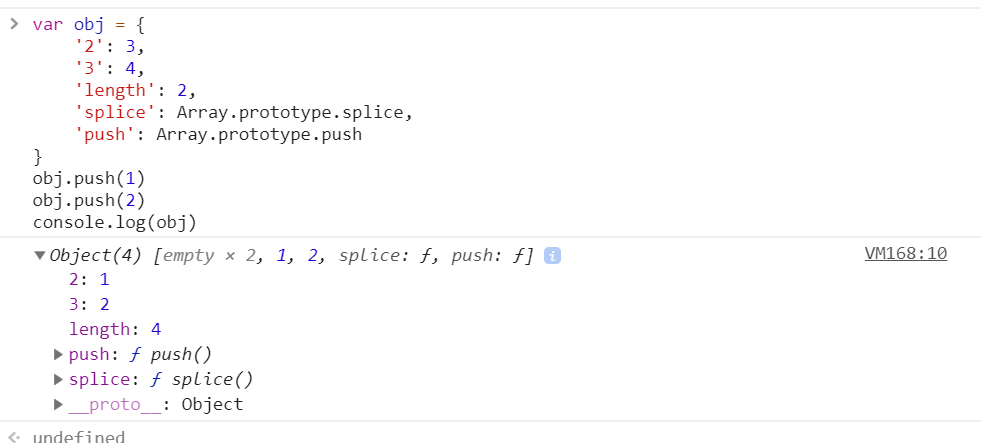
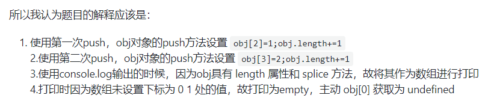

### “newArray”中有哪些元素？
```js
var array = [];
for(var i = 0; i <3; i++) {
 array.push(() => i);
}
var newArray = array.map(el => el());
console.log(newArray); // ??   
```
答案：  
```js
array = [f,f,f] // 三个函数
newArray = [3, 3, 3]
```

### 如果我们在浏览器控制台中运行'foo'函数，是否会导致堆栈溢出错误？
```js
function foo() {
  setTimeout(foo, 0); // 是否存在堆栈溢出错误?
};    

```

答案： 不会， 事件循环机制

###  如果在控制台中运行以下函数，页面(选项卡)的 UI 是否仍然响应

```js
function foo() {
  return Promise.resolve().then(foo);
};    
```

### 能否以某种方式为下面的语句使用展开运算而不导致类型错误
```js
var obj = { x: 1, y: 2, z: 3 };
[...obj]; // TypeError 
```

 

### 以下代码输出什么

```js
var b = 10;
(function b(){
    // 内部作用域会去查找已有的变量b, 此时的b是 具名函数 function b
    // IIFE的函数是无法被赋值（类似const），所有赋值无效
    // 具名自执行函数的变量为只读属性，不可修改
    b = 20;
    console.log(b); 
})();

var b = 10;
(function b() {
    // 严格模式下会报错
  'use strict'
  b = 20;
  console.log(b)
})() // "Uncaught TypeError: Assignment to constant variable."

// 使用window
var b = 10;
(function b() {
    window.b = 20; 
    console.log(b); // [Function b]
    console.log(window.b); // 20是必然的
})();

// 内部使用var
var b = 10;
(function b() {
    var b = 20; // IIFE内部变量
    console.log(b); // 20
   	console.log(window.b); // 10 
})();
```

### a 什么情况打印 1 2 3

> 利用toString

```
let a = {
  i: 1,
  toString () {
    return a.i++
  }
}

if(a == 1 && a == 2 && a == 3) {
  console.log('1');
}
```

> 利用valueOf

```
let a = {
  i: 1,
  valueOf () {
    return a.i++
  }
}

if(a == 1 && a == 2 && a == 3) {
  console.log('1');
}
```

> 数组这个就有点妖了

```
var a = [1,2,3];
a.join = a.shift;
if(a == 1 && a == 2 && a == 3) {
  console.log('1');
}
```

> ES6的symbol

```
let a = {[Symbol.toPrimitive]: ((i) => () => ++i) (0)};
if(a == 1 && a == 2 && a == 3) {
  console.log('1');
}
```


### [下面输出什么](https://github.com/Advanced-Frontend/Daily-Interview-Question/issues/76)



push() 方法将一个或多个元素添加到数组的末尾，并返回该数组的新长度。

根据MDN的说法理解，`push`方法应该是根据数组的`length`来根据参数给数组创建一个下标为`length`的属性

`push`方法影响了数组的`length`属性和对应下标的值。

>  在对象中加入splice属性方法，和length属性后。这个对象变成一个类数组。

