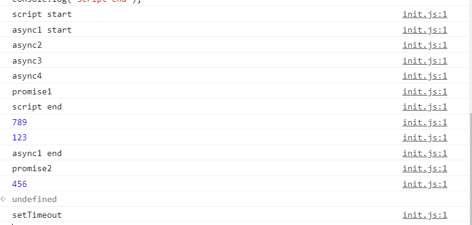
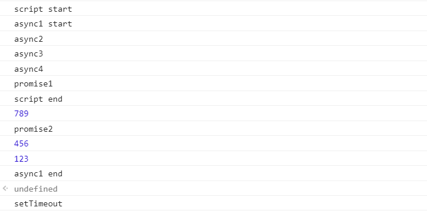
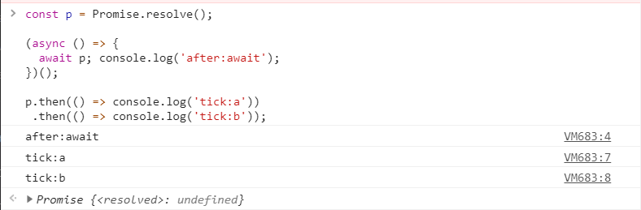
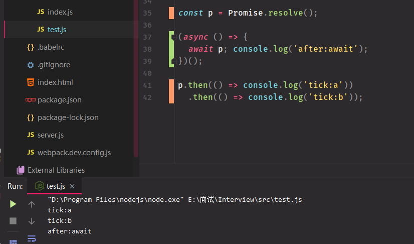

[TOC]

### “newArray”中有哪些元素？

```js
var array = [];
for(var i = 0; i <3; i++) {
 array.push(() => i);
}
var newArray = array.map(el => el());
console.log(newArray); // ??   
```
答案：  
```js
array = [f,f,f] // 三个函数
newArray = [3, 3, 3]
```

### 如果我们在浏览器控制台中运行'foo'函数，是否会导致堆栈溢出错误？
```js
function foo() {
  setTimeout(foo, 0); // 是否存在堆栈溢出错误?
};    

```

答案： 不会， 事件循环机制

###  如果在控制台中运行以下函数，页面(选项卡)的 UI 是否仍然响应

```js
function foo() {
  return Promise.resolve().then(foo);
};    
```

### 能否以某种方式为下面的语句使用展开运算而不导致类型错误
```js
var obj = { x: 1, y: 2, z: 3 };
[...obj]; // TypeError 
```

 

### 以下代码输出什么

```js
var b = 10;
(function b(){
    // 内部作用域会去查找已有的变量b, 此时的b是 具名函数 function b
    // IIFE的函数是无法被赋值（类似const），所有赋值无效
    // 具名自执行函数的变量为只读属性，不可修改
    b = 20;
    console.log(b); 
})();

var b = 10;
(function b() {
    // 严格模式下会报错
  'use strict'
  b = 20;
  console.log(b)
})() // "Uncaught TypeError: Assignment to constant variable."

// 使用window
var b = 10;
(function b() {
    window.b = 20; 
    console.log(b); // [Function b]
    console.log(window.b); // 20是必然的
})();

// 内部使用var
var b = 10;
(function b() {
    var b = 20; // IIFE内部变量
    console.log(b); // 20
   	console.log(window.b); // 10 
})();
```

### a 什么情况打印 1 2 3

> 利用toString

```
let a = {
  i: 1,
  toString () {
    return a.i++
  }
}

if(a == 1 && a == 2 && a == 3) {
  console.log('1');
}
```

> 利用valueOf

```
let a = {
  i: 1,
  valueOf () {
    return a.i++
  }
}

if(a == 1 && a == 2 && a == 3) {
  console.log('1');
}
```

> 数组这个就有点妖了

```
var a = [1,2,3];
a.join = a.shift;
if(a == 1 && a == 2 && a == 3) {
  console.log('1');
}
```

> ES6的symbol

```
let a = {[Symbol.toPrimitive]: ((i) => () => ++i) (0)};
if(a == 1 && a == 2 && a == 3) {
  console.log('1');
}
```


### [下面输出什么](https://github.com/Advanced-Frontend/Daily-Interview-Question/issues/76)


push() 方法将一个或多个元素添加到数组的末尾，并返回该数组的新长度。

根据MDN的说法理解，`push`方法应该是根据数组的`length`来根据参数给数组创建一个下标为`length`的属性

`push`方法影响了数组的`length`属性和对应下标的值。

>  在对象中加入splice属性方法，和length属性后。这个对象变成一个类数组。


### 下面输出什么（promise）

**async/await执行顺序**

1.遇见await左侧先执行，右侧时候要跳出函数，等外部任务执行完再跳回
2.awati可以看成.then是一个微任务，放入微任务队列，和其他微任务一样，顺序执行
3.执行微任务时，产生微任务顺序放入当前微任务队列，顺序执行
4.遇见函数前面有async，awiat返回时，放入到Promise.then微任务队列中，然后执行微任务队列，如果前面没有async，await返回时候直接执行，下次遇见await时候，再跳出执行微任务队列

原文链接：https://blog.csdn.net/u014465934/article/details/99766790

```js
async function async1() {
   console.log('async1 start');
    await async2();
    console.log('async1 end');
}

async function async2() {
    new Promise(function(resolve) {
       console.log('promise1');
        resolve();
    }).then(function() {
        console.log('promise2');
    })
}

console.log('script start');

setTimeout(function() {
    console.log('setTimeout');
}, 0)

async1();

new Promise(function(resolve) {
    console.log('promise3');
    resolve();
}).then(function() {
    console.log('promise4');
})

console.log('script end')
```

```js
async function async1() {
    console.log('async1 start');
    Promise.resolve(async2()).then(() => {
                console.log('async1 end');
        })
}
async function async2() {
     console.log('async2');
Promise.resolve(async3()).then(() => {
                console.log(123);
        })
}
async function async3() {
     console.log('async3');
Promise.resolve(async4()).then(() => {
                console.log(456);
        })
}
async function async4() {
    await console.log('async4');
	console.log(789)
}
console.log('script start');
setTimeout(function() {
    console.log('setTimeout');
}, 0)
async1();
new Promise(function(resolve) {
    console.log('promise1');
    resolve();
}).then(function() {
    console.log('promise2');
});
console.log('script end');
```




```js
async function async1() {
    console.log('async1 start');
    await async2();
    console.log('async1 end');
}
async function async2() {
    console.log('async2');
	await async3()
	console.log(123)
}
async function async3() {
     console.log('async3');
	await async4()
	console.log(456)
}
async function async4() {
    await console.log('async4');
	console.log(789)
}
console.log('script start');
setTimeout(function() {
    console.log('setTimeout');
}, 0)
async1();
new Promise(function(resolve) {
    console.log('promise1');
    resolve();
}).then(function() {
    console.log('promise2');
});
console.log('script end');
```




[Tasks, microtasks, queues 和 schedules](https://hongfanqie.github.io/tasks-microtasks-queues-and-schedules/)

```js
async function async1() {
   console.log('async1 start');
    await async2();
    console.log('async1 end');
}

async function async2() {
    new Promise(function(resolve) {
       console.log('promise1');
        resolve();
    }).then(function() {
        console.log('promise2');
    })
}

console.log('script start');

setTimeout(function() {
    console.log('setTimeout');
}, 0)

async1();

new Promise(function(resolve) {
    console.log('promise3');
    resolve();
}).then(function() {
    console.log('promise4');
})

console.log('script end')
```




