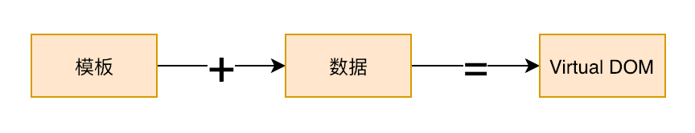
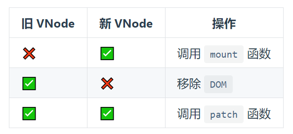

## [渲染器](http://hcysun.me/vue-design/zh/renderer.html#责任重大的渲染器)

### 组件的本质

**一个组件就是一个函数，根据数据，渲染出对应的html内容**， `Vue` 和 `React` 的组件的产出不是 `html` ， 而是 `Virtual DOM`

`Vue` 的组件最核心的的 `render`函数， 产出是 `Virtual DOM` 。也就是 `VNode`，渲染器的目标就是 `VNode`

### [VNode](https://codesandbox.io/s/6x2nvmmxn3)

用 `VNode` 描述真实 `DOM`。我们可以把 `VNode` 分成五类，分别是：**html/svg 元素**、**组件**、**纯文本**、**Fragment** 以及 **Portal**：

可以把组件细分为 **有状态组件** 和 **函数式组件**。同时有状态组件还可以细分为三部分：**普通的有状态组件**、**需要被 keepAlive 的有状态组件** 以及 **已经被 keepAlive 的有状态组件** 。

### 渲染器

渲染器就是将 `Virtual DOM` 渲染唇膏特定平台下真实的 `DOM` 的工具。渲染器的工作流程分为两个阶段： `mount` 和 `patch`

之所以说渲染器的责任非常之大，是因为它不仅仅是一个把 `VNode` 渲染成真实 `DOM` 的工具，它还负责以下工作：

- 控制部分组件生命周期钩子的调用

在整个渲染周期中包含了大量的 `DOM` 操作、组件的挂载、卸载，控制着组件的生命周期钩子调用的时机。

- 多端渲染的桥梁

渲染器也是多端渲染的桥梁，自定义渲染器的本质就是把特定平台操作“DOM”的方法从核心算法中抽离，并提供可配置的方案。

- 与异步渲染有直接关系

`Vue3` 的异步渲染是基于调度器的实现，若要实现异步渲染，组件的挂载就不能同步进行，DOM的变更就要在合适的时机，一些需要在真实DOM存在之后才能执行的操作(如 `ref`)也应该在合适的时机进行。对于时机的控制是由调度器来完成的，但类似于组件的挂载与卸载以及操作 `DOM` 等行为的入队还是由渲染器来完成的，这也是为什么 `Vue2` 无法轻易实现异步渲染的原因。

- 包含最核心的 Diff 算法

`Diff` 算法是渲染器的核心特性之一，可以说正是 `Diff` 算法的存在才使得 `Virtual DOM` 如此成功。

