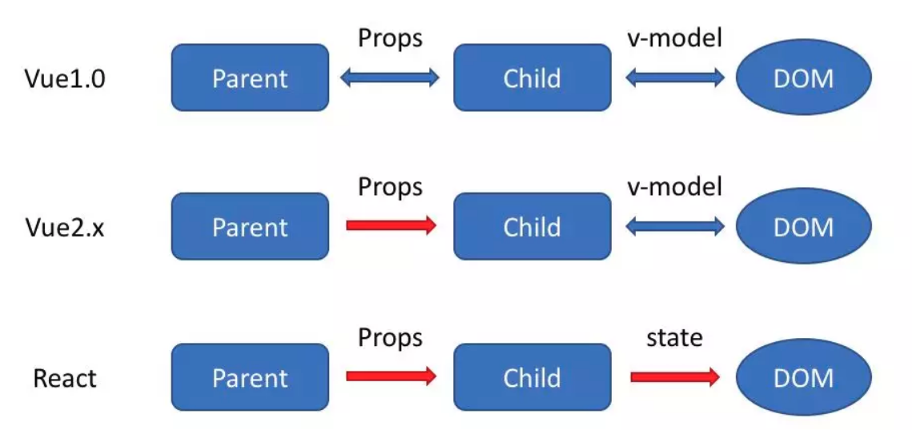
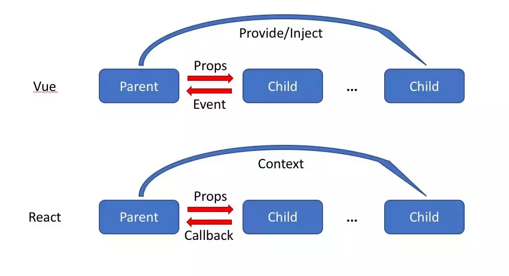
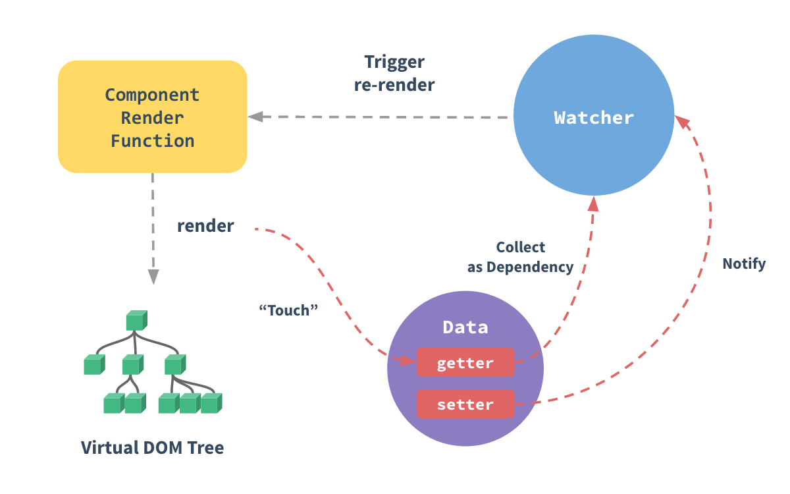
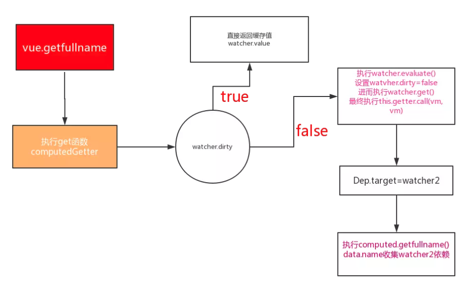
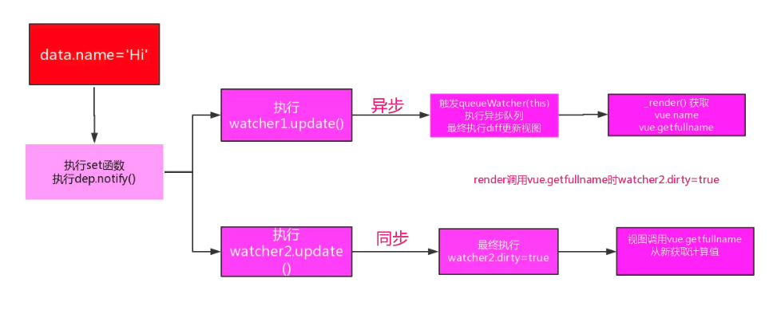
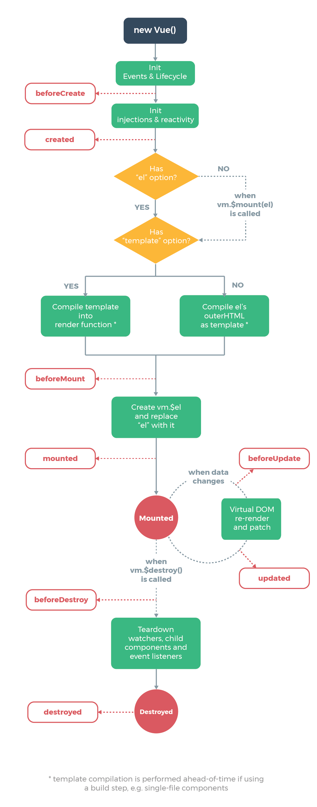
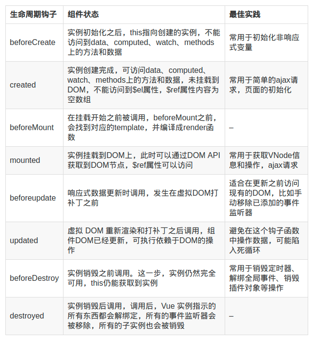

<!-- TOC -->

- [vue 的优点是什么](#vue-的优点是什么)
- [[vue 和 react 区别](https://juejin.im/post/5b8b56e3f265da434c1f5f76)](#vue-和-react-区别httpsjuejinimpost5b8b56e3f265da434c1f5f76)
- [vue 的双向绑定的原理是什么（常考)](#vue-的双向绑定的原理是什么常考)
- [为什么 Vue 3.0 中使用 Proxy 了](#为什么-vue-30-中使用-proxy-了)
- [Vue computed 实现原理](#vue-computed-实现原理)
- [computed 和 watch 区别](#computed-和-watch-区别)
- [组件中 data 什么时候可以使用对象](#组件中-data-什么时候可以使用对象)
- [Vue 虚拟 DOM](#vue-虚拟-dom)
- [虚拟 DOM Diff 算法](#虚拟-dom-diff-算法)
- [Vue.nextTick 的原理和用途](#vuenexttick-的原理和用途)
- [Vue 生命周期](#vue-生命周期)
  - [父子组件生命周期](#父子组件生命周期)
  - [兄弟组件的生命周期](#兄弟组件的生命周期)
  - [mixin](#mixin)
- [React / Vue 列表中 key 的作用](#react--vue-列表中-key-的作用)
  - [Vue中的key](#vue中的key)
  - [key 的作用](#key-的作用)
- [[Vue 中的单向数据流](https://github.com/wengjq/Blog/issues/17)](#vue-中的单向数据流httpsgithubcomwengjqblogissues17)
    - [保持单向数据流的重要性](#保持单向数据流的重要性)
  - [组件通信规范](#组件通信规范)
- [[Vue 项目进行的优化实践](https://juejin.im/post/5d548b83f265da03ab42471d)](#vue-项目进行的优化实践httpsjuejinimpost5d548b83f265da03ab42471d)
- [Vue 3.0 特性了解](#vue-30-特性了解)
  - [**(1)监测机制的改变**](#1监测机制的改变)
  - [**(2）模板**](#2模板)
  - [**(3) 对象式的组件声明方式**](#3-对象式的组件声明方式)
  - [**(4）其它方面的更改**](#4其它方面的更改)
- [说说你使用 Vue 框架踩过最大的坑是什么？](#说说你使用-vue-框架踩过最大的坑是什么)

<!-- /TOC -->


### vue 的优点是什么

- 低耦合。视图（View）可以独立于 Model 变化和修改，一个 ViewModel 可以绑定到不同的"View"上，当 View 变化的时候 Model 可以不变，当 Model 变化的时候 View 也可以不变。
- 可重用性。你可以把一些视图逻辑放在一个 ViewModel 里面，让很多 view 重用这段视图逻辑。
- 独立开发。开发人员可以专注于业务逻辑和数据的开发（ViewModel），设计人员可以专注于页面设计，使用 Expression Blend 可以很容易设计界面并生成 xml 代码。
- 可测试。界面素来是比较难于测试的，而现在测试可以针对 ViewModel 来写。

### [vue 和 react 区别](https://juejin.im/post/5b8b56e3f265da434c1f5f76)

https://juejin.im/post/5b8b56e3f265da434c1f5f76#heading-0

https://segmentfault.com/a/1190000017414633

相同：

- 两者都是用于创建UI的JavaScript库；
- 两者都快速轻便；
- 都有基于组件的架构；
- 都是用虚拟DOM；
- 都可放入单个HTML文件中，或者成为更复杂webpack设置中的模块；
- 都有独立但常用的路由器和状态管理库；

不同点：

1. 监听数据变化的实现原理不同

   - vue 是通过 getter/setter 数据劫持的方式，进，行监听数据变化

   - React 是默认是通过比较引用的方式进行，如果不优化（PureComponent/shouldComponentUpdate）可能导致大量不必要的 VDOM 的重新渲染，修改数据要通过setstate

     react中不可变性可以更容易的确定是否修改，有助于确定组件何时需要重新渲染

   - **vue 强调的是可变数据，React 更强调数据不可变**

2. 数据流不同



改变数据方式不同，Vue 的底层使用了依赖追踪，支持双向绑定

React 一直提倡的是单向数据流，React 需要使用 setState 来改变状态，

Vue 的底层使用了依赖追踪，页面更新渲染已经是最优的了，但是 React 还是需要用户手动去优化这方面的问题。

3.HoC 和 mixins

在 Vue 中我们组合不同功能的方式是通过 mixin，而在React中我们通过 HoC (高阶组件）。

4.组件通信的区别



vue:

- 父组件通过 props 向子组件传递数据或者回调，虽然可以传递回调，但是我们一般只传数据，而通过 事件的机制来处理子组件向父组件的通信

- 子组件通过 事件 向父组件发送消息

- 通过 V2.2.0 中新增的 provide/inject 来实现父组件向子组件注入数据，可以跨越多个层级。

在 React 中，也有对应的三种方式：

- 父组件通过 props 可以向子组件传递数据或者回调
- 可以通过 context 进行跨层级的通信，这其实和 provide/inject 起到的作用差不多。

可以看到，React 本身并不支持自定义事件，Vue中子组件向父组件传递消息有两种方式：事件和回调函数，而且Vue更倾向于使用事件。但是在 React 中我们都是使用回调函数的，这可能是他们二者最大的区别


3. 模板渲染方式不同

- React 是通过 JSX 渲染模板  
- React 是在组件 JS 代码中，通过原生 JS 实现模板中的常见语法，比如插值，条件，循环等，都是通过**JS 语法**实现的
- Vue 是通过一种拓展的 HTML 语法进行渲染  
- Vue 是在和组件 JS 代码分离的单独的模板中，通过**指令**来实现的，比如条件语句就需要 v-if 来实现

### vue 的双向绑定的原理是什么（常考)

vue.js 是采用数据劫持结合发布者 - 订阅者模式的方式，通过 Object.defineProperty() 来劫持各个属性的 setter，getter，在数据变动时发布消息给订阅者，触发相应的监听回调。

具体步骤：  
**第一步：** 需要 observe 的数据对象进行递归遍历，包括子属性对象的属性，都加上 setter 和 getter 这样的话，给这个对象的某个值赋值，就会触发 setter，那么就能监听到了数据变化

**第二步**：compile 解析模板指令，将模板中的变量替换成数据，然后初始化渲染页面视图，并将每个指令对应的节点绑定更新函数，添加监听数据的订阅者，一旦数据有变动，收到通知，更新视图

**第三步：** Watcher 订阅者是 Observer 和 Compile 之间通信的桥梁，主要做的事情是：

- 在自身实例化时往属性订阅器 (dep) 里面添加自己
- 自身必须有一个 update() 方法
- 待属性变动 dep.notice() 通知时，能调用自身的 update() 方法，并触发 Compile 中绑定的回调，则功成身退。

**第四步：** MVVM 作为数据绑定的入口，整合 Observer、Compile 和 Watcher 三者，通过 Observer 来监听自己的 model 数据变化，通过 Compile 来解析编译模板指令，最终利用 Watcher 搭起 Observer 和 Compile 之间的通信桥梁，达到数据变化 -> 视图更新；视图交互变化 (input) -> 数据 model 变更的双向绑定效果。

vue 首先会调用所有使用的数据，从而触发所有的 getter 函数，进而通过 Dep 对象收集所有响应式依赖，然后调用所有 watcher 执行 render 操作，其中会进行虚拟 DOM 的存储和比较，进而渲染页面

当有数据变更时会触发 setter 函数，触发 dep.notify()，进而调用 Watcher 的 update，推入 Vue 的异步观察队列中，最终调用 Watch 的 getter 或者 cb 方法进而调用 vm.\_update(), 再调用 vm**patch**方法进行虚拟 DOM 的 diff，并最终渲染到页面。



### 为什么 Vue 3.0 中使用 Proxy 了

> Proxy 是 es6 的新特性，意为代理，可以在目标对象前架设一层拦截，外界对该对象的访问，都必须通过这层拦截，这提供了一种机制，可以对外界的访问进行过滤和改写。

1. Vue 中使用 Object.defineProperty 进行双向数据绑定时，告知使用者是可以监听数组的，但是只是监听了数组的 push()、pop()、shift()、unshift()、splice()、sort()、reverse() 这八种方法，其他数组的属性检测不到。

2. Object.defineProperty 只能劫持对象的属性，因此对每个对象的属性进行遍历时，如果属性值也是对象需要深度遍历，那么就比较麻烦了，所以在比较 Proxy 能完整劫持对象的对比下，选择 Proxy。

3. 为什么 Proxy 在 Vue 2.0 编写的时候出来了，尤大却没有用上去？因为当时 es6 环境不够成熟，兼容性不好，尤其是这个属性无法用 polyfill 来兼容。（polyfill 是一个 js 库，专门用来处理 js 的兼容性问题 -js 修补器）

1、Proxy 可以劫持整个对象，避免了 Object.defineProperty 的遍历和递归，提高下性能和效率

2、有 13 种劫持操作

	- **get(target, propKey, receiver)**
	- **set(target, propKey, value, receiver)**
	- **has(target, propKey)**
	- **deleteProperty(target, propKey)**
	- **ownKeys(target)**
	- **getOwnPropertyDescriptor(target, propKey)**
	- **defineProperty(target, propKey, propDesc)**
	- **preventExtensions(target)**
	- **getPrototypeOf(target)**
	- **isExtensible(target)**
	- **setPrototypeOf(target, proto)**
	- **apply(target, object, args)**
	- **construct(target, args)**

3、Proxy 返回的是一个新对象,我们可以只操作新的对象达到目的,而 Object.defineProperty 只能遍历对象属性直接修改；

4、Proxy 作为新标准将受到浏览器厂商重点持续的性能优化，也就是传说中的新标准的性能红利

5、**Object.defineProperty**兼容性好，支持 IE9，而 Proxy 的存在浏览器兼容性问题,而且无法用 polyfill 磨平，因此 Vue 的作者才声明需要等到下个大版本( 3.0 )才能用 Proxy 重写。


### Vue computed 实现原理

计算属性的主要应用场景是代替模板内的表达式，或者 data 值的任何复杂逻辑都应该使用 computed 来计算，它有两大优势：

1、逻辑清晰，方便于管理

2、计算值会被缓存，依赖的 data 值改变时才会从新计算

把计算属性的 key 挂载到 vm 对象下，并使用 Object.defineProperty 进行处理

解析下图：
调用 vue.getfullname 第一次会打印 '----- 走了 computed 之 getfullname------'，即计算属性第一次计算了值，第二次调用时，不会再打印值即直接获取的缓存值，为什么第二次是获得的缓存值呢，因为第二次执行时 watcher.dirty=true，就会直接返回 watcher.value 值。


解析下图：
运行 vue.getfullname 时会执行 computedGetter 函数，因为 watcher.dirty=true 因此会从新计算值，因此会打印 '----- 走了 computed 之 getfullname------'，值为'HI world', 再次执行只会获得计算属性的缓存值。


### computed 和 watch 区别

computed 是计算属性，依赖其他属性计算值，并且 computed 的值有缓存，只有当计算值变化才会返回内容。  

computed 对应的是一个值依赖多个值

watch 监听到值的变化就会执行回调，在回调中可以进行一些逻辑操作。
watch 是一个值会影响多个值

1. Computed属于Computed Watcher， Watch属于User Watcher， User Watcher的执行顺序是最快的
2. Watch具有销毁功能， vm.$watch(监听变量， 回调函数，配置项)返回的是销毁函数，内部调用teardown来销毁监听函数

### 组件中 data 什么时候可以使用对象

组件复用时所有组件实例都会共享 data，如果 data 是对象的话，就会造成一个组件修改 data 以后会影响到其他所有组件，所以需要将 data 写成函数，每次用到就调用一次函数获得新的数据。

当我们使用 new Vue() 的方式的时候，无论我们将 data 设置为对象还是函数都是可以的，因为 new Vue() 的方式是生成一个根组件，该组件不会复用，也就不存在共享 data 的情况了。

### Vue 虚拟 DOM

真正的 DOM 元素是非常庞大的，因为浏览器的标准就把 DOM 设计的非常复杂。当我们频繁的去做 DOM 更新，会产生一定的性能问题。

1. 但是对 JS 的操作是高效，可以在某些程度上提高性能，因为频繁的修改 DOM 操作是很耗性能的工作，通过虚拟 DOM 可以将修改操作最小化，提高性能
2. 更重要的是虚拟 DOM 对组件进行了一层抽象，使得开发的应用可以移植到不同的平台
3. vdom 作为一个兼容层可以实现跨端开发，服务端渲染，以及提供一个性能还算不错 Dom 更新策略。
4. 提供了一种方便的工具，使得开发效率得到保证

### 虚拟 DOM Diff 算法

vue 采用的同层比较的方式，对比树的每个层的差异，记录节点之间的差异，然后最小化更新。  
节点间的差异可以归纳为 4 种情况：

1. 修改了节点的属性
2. 修改了节点的文本内容
3. 节点类型变了，替换的原有的节点
4. 节点的顺序，数量发生的更改，节点的移动、增加、删除，这会通过计算最小编辑距离来最小化的修改 DOM，Vue 会尽可能复用 DOM，尽可能不发生 DOM 的移动。

记录完新旧树的差别之后就深度遍历 DOM，将 DIFF 的内容更新

patch 的策略是：

1. 如果 vnode 不存在但是 oldVnode 存在，说明意图是要销毁老节点，那么就调用 invokeDestroyHook(oldVnode) 来进行销毁

2. 如果 oldVnode 不存在但是 vnode 存在，说明意图是要创建新节点，那么就调用 createElm 来创建新节点

3. 当 vnode 和 oldVnode 都存在时

- 如果 oldVnode 和 vnode 是同一个节点，就调用 patchVnode 来进行 patch

- 当 vnode 和 oldVnode 不是同一个节点时，如果 oldVnode 是真实 dom 节点或 hydrating 设置为 true，需要用 hydrate 函数将虚拟 dom 和真是 dom 进行映射，然后将 oldVnode 设置为对应的虚拟 dom，找到 oldVnode.elm 的父节点，根据 vnode 创建一个真实 dom 节点并插入到该父节点中 oldVnode.elm 的位置

- 这里面值得一提的是 patchVnode 函数，因为真正的 patch 算法是由它来实现的（patchVnode 中更新子节点的算法其实是在 updateChildren 函数中实现的，为了便于理解，我统一放到 patchVnode 中来解释）。

### Vue.nextTick 的原理和用途

在下次 DOM 更新循环结束之后执行延迟回调。在修改数据之后立即使用这个方法，获取更新后的 DOM。

1. DOM 更新循环是指什么？
   Vue 是异步执行 DOM 更新的，同步任务执行完毕，开始执行异步 watcher 队列的任务，更新 DOM 。Vue 在内部尝试对异步队列使用原生的 Promise.then 和 MessageChannel 方法，如果执行环境不支持，会采用 setTimeout(fn, 0) 代替。
2. 下次更新循环是什么时候？
3. 修改数据之后使用，是加快了数据更新进度吗？
4. 在什么情况下要用到？
   需要在视图更新之后，基于新的视图进行操作。
   created 和 mounted 阶段，如果需要操作渲染后的试图，也要使用 nextTick 方法。

- 获取隐藏元素的 dom 属性

### Vue 生命周期





1、created 阶段的 ajax 请求与 mounted 请求的区别：前者页面视图未出现，如果请求信息过多，页面会长时间处于白屏状态  
2、mounted 不会承诺所有的子组件也都一起被挂载。如果你希望等到整个视图都渲染
完毕，可以用 vm.\$nextTick

#### 父子组件生命周期

1、仅当子组件完成挂载后，父组件才会挂载  
2、当子组件完成挂载后，父组件会主动执行一次 beforeUpdate/updated 钩子函数（仅首次）  
3、父子组件在 data 变化中是分别监控的，但是在更新 props 中的数据是关联的（可实践）
4、销毁父组件时，先将子组件销毁后才会销毁父组件

- 加载渲染过程

父 beforeCreate -> 父 created -> 父 beforeMount -> 子 beforeCreate -> 子 created -> 子 beforeMount -> 子 mounted -> 父 mounted

- 子组件更新过程

父 beforeUpdate -> 子 beforeUpdate -> 子 updated -> 父 updated

- 父组件更新过程

父 beforeUpdate -> 父 updated

- 销毁过程

父 beforeDestroy -> 子 beforeDestroy -> 子 destroyed -> 父 destroyed


#### 兄弟组件的生命周期

1、组件的初始化（mounted 之前）分开进行，挂载是从上到下依次进行  
2、当没有数据关联时，兄弟组件之间的更新和销毁是互不关联的

#### mixin

1、mixin 中的生命周期与引入该组件的生命周期是仅仅关联的，且 mixin 的生命周期优先执行 ，顺序执行
2、自身 data 优先级高于混入的 data 属性


### React / Vue 列表中 key 的作用

#### Vue中的key
[官网介绍](https://cn.vuejs.org/v2/guide/list.html#key)  

Vue 用 `v-for` 更新已渲染的元素列表，默认会使用 "就地复用" 策略，如果数据的顺序被改变， Vue 将不会移动DOM元素来匹配数据项的顺序， 而是复用此处的每个元素。 不带 key 并且使用简单模板的时候， 可以更有效地复用节点，这种默认的模式是高效， 但是只适用于不依赖子组件状态或者临时 DOM 状态的列表渲染输出。

#### key 的作用
key 更新组件的时候diff算法会优先判断key是否相同，相同就复用，不同就删除旧的创建新的。

key 是给每一个 VNode 的一个唯一 id，在 diff 算法执行时可以依靠 key 更准确， 更快的拿到 oldVNode 中对应的 VNode 节点。

如果节点稳定，就能提高性能，因为节点可以复用。
对于频繁更新的场景， 节点不能复用，但是有 key 的话可以省去一部分判断逻辑(虽然此时没法复用，需要更新)。
前者的是在创建很更新节点的优化， 后者

1、更准确
节点带有 key 就不用就地复有， 在 sameNode 函数 a.key === b.key 对比可以避免复用的情况

2、 更快
利用 key 的唯一性，可以生成map对象来获取对应节点， 对比遍历查询的方式更快。 (map 会比遍历更快)


### [Vue 中的单向数据流](https://github.com/wengjq/Blog/issues/17)

所有的 prop 都使得其父子 prop 之间形成了一个**单向下行绑定**：父级 prop 的更新会向下流动到子组件中，但是反过来则不行。这样会防止从子组件意外改变父级组件的状态，从而导致你的应用的数据流向难以理解。

##### 保持单向数据流的重要性

在父组件中，**一个变量往往关联着多个变量或动作**

- 如果在子组件中修改了传进来的prop对象，并且没有在父组件中`watch`该prop对象，不会主动触发其他变量的修改或动作的发生，导致数据局部展示错误。
- 如果主动`watch`该prop对象，由于无法准确预知修改的来源和方式，从而大大增加了父组件的维护难度。

#### 组件通信规范

Vue 组件有多种通信方式，选择合理的通信方式，**尽可能保证数据的单向流动**。

- `props`，遵守使用props来初始化子组件，尽量不修改props值
- `refs`，父组件通过refs获取子组件实例，适用于**主动**获取（只读）子组件数据或调用子组件方法修改数据
- `v-on`，适用于被动获取子组件数据
- `bus`，监听自定义事件，适用于被动获取组件数据，忽略组件层级关系

注：基于**数据劫持**和**发布订阅模式**。为了避免修改，可以直接使用深度拷贝来初始化。

> [单向数据流]([https://chenoge.github.io/2019/01/19/%E5%85%B3%E4%BA%8EVue%E5%8D%95%E5%90%91%E6%95%B0%E6%8D%AE%E6%B5%81%E7%9A%84%E7%90%86%E8%A7%A3/](https://chenoge.github.io/2019/01/19/关于Vue单向数据流的理解/))


### [Vue 项目进行的优化实践](https://juejin.im/post/5d548b83f265da03ab42471d)

**（1）代码层面的优化**

- v-if 和 v-show 区分使用场景

- computed 和 watch  区分使用场景

- v-for 遍历必须为 item 添加 key，且避免同时使用 v-if

- 长列表性能优化

  Vue 会通过 Object.defineProperty 对数据进行劫持，来实现视图响应数据的变化，然而有些时候我们的组件就是纯粹的数据展示，不会有任何改变，我们就不需要 Vue 来劫持我们的数据，在大量数据展示的情况下，这能够很明显的减少组件初始化的时间

  可以通过 Object.freeze 方法来冻结一个对象，一旦被冻结的对象就再也不能被修改了。

  ```
  export default {
    data: () => ({
      users: {}
    }),
    async created() {
      const users = await axios.get("/api/users");
      this.users = Object.freeze(users);
    }
  };
  ```

  

- 事件的销毁

- 图片资源懒加载

- 路由懒加载

- 第三方插件的按需引入

- 优化无限列表性能

如果你的应用存在非常长或者无限滚动的列表，那么需要采用 窗口化 的技术来优化性能，只需要渲染少部分区域的内容，减少重新渲染组件和创建 dom 节点的时间。 你可以参考以下开源项目 [vue-virtual-scroll-list](https://link.juejin.im/?target=https%3A%2F%2Fgithub.com%2Ftangbc%2Fvue-virtual-scroll-list) 和 [vue-virtual-scroller](https://link.juejin.im/?target=https%3A%2F%2Fgithub.com%2FAkryum%2Fvue-virtual-scroller)  来优化这种无限列表的场景的。

- 服务端渲染 SSR or 预渲染

**（2）Webpack 层面的优化**

- Webpack 对图片进行压缩
- 减少 ES6 转为 ES5 的冗余代码
- 提取公共代码
- 模板预编译
- 提取组件的 CSS
- 优化 SourceMap
- 构建结果输出分析
- Vue 项目的编译优化

**（3）基础的 Web 技术的优化**

- 开启 gzip 压缩
- 浏览器缓存
- CDN 的使用
- 使用 Chrome Performance 查找性能瓶颈

### Vue 3.0 特性了解

#### **(1)监测机制的改变**

3.0 将使用 `proxy` 实现 observer， 提供全语言覆盖和反应性跟踪，消除基于 `Object.definedProperty` 实现所存在的很多限制。

新的 observer 还提供了以下特性：

- 用于创建 observable 的公开 API。这为中小规模场景提供了简单轻量级的跨组件状态管理解决方案。
- 默认采用惰性观察。在 2.x 中，不管反应式数据有多大，都会在启动时被观察到。如果你的数据集很大，这可能会在应用启动时带来明显的开销。在 3.x 中，只观察用于渲染应用程序最初可见部分的数据。
- 更精确的变更通知。在 2.x 中，通过 Vue.set 强制添加新属性将导致依赖于该对象的 watcher 收到变更通知。在 3.x 中，只有依赖于特定属性的 watcher 才会收到通知。
- 不可变的 observable：我们可以创建值的“不可变”版本（即使是嵌套属性），除非系统在内部暂时将其“解禁”。这个机制可用于冻结 prop 传递或 Vuex 状态树以外的变化。
- 更好的调试功能：我们可以使用新的 renderTracked 和 renderTriggered 钩子精确地跟踪组件在什么时候以及为什么重新渲染。

#### **(2）模板**

模板方面没有大的变更，只改了作用域插槽，2.x 的机制导致作用域插槽变了，父组件会重新渲染，而 3.0 把作用域插槽改成了函数的方式，这样只会影响子组件的重新渲染，提升了渲染的性能。

同时，对于 render 函数的方面，vue3.0 也会进行一系列更改来方便习惯直接使用 api 来生成 vdom 。

#### **(3) 对象式的组件声明方式**

vue2.x 中的组件是通过声明的方式传入一系列 option，和 TypeScript 的结合需要通过一些装饰器的方式来做，虽然能实现功能，但是比较麻烦。3.0 修改了组件的声明方式，改成了类式的写法，这样使得和 TypeScript 的结合变得很容易。

此外，vue 的源码也改用了 TypeScript 来写。其实当代码的功能复杂之后，必须有一个静态类型系统来做一些辅助管理。现在 vue3.0 也全面改用 TypeScript 来重写了，更是使得对外暴露的 api 更容易结合 TypeScript。静态类型系统对于复杂代码的维护确实很有必要。

#### **(4）其它方面的更改**

vue3.0 的改变是全面的，上面只涉及到主要的 3 个方面，还有一些其他的更改：

- 支持自定义渲染器，从而使得 weex 可以通过自定义渲染器的方式来扩展，而不是直接 fork 源码来改的方式。
- 支持 Fragment（多个根节点）和 Protal（在 dom 其他部分渲染组建内容）组件，针对一些特殊的场景做了处理。
- 基于 treeshaking 优化，提供了更多的内置功能。


### 说说你使用 Vue 框架踩过最大的坑是什么？

1、就地复用的坑

vue在用v-if v-else渲染两个相同的按钮，一个绑定了事件，另外一个没有绑定事件。当渲染状态切换的时候，会导致未绑定事件的按钮也绑定上了事件。原因是有的vue版本在没给条件渲染的元素加上key标识时候会默认复用元素提升渲染能力，导致事件被错误的绑定上另一个按钮。解决方案：更换高版本vue，加上key标识两个按钮。