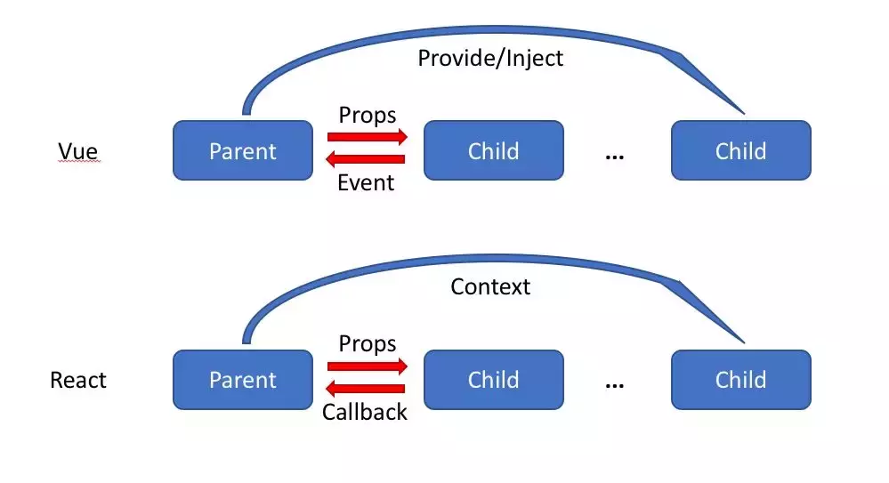

### [vue 和 react 区别](https://juejin.im/post/5b8b56e3f265da434c1f5f76)

> [个人理解Vue和React区别]( https://juejin.im/post/5b8b56e3f265da434c1f5f76#heading-0)
>
> [打破框架的范式之争](https://mp.weixin.qq.com/s/2xtqHAmBCX18e9iw3iAeEQ)
>
> https://segmentfault.com/a/1190000017414633
>
> Svelte 框架的作者 Rich Harris 去做一个技术分享([ppt](https://docs.google.com/presentation/d/1PUvpXMBEDS45rd0wHu6tF3j_8wmGC6cOLtOw2hzU-mw/edit#slide=id.g33e09941c5_0_53))。
>
> [React 和 Vue 的区别](http://mingjue.online/#/ReactAndVue/index?id=react-和-vue-的区别)
>
> 

相同：

- 两者都是用于创建UI的JavaScript库；
- 两者都快速轻便；
- 都有基于组件的架构；
- 都是用虚拟DOM；
- 都可放入单个HTML文件中，或者成为更复杂webpack设置中的模块；
- 都有独立但常用的路由器和状态管理库；

不同点：

1. 监听数据变化的实现原理不同

   - vue 是通过 getter/setter 数据劫持的方式，进，行监听数据变化

   - React 是默认是通过比较引用的方式进行，如果不优化（PureComponent/shouldComponentUpdate）可能导致大量不必要的 VDOM 的重新渲染，修改数据要通过setstate

     react中不可变性可以更容易的确定是否修改，有助于确定组件何时需要重新渲染

   - **vue 强调的是可变数据，React 更强调数据不可变**

两类 `Reactivity` 的处理方式

一种是 Vue 为代表的 可变数据结构，配合变更追踪，触发更新函数。

另一种是 React 为代表的不可变数据结构，配合反复执行的渲染函数，通过数据的引用相等性判断，找出变更部分，只应用变化到UI上。

1. 数据流不同

改变数据方式不同，Vue 的底层使用了依赖追踪，支持双向绑定

React 一直提倡的是单向数据流，React 需要使用 setState 来改变状态，

Vue 的底层使用了依赖追踪，页面更新渲染已经是最优的了，但是 React 还是需要用户手动去优化这方面的问题。

3.HoC 和 mixins

在 Vue 中我们组合不同功能的方式是通过 mixin，而在React中我们通过 HoC (高阶组件）。

4.组件通信的区别

vue:

- 父组件通过 props 向子组件传递数据或者回调，虽然可以传递回调，但是我们一般只传数据，而通过 事件的机制来处理子组件向父组件的通信
- 子组件通过 事件 向父组件发送消息
- 通过 V2.2.0 中新增的 provide/inject 来实现父组件向子组件注入数据，可以跨越多个层级。

在 React 中，也有对应的三种方式：

- 父组件通过 props 可以向子组件传递数据或者回调
- 可以通过 context 进行跨层级的通信，这其实和 provide/inject 起到的作用差不多。

可以看到，React 本身并不支持自定义事件，Vue中子组件向父组件传递消息有两种方式：事件和回调函数，而且Vue更倾向于使用事件。但是在 React 中我们都是使用回调函数的，这可能是他们二者最大的区别

3. 模板渲染方式不同

- React 是通过 JSX 渲染模板  
- React 是在组件 JS 代码中，通过原生 JS 实现模板中的常见语法，比如插值，条件，循环等，都是通过**JS 语法**实现的
- Vue 是通过一种拓展的 HTML 语法进行渲染  
- Vue 是在和组件 JS 代码分离的单独的模板中，通过**指令**来实现的，比如条件语句就需要 v-if 来实现