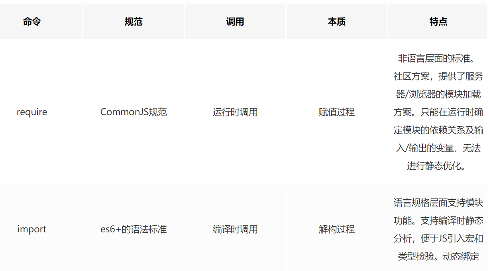
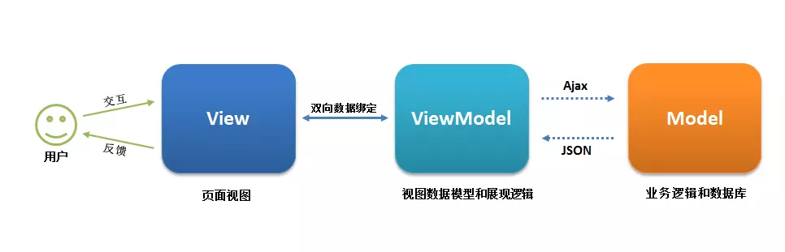

<!-- TOC -->

  - [模块化的意义](#模块化的意义)
  - [为什么需要模块化](#为什么需要模块化)
  - [前端模块化历史和方案](#前端模块化历史和方案)
      - [IIFE：使用自执行函数来编写 在一个单独的函数作用域中执行代码，避免变量冲突](#iife使用自执行函数来编写-在一个单独的函数作用域中执行代码避免变量冲突)
      - [同步加载 CommonJS](#同步加载-commonjs)
      - [异步加载 AMD (Asynchronous Module Definition，异步模块定义)](#异步加载-amd-asynchronous-module-definition异步模块定义)
      - [CMD (Common Module Definition，通用模块定义)](#cmd-common-module-definition通用模块定义)
      - [规范的实现库](#规范的实现库)
    - [es6 原生的模块化方案](#es6-原生的模块化方案)
    - [模块化打包工具 webpack](#模块化打包工具-webpack)
  - [组件化](#组件化)
    - [为什么要使用模块化？都有哪几种方式可以实现模块化，各有什么特点](#为什么要使用模块化都有哪几种方式可以实现模块化各有什么特点)
    - [什么是 mvvm](#什么是-mvvm)
- [[聊聊 Vue 的双向数据绑定，Model 如何改变 View，View 又是如何改变 Model 的](https://github.com/Advanced-Frontend/Daily-Interview-Question/issues/34)](#聊聊-vue-的双向数据绑定model-如何改变-viewview-又是如何改变-model-的httpsgithubcomadvanced-frontenddaily-interview-questionissues34)
    - [mvvm 和 mvc 区别](#mvvm-和-mvc-区别)

<!-- /TOC -->

## 模块化的意义

模块化主要体现的是一种分而治之的思想，分而治之就是将一个大问题分解成多个独立的的小问题，最后组合就是大问题的答案。

模块化则是前端最流行的分治手段，模块化可以对功能进行划分，有利于代码的复用和维护。有利于提高团队开发效率

## 为什么需要模块化

- web sites 慢慢变成了 web app
- 随着项目的扩大，代码量越来越大，代码越来越复杂
- 对代码、文件的高度解耦的要求
- 优化上，希望减少 http 请求

随着前端应用越来越复杂，模块化在前端是很有必要的。

## 前端模块化历史和方案

> [模块化](https://www.processon.com/view/link/5c8409bbe4b02b2ce492286a#map)
>
> [前端模块化：CommonJS,AMD,CMD,ES6](https://juejin.im/post/5aaa37c8f265da23945f365c)
>
> [这一次，我要弄懂javascript的模块化](https://juejin.im/post/5b4420e7f265da0f4b7a7b27)

早起的模块化的方案很简单，就是通过命名空间，匿名闭包的方式，或 module 模式模拟类提供私有和共有方法来实现模块化，但是这些模块都不是以文件为单位，而是以对象为单位。

#### 1、IIFE：使用自执行函数来编写 在一个单独的函数作用域中执行代码，避免变量冲突

#### 2、同步加载 CommonJS

比如 node.js，使用的便是 CommomJS 规范。通过 require，module.exports，exports 来进行导入和导出，这里 exports 是 module.exports 的一个引用。

CommonJS 的规范： 根据 CommonJS 规范，一个单独的文件就是一个模块。加载模块使用 require 方法，该方法读取一个文件并执行，最后返回文件内部的 exports 对象。

#### 3、异步加载 AMD (Asynchronous Module Definition，异步模块定义)

采用异步方式加载模块，通过 define 来定义一个模块，通过 require 来引入模块，模块的加载不影响后面语句的执行，所有依赖于这些模块的语句都写在一个回调函数中，加载完毕后，这个回调函数才运行

**CommonJS** 规范**加载模块是同步**的，也就是说**，只有加载完成，才能执行后面的操作**。**AMD** 规范则是**非同步加载模块，允许指定回调函数**。由于 Node.js 主要用于服务器编程，模块文件一般都已经存在于本地硬盘，所以加载起来比较快，不用考虑非同步加载的方式，所以 CommonJS 规范比较适用。但是，如果是浏览器环境，要从服务器端加载模块，这时就必须采用非同步模式，因此浏览器端一般采用 AMD 规范

#### 4、CMD (Common Module Definition，通用模块定义)

- AMD 提倡依赖前置，在定义模块的时候就要声明其依赖的模块
- CMD 提倡就近依赖（按需加载），在用到某个模块的时候再去 require 进来。

#### 规范的实现库

AMD 规范的 require.js 与 CMD 规范的 sea.js

> require.js 主要解决的问题：  
> 管理文件之间的依赖性  
> 避免浏览器因为加载依赖而停止页面渲染，失去响应。

### 5、es6 原生的模块化方案

**_import export/export default_**

## import 和 require区别

（1） CommonJS 模块输出的是一个值的拷贝，ES6 模块输出的是值的引用.

- CommonJS 模块输出的是值的拷贝，也就是说，一旦输出一个值，模块内部的变化就影响不到这个值。

- ES6 模块的运行机制与 CommonJS 不一样。JS 引擎对脚本静态分析的时候，遇到模块加载命令`import`，就会生成一个只读引用。等到脚本真正执行时，再根据这个只读引用，到被加载的那个模块里面去取值。换句话说，ES6 的`import`有点像 Unix 系统的“符号连接”，原始值变了，`import`加载的值也会跟着变。因此，ES6 模块是动态引用，并且不会缓存值，模块里面的变量绑定其所在的模块。

（2） CommonJS 模块是运行时加载，ES6 模块是编译时输出接口。

- 运行时加载: CommonJS 模块就是对象；即在输入时是先加载整个模块，生成一个对象，然后再从这个对象上面读取方法，这种加载称为“运行时加载”。
- 编译时加载: ES6 模块不是对象，而是通过 `export` 命令显式指定输出的代码，`import`时采用静态命令的形式。即在`import`时可以指定加载某个输出值，而不是加载整个模块，这种加载称为“编译时加载”。

CommonJS 加载的是一个对象（即`module.exports`属性），该对象只有在脚本运行完才会生成。而 ES6 模块不是对象，它的对外接口只是一种静态定义，在代码静态解析阶段就会生成。



### 遵循的规范不同

1.require/exports是CommonJS的一部分

2.import/export是ES6新规范

### 出现时间不同

CommonJS 作为 Node.js 的规范，一直沿用至今。由于 npm 上 CommonJS 的类库众多，以及 CommonJS 和 ES6 之间的差异，Node.js 无法直接兼容 ES6。所以现阶段 require/exports 仍然是必要且是必须的。

### 形式不同

require/exports 的用法只有以下三种：

```
const fs = require('fs');
 exports.fs = fs;
 module.exports = fs;
复制代码
```

import/export的写法就多种多样

```
import fs from 'fs';
import {default as fs} from 'fs';
import * as fs from 'fs';
-----------------------------
export default fs;
export const fs;
export * from 'fs';
复制代码
```

### 本质上的不同

1.CommonJS还是ES6 Module 输出都可以看成是一个具备多个属性或者方法的对象;

2.default 是ES6 Module所独有的关键字，export default 输出默认的接口对象，import from 'fs'可直接导入这个对象;

3.ES6 Module中导入模块的属性或者方法是强绑定的，包括基础类型；而 CommonJS 则是普通的值传递或者引用传递。

## 组件化

组件化主要要针对的是 UI 组件的分治，可以提高代码复用性，有利于扩展，团队协作

如何划分：  
页面上每个独立可视的可交互区域视为组件  
每个组件构建的时候对于一个工程目录，组件所需的资源在这个目录下维护，
组件不依赖其他组件 ，高内聚低耦合
功能封装，组件不涉及具体的功能逻辑

### 为什么要使用模块化？都有哪几种方式可以实现模块化，各有什么特点

模块化可以给我们带来以下好处

- 解决命名冲突
- 提供复用性
- 提高代码可维护性

实现模块化方式：

- 立即执行函数
- AMD 和 CMD
- CommonJS
- ES Module

### 什么是 mvvm

MVVM 是 Model-View-ViewModel 的缩写。mvvm 是一种设计思想。  
Model 层代表数据模型，也可以在 Model 中定义数据修改和操作的业务逻辑；  
View 代表 UI 组件，它负责将数据模型转化成 UI 展现出来，  
ViewModel 是一个同步 View 和 Model 的对象。

在 MVVM 架构下，View 和 Model 之间并没有直接的联系，而是通过 ViewModel 进行交互，Model 和 ViewModel 之间的交互是双向的， 因此 View 数据的变化会同步到 Model 中，而 Model 数据的变化也会立即反应到 View 上。

ViewModel 通过双向数据绑定把 View 层和 Model 层连接了起来，而 View 和 Model 之间的同步工作完全是自动的，无需人为干涉，因此开发者只需关注业务逻辑，不需要手动操作 DOM, 不需要关注数据状态的同步问题，复杂的数据状态维护完全由 MVVM 来统一管理。

Model–View–ViewModel （MVVM） 是一个软件架构设计模式，由微软 WPF 和 Silverlight 的架构师 Ken Cooper 和 Ted Peters 开发，是一种简化用户界面的事件驱动编程方式。由 John Gossman（同样也是 WPF 和 Silverlight 的架构师）于2005年在他的博客上发表

MVVM 源自于经典的 Model–View–Controller（MVC）模式  ，MVVM 的出现促进了前端开发与后端业务逻辑的分离，极大地提高了前端开发效率，MVVM 的核心是 ViewModel 层，它就像是一个中转站（value converter），负责转换 Model 中的数据对象来让数据变得更容易管理和使用，该层向上与视图层进行双向数据绑定，向下与 Model 层通过接口请求进行数据交互，起呈上启下作用。如下图所示：




### mvvm 和 mvc 区别

mvc 和 mvvm 其实区别并不大。都是一种设计思想。主要就是 mvc 中 Controller 演变成 mvvm 中的 viewModel。mvvm 主要解决了 mvc 中大量的 DOM 操作使页面渲染性能降低，加载速度变慢，影响用户体验。和当 Model 频繁发生变化，开发者需要主动更新到 View 。