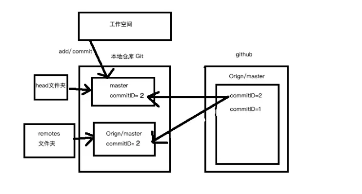

### [git pull 跟 git fetch 的区别](https://www.jianshu.com/p/e3aefb378f32)

### 1. git fetch

- 使用git fetch更新代码，本地的库中master的commitID不变，还是等于1。但是与git上面关联的那个orign/master的commit ID变成了2。这时候我们本地相当于存储了两个代码的版本号，我们还要通过merge去合并这两个不同的代码版本，如果这两个版本都修改了同一处的代码，这时候merge就会出现冲突，然后我们解决冲突之后就生成了一个新的代码版本。
- 这时候本地的代码版本可能就变成了commit ID=3，即生成了一个新的代码版本。

### 相当于fetch的时候本地的master没有变化，但是与远程仓关联的那个版本号被更新了，我们接下来就是在本地合并这两个版本号的代码。

### 2. git pull

*是用git pull更新代码的话就比较简单暴力了，看下图。

image.png

### 使用git pull的会将本地的代码更新至远程仓库里面最新的代码版本

1. 总结
   *由此可见，git pull看起来像git fetch+get merge，但是根据commit ID来看的话，他们实际的实现原理是不一样的。
   *这里借用之前文献看到的一句话：

> 不要用git pull，用git fetch和git merge代替它。
> git pull的问题是它把过程的细节都隐藏了起来，以至于你不用去了解git中各种类型分支的区别和使用方法。当然，多数时候这是没问题的，但一旦代码有问题，你很难找到出错的地方。看起来git pull的用法会使你吃惊，简单看一下git的使用文档应该就能说服你。
> 将下载（fetch）和合并（merge）放到一个命令里的另外一个弊端是，你的本地工作目录在未经确认的情况下就会被远程分支更新。当然，除非你关闭所有的安全选项，否则git pull在你本地工作目录还不至于造成不可挽回的损失，但很多时候我们宁愿做的慢一些，也不愿意返工重来。