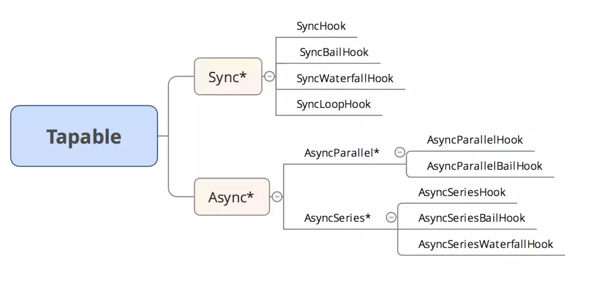
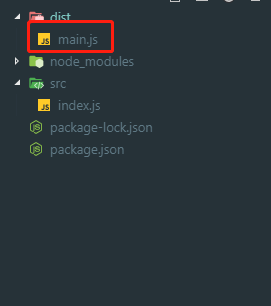

##  webpack 简介

组件化、模块化开发的模式产生有个问题必然会产生，就是如何把模块、组件加载组合到一起。

本质上 webpack 是一个现代 JavaScript 应用程序的静态模块打包器。它递归的构建一个依赖关系图，其中包含应用程序的每个模块，然后将这些模块打包成一个或多个 bundle.js。
webpack 支持 CommonJS，AMD，ES6 等规范，所以我们在代码中可以使用多种模块加载规范，而且通过 loader，它不仅可以处理 JavaScript，还可以处理像 css，图片等等的静态资源。

webpack 的优势  

1、支持 CommonJS 和 AMD 模块。  
2、支持模块加载器和插件机制，可对模块灵活定制。babel-loader 支持 ES6  
3、可以通过配置，打包成多个文件。有效的利用浏览器的缓存。  
4、将样式文件和图片等静态资源视为模块进行打包。配合 loader 加载器，对资源进行处理。

> https://segmentfault.com/a/1190000015088834
>
> [Webpack原理与实践（一）：打包流程](https://juejin.im/post/5be9297351882516f5786404)

#### 组成部分

webpack 是一个前端模块化打包工具，主要由入口，出口，loader，plugins 四个部分。

- `Entry`：入口，Webpack 执行构建的第一步将从 Entry 开始，可抽象成输入。
- `Module`：模块，在 Webpack 里一切皆模块，一个模块对应着一个文件。Webpack 会从配置的 Entry 开始递归找出所有依赖的模块。
- `Chunk`：代码块，一个 Chunk 由多个模块组合而成，用于代码合并与分割。
- `Loader`：模块转换器，用于把模块原内容按照需求转换成新内容。
- `Plugin`：扩展插件，在 Webpack 构建流程中的特定时机会广播出对应的事件，插件可以监听这些事件的发生，在特定时机做对应的事情。

devDependencies 节点下的模块是我们在开发时需要用的，比如项目中使用的 gulp ，压缩 css、js 的模块。这些模块在我们的项目部署后是不需要的，所以我们可以使用 -save-dev 的形式安装

#### 运行过程

**Webpack 的运行流程是一个串行的过程**，从启动到结束会依次执行以下流程：

1. 初始化参数：从配置文件和 Shell 语句中读取与合并参数，得出最终的参数；
2. 开始编译：用上一步得到的参数初始化 Compiler 对象，加载所有配置的插件，执行对象的 run 方法开始执行编译；
3. 确定入口：根据配置中的 entry 找出所有的入口文件；
4. 编译模块：从入口文件出发，调用所有配置的 Loader 对模块进行翻译，再找出该模块依赖的模块，再递归本步骤直到所有入口依赖的文件都经过了本步骤的处理；
5. 完成模块编译：在经过第4步使用 Loader 翻译完所有模块后，得到了每个模块被翻译后的最终内容以及它们之间的依赖关系；
6. 输出资源：根据入口和模块之间的依赖关系，组装成一个个包含多个模块的 Chunk，再把每个 Chunk 转换成一个单独的文件加入到输出列表，这步是可以修改输出内容的最后机会；
7. 输出完成：在确定好输出内容后，根据配置确定输出的路径和文件名，把文件内容写入到文件系统。

在以上过程中，Webpack 会在特定的时间点广播出特定的事件，插件在监听到感兴趣的事件后会执行特定的逻辑，并且插件可以调用 Webpack 提供的 API 改变 Webpack 的运行结果。


### [webpack4.0源码分析之Tapable](https://juejin.im/post/5abf33f16fb9a028e46ec352)

webpack 本质上是一种事件流机制，他的工作流程就是讲各个插件串联起来。而实现这一切的核心就是`Tapable`，`webpack`中最核心的负责编译的`Compiler`和负责创建bundles的`Compilation`都是`Tapable`的实例。本文主要介绍一下Tapable中的钩子函数。



序号 | 钩子名称 | 执行方式 | 使用要点     1 SyncHook 同步串行 不关心监听函数的返回值   2 SyncBailHook 同步串行 只要监听函数中有一个函数的返回值不为 `null`，则跳过剩下所有的逻辑   3 SyncWaterfallHook 同步串行 上一个监听函数的返回值可以传给下一个监听函数   4 SyncLoopHook 同步循环 当监听函数被触发的时候，如果该监听函数返回`true`时则这个监听函数会反复执行，如果返回 `undefined` 则表示退出循环   5 AsyncParallelHook 异步并发 不关心监听函数的返回值   6 AsyncParallelBailHook 异步并发 只要监听函数的返回值不为 `null`，就会忽略后面的监听函数执行，直接跳跃到`callAsync`等触发函数绑定的回调函数，然后执行这个被绑定的回调函数   7 AsyncSeriesHook 异步串行 不关系`callback()`的参数   8 AsyncSeriesBailHook 异步串行 `callback()`的参数不为`null`，就会直接执行`callAsync`等触发函数绑定的回调函数   9 AsyncSeriesWaterfallHook 异步串行 上一个监听函数的中的`callback(err, data)`的第二个参数,可以作为下一个监听函数的参数

作者：whynotgonow链接：https://juejin.im/post/5abf33f16fb9a028e46ec352


### 输出文件分析

立即执行函数

```js
(function(modules) {

  // 模拟 require 语句
  function __webpack_require__() {
  }

  // 执行存放所有模块数组中的第0个模块
  __webpack_require__(0);

})([/*存放所有模块的数组*/])

```

`bundle.js` 能直接运行在浏览器中的原因在于输出的文件中通过 `__webpack_require__` 函数定义了一个可以在浏览器中执行的加载函数来模拟 Node.js 中的 `require` 语句。

原来一个个独立的模块文件被合并到了一个单独的 `bundle.js` 的原因在于浏览器不能像 Node.js 那样快速地去本地加载一个个模块文件，而必须通过网络请求去加载还未得到的文件。 如果模块数量很多，加载时间会很长，因此把所有模块都存放在了数组中，执行一次网络加载。

如果仔细分析 `__webpack_require__` 函数的实现，你还有发现 Webpack 做了缓存优化： 执行加载过的模块不会再执行第二次，执行结果会缓存在内存中，当某个模块第二次被访问时会直接去内存中读取被缓存的返回值。

### 代码分割输出

在使用了 `CommonsChunkPlugin` 去提取公共代码时输出的文件和使用了异步加载时输出的文件是一样的，都会有 `__webpack_require__.e` 和 `webpackJsonp`。 原因在于提取公共代码和异步加载本质上都是代码分割。


 [import、require、export、module.exports 混合使用详解](https://juejin.im/post/5a2e5f0851882575d42f5609)

## [Webpack4](https://juejin.im/post/5adea0106fb9a07a9d6ff6de)

1. `npm init`

2. `npm i webpack webpack-cli -D`

3. `npx webpack`

   

   // node v8.2版本以后都会有一个npx
   // npx会执行bin里的文件

   

   webpack 默认会将src/index.js 作为入口文件，打包至 dist/main.js

4. 创建一个webpack.config.js （默认，可修改）文件来配置项目

   ```js
   module.exports = {
     entry: '',               // 入口文件
     output: {},              // 出口文件
     module: {},              // 处理对应模块
     plugins: [],             // 对应的插件
     devServer: {},           // 开发服务器配置
     mode: 'development'      // 模式配置
   }
   ```

   启动 devServer 需要安装对应的模块

   `npm i webpack-dev-server -D`

   配置文件的入口和出口， 运行`npx webpack`

```js
// webpack.config.js

const path = require('path');

module.exports = {
    entry: './src/index.js',    // 入口文件
    output: {
        filename: 'bundle.js',      // 打包后的文件名称
        path: path.resolve('dist')  // 打包后的目录，必须是绝对路径
    }
}
```


上面就是简单的webpack配置了。接下来为了方便，我们来配置一下执行文件


之后就可以使用 `npm run dev` 或者 `npm run build` 来运行


#### 多入口文件

多入口文件分为两种类型

- 多个入口文件，最终想打包成一个文件

```js
const path = require('path');

module.exports = {
    // 1.写成数组的方式就可以打出多入口文件，不过这里打包后的文件都合成了一个
    entry: ['./src/index.js', './src/js/a.js'],
    output: {
       filename: 'bundle.js',
    }
}
```


- 每一个文件都单独打包

```js
let path = require('path');

module.exports = {
    // 2.真正实现多入口和多出口需要写成对象的方式
    entry: {
        index: './src/index.js',
        login: './src/login.js'
    },
    output: {
        // 2. [name]就可以将出口文件名和入口文件名一一对应
        filename: '[name].js',      // 打包后会生成index.js和login.js文件
        path: path.resolve('dist')
    }
}

```


### 配置HTML模板

文件打包功能已经实现了，但是HTML文件怎么引入打包后的文件，我们需要一个html打包功能，可以引用打包好的文件路径。

安装一下这个插件：**html-webpack-plugin**

`npm i html-webpack-plugin -D`

在配置文件中配置该插件

```js
const path = require('path')

const HtmlWebpackPlugin = require('html-webpack-plugin')

module.exports = {
  // 多个文件打包成一个文件
  entry: ['./src/index.js', './src/js/a.js'],               // 入口文件
  output: {
    filename: 'bundle.[hash4]..js',
    path: path.resolve('dist')
  }, 
  module: {},    // 处理对应模块
  plugins: [
    new HtmlWebpackPlugin({
      template: './src/index.html',
      hash: true
    })
  ],             // 对应的插件
  devServer: {},           // 开发服务器配置
  mode: 'development'      // 模式配置
}
```


### 多页面开发配置

```js
const path = require('path')

const HtmlWebpackPlugin = require('html-webpack-plugin')

module.exports = {
  // 多个文件分别打包
  entry: {
    index: './src/index.js',
    a: './src/js/a.js'
  },
  output: {
    filename: '[name].[hash4].js',
    path: path.resolve('dist')
  },
  module: {},              // 处理对应模块
  plugins: [
    new HtmlWebpackPlugin({
      template: './src/index.html',
      hash: true,
      chunks: ['index']
    }),
    new HtmlWebpackPlugin({
      template: './src/a.html',
      hash: true,
      chunks: ['a']
    })
  ],             // 对应的插件
  devServer: {},           // 开发服务器配置
  mode: 'development'      // 模式配置
}
```


### CSS 打包配置

页面配置完了，我们还需要配置CSS，这里需要用到loader，loader可以按一定的方式处理对应的文件。

**style-loader  和 css-loader**

**less 和 less-loader**

```
npm i style-loader css-loader -D
// 引入less文件的话，也需要安装对应的loader
npm i less less-loader -D
```


```js
module: {
    rules: [
      {
        test: /\.css$/, // 解析css
        use: ["style-loader", "css-loader"] // 从右向左解析
        /* 
            也可以这样写，这种方式方便写一些配置参数
            use: [
                {loader: 'style-loader'},
                {loader: 'css-loader'}
            ]
        */
      }
    ]
 }, // 处理对应模块
```

```js
// index.js 中引入样式
import './less/style.less';
import './less/style.css';


console.log('hello webpack')
```


### webpack 和 gulp有什么不同

[Gulp](https://link.jianshu.com/?t=https://github.com/gulpjs/gulp)就是为了规范前端开发流程，实现前后端分离、模块化开发、版本控制、文件合并与压缩、mock数据等功能的一个前端自动化构建工具。说的形象点，“Gulp就像是一个产品的流水线，整个产品从无到有，都要受流水线的控制，在流水线上我们可以对产品进行管理。”

gulp强调的是前端开发的工作流程，我们可以通过配置一系列的task，定义task处理的事务（例如文件压缩合并、雪碧图、启动server、版本控制等），然后定义执行顺序，来让gulp执行这些task，从而构建项目的整个前端开发流程。

PS：简单说就一个Task Runner

另外，Gulp是通过task对整个开发过程进行构建。

[Webpack](https://link.jianshu.com/?t=https://github.com/webpack/webpack) 是当下最热门的前端资源模块化管理和打包工具。它可以将许多松散的模块按照依赖和规则打包成符合生产环境部署的前端资源。还可以将按需加载的模块进行代码分隔，等到实际需要的时候再异步加载。通过 loader的转换，任何形式的资源都可以视作模块，比如 CommonJs 模块、AMD 模块、ES6 模块、CSS、图片、JSON、Coffeescript、LESS 等。

webpack是一个前端模块化方案，更侧重模块打包，我们可以把开发中的所有资源（图片、js文件、css文件等）都看成模块，通过loader（加载器）和plugins（插件）对资源进行处理，打包成符合生产环境部署的前端资源。

Gulp侧重于前端开发的**整个过程**的控制管理（像是流水线），我们可以通过给gulp配置不通的task（通过Gulp中的gulp.task()方法配置，比如启动server、sass/less预编译、文件的合并压缩等等）来让gulp实现不同的功能，从而构建整个前端开发流程。

Webpack有人也称之为**模块打包机**，由此也可以看出Webpack更侧重于模块打包，当然我们可以把开发中的所有资源（图片、js文件、css文件等）都可以看成模块，最初Webpack本身就是为前端JS代码打包而设计的，后来被扩展到其他资源的打包处理。Webpack是通过loader（加载器）和plugins（插件）对资源进行处理的。