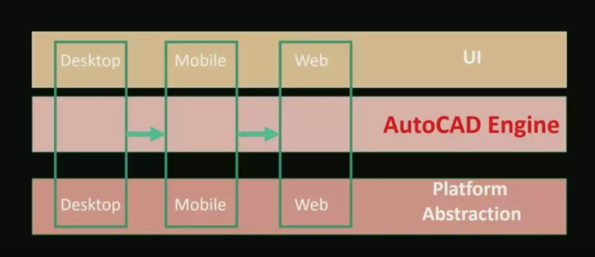
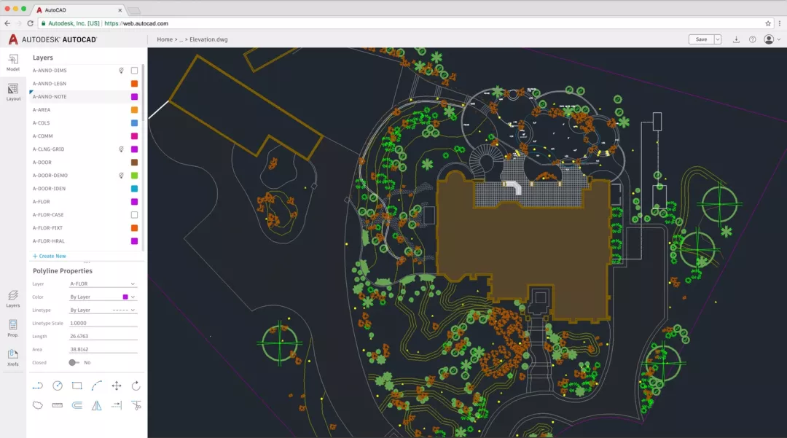

## WebAssembly

WebAssembly 是一种新的字节码格式，目前主流浏览器都已经支持 WebAssembly。 和 JS 需要解释执行不同的是，WebAssembly 字节码和底层机器码很相似，可以快速装载运行，因此性能相对于 JS 解释执行而言有了极大的提升。 也就是说 WebAssembly 并不是一门编程语言，而是一份字节码标准，需要用高级编程语言编译出字节码放到 WebAssembly 虚拟机中才能运行， 浏览器厂商需要做的就是根据 WebAssembly 规范实现虚拟机。这很像 Java 早年的 Applet，能够让其他语言运行在浏览器里。Applet 是一种 Java 程序，它可以运行在支持 Java 的 Web 浏览器内。因为它有完整的 Java API 支持，所以 Applet 是一个全功能的 Java 应用程序。

有了 WebAssembly，在浏览器上可以跑任何语言。从 Coffee 到 TypeScript，到 Babel，这些都是需要转译为 js 才能被执行的，而 WebAssembly 是在浏览器里嵌入 vm，直接执行，不需要转译，执行效率自然高得多。

举个例子，AutoCAD 软件是由美国欧特克有限公司（Autodesk）出品的一款自动计算机辅助设计软件，可以用于绘制二维制图和基本三维设计。使用它时，无需懂得编程，即可自动制图，因此它在全球被广泛应用于土木建筑、装饰装潢、工业制图、工程制图、电子工业、服装加工等诸多领域。

AutoCAD 是由大量 C++ 代码编写的软件，经历了非常多的技术变革，从桌面到移动端再到 web。之前，InfoQ 上有一个演讲，题目是《AutoCAD & WebAssembly: Moving a 30 Year Code Base to the Web》，即通过 WebAssembly，让很多年代久远的 C++ 代码在 Web 上可以运行，并且保证了执行效率。

举个例子，AutoCAD 软件是由美国欧特克有限公司（Autodesk）出品的一款自动计算机辅助设计软件，可以用于绘制二维制图和基本三维设计。使用它时，无需懂得编程，即可自动制图，因此它在全球被广泛应用于土木建筑、装饰装潢、工业制图、工程制图、电子工业、服装加工等诸多领域。

AutoCAD 是由大量 C++ 代码编写的软件，经历了非常多的技术变革，从桌面到移动端再到 web。之前，InfoQ 上有一个演讲，题目是《AutoCAD & WebAssembly: Moving a 30 Year Code Base to the Web》，即通过 WebAssembly，让很多年代久远的 C++ 代码在 Web 上可以运行，并且保证了执行效率。

本来，我以为 WebAssembly 离我们很远，但在 2018 年 Google I/O 大会亲眼见到 AutoCad Web 应用后，非常震撼，效果如下图所示。

能够让如此庞大的项目跑在 Web 端，真的是非常了不起。通过 WebAssembly 技术，既能复用之前的 C++ 代码，又能完成 Web 化，这也许就是所谓的两全其美吧。

之前，全民直播的前端研发经理赵洋曾分享了 WebAssembly 在全民直播里对直播编解码方面的应用，效果也非常不错。

另外，许式伟在 ECUG Con 2018 上也分享了一个 Topic，主题是《再谈 Go 语言在前端的应用前景》，Go 的发展也遇到了瓶颈，专注后端开发是没办法让 Go 排到第一的，目前的一个方向是借助 GopherJS，将 Go 代码编译为 JS。这种实践是没问题的，和 Kotlin 类似，对于绝大部分 Go 用户也是非常好的。但问题在于，真正的前端不太可能换语言，目前连 Babel、ts 这种都折腾的心累，更何况切换到 Go。“求别更新了，老子学不动了”，这是大部分前端工程师的心声。

从 WebAssembly 的现状来看，对于复杂计算耗时的部分采用其他语言实现，确实是比较好的一种方式。从趋势上看，WebAssembly 让所有语言都能跑在浏览器上，浏览器上有了 vm，浏览器不就是操作系统了吗？

Chrome 的核心 JavaScript 引擎 V8 目前已包含了 Liftoff 这一新款 WebAssembly baseline 编译器。Liftoff 简单快速的代码生成器极大地提升了 WebAssembly 应用的启动速度。不过在桌面系统上，V8 依然会通过让 TurboFan 在后台重新编译代码的方式最终让代码运行性能达到峰值。

目前，V8 v6.9 (Chrome 69) 中的 Liftoff 已经设置为默认工作状态，也可以显式地通过 --liftoff/--no-liftoff 或者 chrome://flags/#enable-webassembly-baseline 开关来控制。另外，Node.js v11 采用的 v8 引擎的 v7 版本，对 WebAssembly 支持更好，虽然这没啥意义，但练手还是蛮好的。

移动端

本来，我以为 WebAssembly 离我们很远，但在 2018 年 Google I/O 大会亲眼见到 AutoCad Web 应用后，非常震撼，效果如下图所示。

能够让如此庞大的项目跑在 Web 端，真的是非常了不起。通过 WebAssembly 技术，既能复用之前的 C++ 代码，又能完成 Web 化，这也许就是所谓的两全其美吧。

之前，全民直播的前端研发经理赵洋曾分享了 WebAssembly 在全民直播里对直播编解码方面的应用，效果也非常不错。

另外，许式伟在 ECUG Con 2018 上也分享了一个 Topic，主题是《再谈 Go 语言在前端的应用前景》，Go 的发展也遇到了瓶颈，专注后端开发是没办法让 Go 排到第一的，目前的一个方向是借助 GopherJS，将 Go 代码编译为 JS。这种实践是没问题的，和 Kotlin 类似，对于绝大部分 Go 用户也是非常好的。但问题在于，真正的前端不太可能换语言，目前连 Babel、ts 这种都折腾的心累，更何况切换到 Go。“求别更新了，老子学不动了”，这是大部分前端工程师的心声。

从 WebAssembly 的现状来看，对于复杂计算耗时的部分采用其他语言实现，确实是比较好的一种方式。从趋势上看，WebAssembly 让所有语言都能跑在浏览器上，浏览器上有了 vm，浏览器不就是操作系统了吗？

Chrome 的核心 JavaScript 引擎 V8 目前已包含了 Liftoff 这一新款 WebAssembly baseline 编译器。Liftoff 简单快速的代码生成器极大地提升了 WebAssembly 应用的启动速度。不过在桌面系统上，V8 依然会通过让 TurboFan 在后台重新编译代码的方式最终让代码运行性能达到峰值。

目前，V8 v6.9 (Chrome 69) 中的 Liftoff 已经设置为默认工作状态，也可以显式地通过 --liftoff/--no-liftoff 或者 chrome://flags/#enable-webassembly-baseline 开关来控制。另外，Node.js v11 采用的 v8 引擎的 v7 版本，对 WebAssembly 支持更好，虽然这没啥意义，但练手还是蛮好的。

