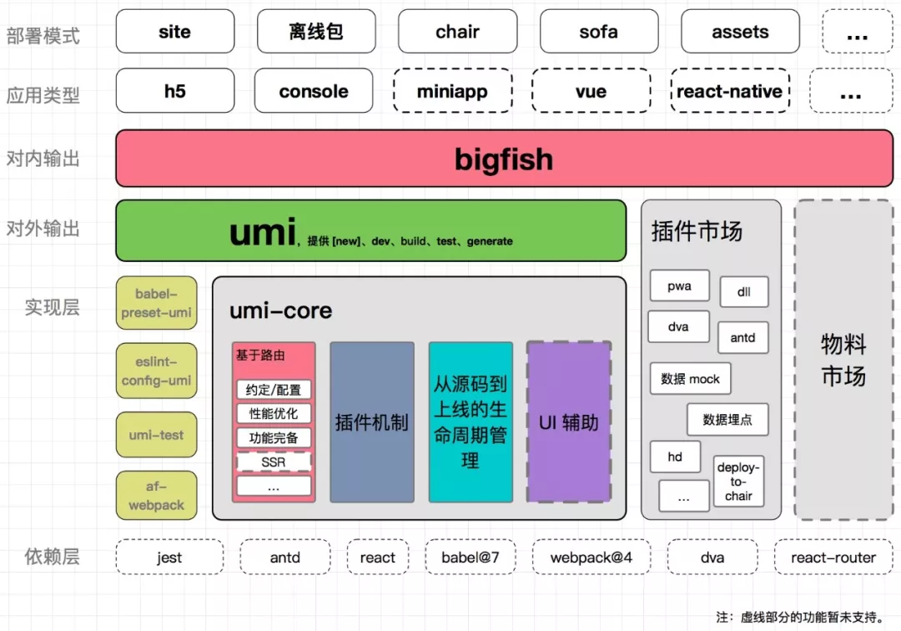

> https://mp.weixin.qq.com/s/WWqsd-SnILUWbiKEnSArDQ

框架和工程化基本探索稳定后，大家就开始思考如何更好的用，更简单的用。目前，各家大厂都在前端技术栈思考如何选型和降低成本，统一技术栈。

Umi 就是一套零配置（约定高于配制），按最佳实践进行开发的，开箱即用的前端框架: React 全家桶 + dva + jest + antd (mobile) + less + eslint。如下图所示：

从上图中可以看出，Umi 已经思考的相对全面，从技术选型、构建到多端输出、性能优化、发布等方面进行了拆分，使得 Umi 的边界更为清晰，是前端最佳实践，目前大多数前端组都是类似的实现方式。说白了，Umi 和 create-react-app（cra）类似，就是现有技术栈的组合，封装细节，让开发者用起来更简单，只写业务代码就可以了。

- 零配置就是默认选型都给你做好了。
- 开箱即用就是技术栈都固化了。
- 约定大于配置，开发模式也固化好了。