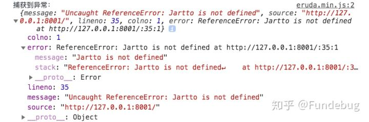
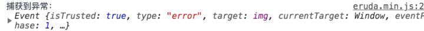
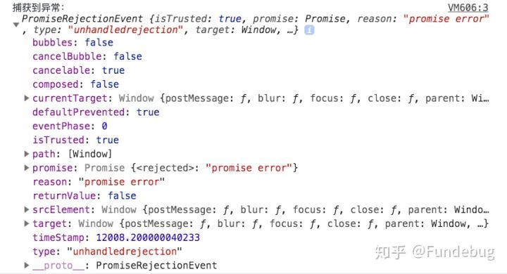

> [如何优雅处理前端异常？](https://zhuanlan.zhihu.com/p/51800345)

## 一、为什么要处理异常？

异常是不可控的，会影响最终的呈现结果，但是我们有充分的理由去做这样的事情。

- 增强用户体验；
- 远程定位问题；
- 未雨绸缪，及早发现问题；
- 无法复线问题，尤其是移动端，机型，系统都是问题；
- 完善的前端方案，前端监控系统；

对于 `JS` 而言，我们面对的仅仅只是异常，异常的出现不会直接导致 `JS` 引擎崩溃，最多只会使当前执行的任务终止。

## 二、需要处理哪些异常？

对于前端来说，我们可做的异常捕获还真不少。总结一下，大概如下：

- `JS` 语法错误、代码异常
- `AJAX` 请求异常
- 静态资源加载异常
- `Promise` 异常
- `Iframe` 异常
- 跨域 Script error
- 崩溃和卡顿

## 三、Try-Catch 的误区

`try-catch` 只能捕获到同步的运行时错误，对语法和异步错误却无能为力，捕获不到。

**1. 同步运行时错误：**

```js
try {
  let name = 'jartto';
  console.log(nam);
} catch(e) {
  console.log('捕获到异常：',e);
}
```

输出：

```js
捕获到异常： ReferenceError: nam is not defined
    at <anonymous>:3:15
```

**2. 不能捕获到语法错误，我们修改一下代码，删掉一个单引号：**

```js
try {
  let name = 'jartto;
  console.log(nam);
} catch(e) {

  console.log('捕获到异常：',e);
}
```

输出：

```js
Uncaught SyntaxError: Invalid or unexpected token
```

不过语法错误在我们开发阶段就可以看到，应该不会顺利上到线上环境。

**3. 异步错误**

```js
try {
  setTimeout(() => {
    undefined.map(v => v);
  }, 1000)
} catch(e) {
  console.log('捕获到异常：',e);
}
```

我们看看日志：

```js
Uncaught TypeError: Cannot read property 'map' of undefined
    at setTimeout (<anonymous>:3:11)
```

并没有捕获到异常，这是需要我们特别注意的地方。

## 四、window.onerror 不是万能的

当 `JS` 运行时错误发生时，`window` 会触发一个 `ErrorEvent` 接口的 `error` 事件，并执行 `window.onerror()`。

```js
/**
* @param {String}  message    错误信息
* @param {String}  source    出错文件
* @param {Number}  lineno    行号
* @param {Number}  colno    列号
* @param {Object}  error  Error对象（对象）
*/

window.onerror = function(message, source, lineno, colno, error) {
   console.log('捕获到异常：',{message, source, lineno, colno, error});
}
```

**1. 首先试试同步运行时错误**

```js
window.onerror = function(message, source, lineno, colno, error) {
// message：错误信息（字符串）。
// source：发生错误的脚本URL（字符串）
// lineno：发生错误的行号（数字）
// colno：发生错误的列号（数字）
// error：Error对象（对象）
console.log('捕获到异常：',{message, source, lineno, colno, error});
}
Jartto;
```

可以看到，我们捕获到了异常：




**2. 再试试语法错误呢？**

```js
window.onerror = function(message, source, lineno, colno, error) {
console.log('捕获到异常：',{message, source, lineno, colno, error});
}
let name = 'Jartto
```

控制台打印出了这样的异常：

```js
Uncaught SyntaxError: Invalid or unexpected token
```

什么，竟然没有捕获到语法错误？

**3. 怀着忐忑的心，我们最后来试试异步运行时错误：**

```js
window.onerror = function(message, source, lineno, colno, error) {
    console.log('捕获到异常：',{message, source, lineno, colno, error});
}
setTimeout(() => {
    Jartto;
});
```

控制台输出了：

```js
捕获到异常： {message: "Uncaught ReferenceError: Jartto is not defined", source: "http://127.0.0.1:8001/", lineno: 36, colno: 5, error: ReferenceError: Jartto is not defined
    at setTimeout (http://127.0.0.1:8001/:36:5)}
```

**4. 接着，我们试试网络请求异常的情况：**

```html
<script>
window.onerror = function(message, source, lineno, colno, error) {
    console.log('捕获到异常：',{message, source, lineno, colno, error});
    return true;
}
</script>

```

我们发现，不论是静态资源异常，或者接口异常，错误都无法捕获到。

补充一点：`window.onerror` 函数只有在返回 `true` 的时候，异常才不会向上抛出，否则即使是知道异常的发生控制台还是会显示 `Uncaught Error: xxxxx`

```js
window.onerror = function(message, source, lineno, colno, error) {
    console.log('捕获到异常：',{message, source, lineno, colno, error});
    return true;
}
setTimeout(() => {
    Jartto;
});
```

控制台就不会再有这样的错误了：

```js
Uncaught ReferenceError: Jartto is not defined
    at setTimeout ((index):36)
```

需要注意：
`onerror` 最好写在所有 `JS` 脚本的前面，否则有可能捕获不到错误；
`onerror` 无法捕获语法错误；

到这里基本就清晰了：在实际的使用过程中，`onerror` 主要是来捕获预料之外的错误，而 `try-catch` 则是用来在可预见情况下监控特定的错误，两者结合使用更加高效。

问题又来了，捕获不到静态资源加载异常怎么办？

## 五、window.addEventListener

当一项资源（如图片或脚本）加载失败，加载资源的元素会触发一个 `Event` 接口的 `error` 事件，并执行该元素上的`onerror()` 处理函数。这些 `error` 事件不会向上冒泡到 `window` ，不过（至少在 `Firefox` 中）能被单一的`window.addEventListener` 捕获。

```html
<scritp>
window.addEventListener('error', (error) => {
    console.log('捕获到异常：', error);
}, true)
</script>

```

控制台输出：



由于网络请求异常不会事件冒泡，因此必须在捕获阶段将其捕捉到才行，但是这种方式虽然可以捕捉到网络请求的异常，但是无法判断 `HTTP` 的状态是 `404` 还是其他比如 `500` 等等，所以还需要配合服务端日志才进行排查分析才可以。

需要注意：

- 不同浏览器下返回的 `error` 对象可能不同，需要注意兼容处理。
- 需要注意避免 `addEventListener` 重复监听。

## 六、Promise Catch

在 `promise` 中使用 `catch` 可以非常方便的捕获到异步 `error` ，这个很简单。

没有写 `catch` 的 `Promise` 中抛出的错误无法被 `onerror` 或 `try-catch` 捕获到，所以我们务必要在 `Promise` 中不要忘记写 `catch` 处理抛出的异常。

解决方案： 为了防止有漏掉的 `Promise` 异常，建议在全局增加一个对 `unhandledrejection` 的监听，用来全局监听`Uncaught Promise Error`。使用方式：

```js
window.addEventListener("unhandledrejection", function(e){
  console.log(e);
});
```

我们继续来尝试一下：

```js
window.addEventListener("unhandledrejection", function(e){
  e.preventDefault()
  console.log('捕获到异常：', e);
  return true;
});
Promise.reject('promise error');
```

可以看到如下输出：



那如果对 `Promise` 不进行 `catch` 呢？

```js
window.addEventListener("unhandledrejection", function(e){
  e.preventDefault()
  console.log('捕获到异常：', e);
  return true;
});
new Promise((resolve, reject) => {
  reject('jartto: promise error');
});
```

嗯，事实证明，也是会被正常捕获到的。

所以，正如我们上面所说，为了防止有漏掉的 `Promise` 异常，建议在全局增加一个对 `unhandledrejection` 的监听，用来全局监听 `Uncaught Promise Error`。

补充一点：如果去掉控制台的异常显示，需要加上：

```js
event.preventDefault();
```

## 七、VUE errorHandler

```js
Vue.config.errorHandler = (err, vm, info) => {
  console.error('通过vue errorHandler捕获的错误');
  console.error(err);
  console.error(vm);
  console.error(info);
}
```

## 十二、错误上报

**1. 通过** **Ajax** **发送数据**

因为 `Ajax` 请求本身也有可能会发生异常，而且有可能会引发跨域问题，一般情况下更推荐使用动态创建 `img` 标签的形式进行上报。

**2. 动态创建** **img** **标签的形式**

```js
function report(error) {
  let reportUrl = 'http://jartto.wang/report';
  new Image().src = `${reportUrl}?logs=${error}`;
}
```

收集异常信息量太多，怎么办？实际中，我们不得不考虑这样一种情况：如果你的网站访问量很大，那么一个必然的错误发送的信息就有很多条，这时候，我们需要设置采集率，从而[减缓服务器的压力](https://link.zhihu.com/?target=https%3A//github.com/happylindz/blog/issues/5)：

```js
Reporter.send = function(data) {
  // 只采集 30%
  if(Math.random() < 0.3) {
    send(data)      // 上报错误信息
  }
}
```

采集率应该通过实际情况来设定，随机数，或者某些用户特征都是不错的选择

## 十三、总结

回到我们开头提出的那个问题，如何优雅的处理异常呢？

- 可疑区域增加 `Try-Catch`
- 全局监控 `JS` 异常 `window.onerror`
- 全局监控静态资源异常 `window.addEventListener`
- 捕获没有 `Catch` 的 `Promise` 异常：`unhandledrejection`
- `VUE errorHandler` 和 `React componentDidCatch`
- 监控网页崩溃：`window` 对象的 `load` 和 `beforeunload`
- 跨域 `crossOrigin` 解决

其实很简单，正如[上文](https://link.zhihu.com/?target=http%3A//jartto.wang/2018/11/20/js-exception-handling/)所说：采用组合方案，分类型的去捕获异常，这样基本 80%-90% 的问题都化于无形。