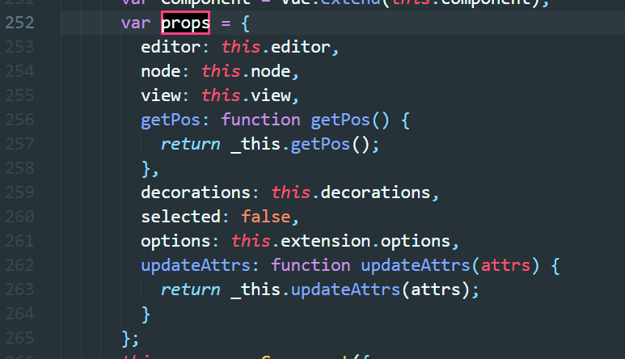

## 动手实现一个可改变图片大小的 tiptap 插件

### 前言

最近在项目中需要使用到富文本编辑器，调研了几款编辑器之后，决定使用 tiptap 。主要原因是项目中对编辑的需求不用特别丰富，tiptap 是一个比较轻量并且拓展性很强的编辑器，是基于 ProseMirror 进行再封装的 vue 版的编辑器。 由于tiptap本身的图片插件不满足项目需求，因此扩展写了一个支持拖拽上传和可拖动改变图片大小的插件。

###  [ProseMirror](https://prosemirror.net/)

介绍 tiptap 之前我们先来了解一 下 ProseMirror。 ProseMirror 是一款配置项极强，模块化的编辑器工具包，它不同于 CKeditor 或者 Quill 是可以开箱即用，它是由无数个小模块组成， 你可自由组装扩展。

这里我们先简单了解一下ProseMirror的几个核心模块：

-  `prosemirror-model` 定义了编辑器的文档模型，用来描述编辑器内容的数据结构；
- `prosemirror-state ` 描述整个文档状态的数据结构， 包括选择(selection) ,以及从一个状态到下一状态的事务系统； 
- `prosemirror-view` 实现了一个用户界面组件，该组件将给定的编辑器状态显示为浏览器中的可编辑元素，并处理用户与该元素的交互。
- `prosemirror-transform`  包含以可记录和重放的方式修改文档的功能，这是状态模块中事务的基础，并使撤消历史记录和协作编辑成为可能。

除此之外还有如 编辑命令（command）, 撤销历史记录， 输入宏等模块。详细可去官网查看。


### [tiptap](https://tiptap.scrumpy.io/)

tiptap  编辑器基于Prosemirror，完全可扩展且无渲染，无渲染组件表示我们可以完全的控住标记样式，组件对我们来说是完全可控, 可以轻松地将自定义节点添加为Vue组件。

#### 数据格式

tiptap的支持将数据保存为原始的HTML字符串，也可以获取文档的可序列化的JSON表示形式。也可以将这两种数据格式回传到编辑器。

#### 安装

```
npm i tiptap
// 安装扩展插件
npm i tiptap-extensions
```

安装上面两个就可以快速的创建一个编辑器：

[官网demo代码](https://github.com/scrumpy/tiptap/blob/master/examples/Components/Routes/Basic/index.vue)效果如下：


首先引入 `Editor, EditorContent, EditorMenuBar`, 再引入需要的编辑功能插件， 初始化注册即可。这里的extension可以按需引入。


#### 存在问题

由于项目可能会有上传图片的需求，但是看了一下tiptap的介绍，image这个扩展的插件并没有提供异步上传图片的功能，也没有提供图片上传的事件。于是便去看了一下image部分源码。


在`extensions.ems.js` 的 872 行，我们可以看到tiptap直接使用` reader.readAsDataURL(image);`保存图片。在864行新建一个image node，插入文档中，然后更新状态。

> `schema` 用于描述一个文档可能出现的节点类型，以及他们的嵌套方式，支持自定义

`FileReader.readAsDataURL`会对文件进行编码，以URL格式的字符串（base64编码）表示文件的内容。使用这个方法虽然可以方便的将图片以字符串的形式存储，但是在Base 64一般的使用场景是小图，经过编码后的文件大小会变大，这个保存方式不大符合我们的需求并且 tiptap 内置的图片功能上传后的图片无法拖动修改大小。

#### 自定义 ResizeImage extension

由于tiptap可扩展性极强，便思考着能否自己实现一个能拖拽异步上传，支持改变图片大小的扩展插件。

#### 新增图片上传事件

tiptap 并没有对外暴露图片上传时间，因此，在 `tiptap.esm.js`第1002行和1004行新增 `upload`事件。


新增了事件，但是要在何时触发，在查看代码的时候发现，在每次编辑器状态发生变化的时候都会去调用`dispatch` 事件更新编辑器的状态，因此，在 `tiptap.esm.js`第1290行的新增如下代码, 判断是否有图片需要上传，有的话则触发 `upload` 事件。


#### 实现

ResizeImage 扩展插件需要实现下面几个方法：


#### name

扩展的名字，调用的名称

#### schema

模式描述了由它组成的节点和标记集，以及它们之间的关系

```js
{
      key: "schema",
      get: function get() {
        return {
          // 行内
          inline: true,
          // 属性
          attrs: {
            src: {},
            alt: {
              default: null
            },
            title: {
              default: null
            },
            width: {default: "100px"},
            maxWidth: {default: "100px"},
          },
          group: 'inline',
          // 拖拽
          draggable: true,
          // 将DOM解析器信息与此节点相关联，可以使用它DOMParser.fromSchema来自动派生解析器。
          parseDOM: [{
            tag: 'img[src][width]',
            getAttrs: function getAttrs(dom) {
              return {
                src: dom.getAttribute('src'),
                title: dom.getAttribute('title'),
                alt: dom.getAttribute('alt'),
                width: dom.getAttribute("width")
              };
            }
          }],
          //定义此类型节点应序列化为DOM / HTML（由使用者）的默认方式 DOMSerializer.fromSchema。
          toDOM: function toDOM(node) {
            const attrs = {style: `width: ${node.attrs.width}`}
            return ["img", {...node.attrs, ...attrs}]
          }
        };
      }
    }
```


#### command 

command 是操作命令，可以将创建node 的操作连接到菜单或者以其他方法暴露给用户。

用command实现用户提供一个图片地址，将图片插入文档。


#### Plugins

Plugins 用于以各种方式扩展编辑器和编辑器状态的行为， 比如动作绑定到键盘输入事件等。拖拽上传就是通过监听drop事件来实现的。

```js
{
      key: "plugins",
      get: function get() {
        return [new Plugin({
          props: {
            handleDOMEvents: {
              drop: function drop(view, event) {
                let hasFiles = event.dataTransfer && event.dataTransfer.files && event.dataTransfer.files.length;

                if (!hasFiles) {
                  return;
                }

                let images = Array.from(event.dataTransfer.files).filter(function (file) {
                  return /image/i.test(file.type);
                });

                if (images.length === 0) {
                  return;
                }

                event.preventDefault();
                let schema = view.state.schema;
                let coordinates = view.posAtCoords({
                  left: event.clientX,
                  top: event.clientY
                });
                // 获取编辑器的宽度，用于限制图片的宽度
                let editorWidth = view.dom.offsetWidth
                images.forEach(function (image) {

                  try {
               
                    let src = window.URL.createObjectURL(image);

                    let img = new Image()
                    img.onload = function () {
                      let width = img.width;
                      let height = img.height;
                      // 高度大于600 则把高度降到600
                      if(height > 600) {
                        width = width * 600 / height
                      }
                      // 新建节点  
                      let node = schema.nodes.resizeImage.create({
                        src: src,
                        title: 'image',
                        width: width > editorWidth ? `${editorWidth}px` : `${width}px`,
                        maxWidth: editorWidth
                      });
                      let transaction = view.state.tr.insert(coordinates.pos, node);
                      // 把图片信息挂到 transaction
                      transaction.file = {image, pos: coordinates.pos, node}
                      // 更新编辑状态， 这里会触发上传图片事件
                      view.dispatch(transaction);
                    };
                    img.src = src;

                  } catch (e) {
                    throw new Error('browser doest not support URL')
                  }
                });
              }
            }
          }
        })];
      }
    }
```

上面通过将DOM事件的钩子，获取到图片的事件，这边会生成图片的本地地址先创建节点视图，等上传完毕后再将本地的临时地址替换成服务器的图片地址。 


#### Node View

这个属性可以用来自定义编辑器绘制文档的方式， 可以自定义更新方式和添加自定义代码的响应事件。

思路： 修改图片大小这个属性就派上了用场。修改图片大小的思路就是，在图片外层增加一层wrapper， 左下角增加一个拖拽的handle，拖拽的时候动态的改变wrapper的大小，内部 img 宽度跟随。


1、组件结构如下（实际是下面代码中的template）：


2、定于 view

我们需要实现view 的 get 方法， 这个会将node渲染成指定的结构。

```js
{
      key: 'view',
      get: function get() {
        return {
          // 定于组件的props 
          props: ['node', 'updateAttrs', 'view', 'getPos'],
          // 组件模板 如上图
          template: "<span ref=\"wrapper\" :style=\"{'width': node.attrs.width}\" class=\"resize-wrapper\"><span ref=\"handle\" @mousedown=\"onmousedown\"  class=\"resize-handle\"></span></span>"
        };
          // 定义组件的方法
          methods: {
            // 响应事件， 改变图片大小  
            onmousedown: function onmousedown(e) {
              e.preventDefault()
              const startX = e.pageX;
           
              const startWidth = parseFloat(this.node.attrs.width.match(/(.+)px/)[1])

              const onMouseMove = (e) => {
                const currentX = e.pageX;

                const diffInPx = currentX - startX
                let w = startWidth + diffInPx
                if(w > this.node.attrs.maxWidth) {
                  w = this.node.attrs.maxWidth
                }
                this.$refs.wrapper.style.width = `${w}px`
              }

              const onMouseUp = (e) => {
                e.preventDefault()

                document.removeEventListener("mousemove", onMouseMove)
                document.removeEventListener("mouseup", onMouseUp)

                const transaction = this.view.state.tr.setNodeMarkup(this.getPos(), null, {
                  src: this.node.attrs.src,
                  width: this.$refs.wrapper.style.width,
                  maxWidth: this.node.attrs.maxWidth,
                });

                this.view.dispatch(transaction)
              }

              document.addEventListener("mousemove", onMouseMove)
              document.addEventListener("mouseup", onMouseUp)
            },
          },
      }
    }
```


- props 的可选参数 （tiptap.esm.js 252行）

  

#### 错误处理

实现完上述功能之后，发现会出现如下错误信息，提示告诉我们所用的vue版本是 runtime-only，使用 template 需要包含编译器。


Vue 的`dist` 目录总共有8个不同的版本，[官网介绍]([https://cn.vuejs.org/v2/guide/installation.html#%E6%9C%AF%E8%AF%AD](https://cn.vuejs.org/v2/guide/installation.html#术语))的很清楚：


在实现 view 的时候我们用到了 template， 因此需要引入完整版才行。

### 


### 总结： 

ProseMirror 真的是一款配置性强，模块化的编辑器，搭乐高式的组合真的是非常适合扩展，tiptap 基于 vue，很适合技术栈是vue的项目，虽然上手可能需要一点时间。 除了上面提到概念以外，还有`Decorations`等，它们使你可以控制视图绘制文档的方式。如果有兴趣可以去了解一下，组装自己的编辑器。


