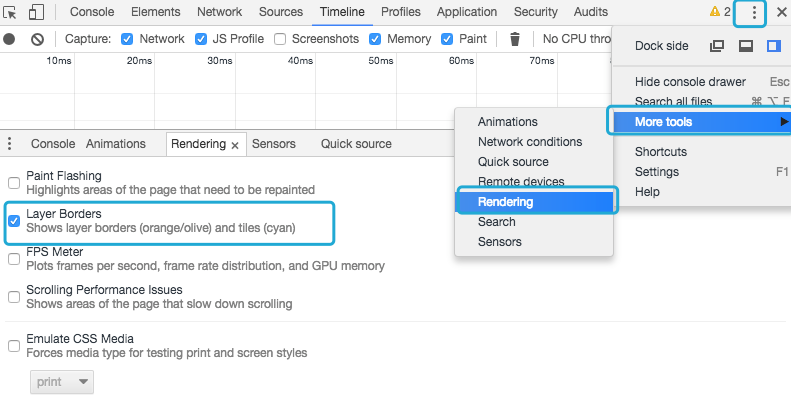
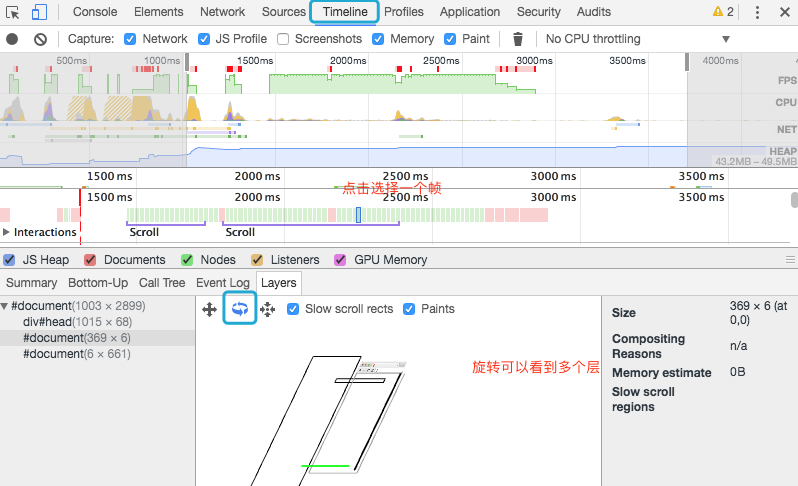

##### **HTTP 优化**

- 减少请求次数
  - 合并请求
- 减少单次请求所花费的时间
  - 压缩文件
- DNS 预解析

##### **浏览器缓存策略**

浏览器缓存机制有四个方面，它们按照获取资源时请求的优先级依次排列如下：

- Memory Cache

- Service Worker Cache

- HTTP Cache

  它又分为强缓存和协商缓存。优先级较高的是强缓存，在命中强缓存失败的情况下，才会走协商缓存。

- Push Cache

##### **CND**

CDN 的核心点有两个，一个是缓存，一个是回源。“缓存”就是说我们把资源 copy 一份到 CDN 服务器上这个过程，“回源”就是说 CDN 发现自己没有这个资源（一般是缓存的数据过期了），转头向根服务器（或者它的上层服务器）去要这个资源的过程。

CDN的域名必须和主业务服务器的域名不一样，要不，同一个域名下面的Cookie各处跑，浪费了性能流量的开销，CDN域名放在不同的域名下，可以完美地避免了不必要的 Cookie 的出现。

##### **图片优化**

- 减少像素点
- 减少每个像素点能够显示的颜色

图片压缩，选择合适图片类型

##### **渲染优化**

**基于渲染流程的CSS优化建议**

- 避免使用通配符，只对需要用到的元素进行选择。
- 关注可以通过继承实现的属性，避免重复匹配重复定义。
- 少用标签选择器。如果可以，用类选择器替代。错误：#dataList li{} 正确：.dataList{}
- 不要画蛇添足，id 和 class 选择器不应该被多余的标签选择器拖后腿。错误：.dataList#title 正确：#title
- 减少嵌套。后代选择器的开销是最高的，因此我们应该尽量将选择器的深度降到最低（最高不要超过三层），尽可能使用类来关联每一个标签元素。

**CSS的阻塞**

CSS 是阻塞的资源。浏览器在构建 CSSOM 的过程中，不会渲染任何已处理的内容。即便 DOM 已经解析完毕了，只要 CSSOM 不 OK，那么渲染这个事情就不 OK。我们将 CSS 放在 head 标签里 和尽快 启用 CDN 实现静态资源加载速度的优化。

**DOM渲染优化**

- 回流：当我们对 DOM 的修改引发了 DOM 几何尺寸的变化（比如修改元素的宽、高或隐藏元素等）时，浏览器需要重新计算元素的几何属性（其他元素的几何属性和位置也会因此受到影响），然后再将计算的结果绘制出来。这个过程就是回流（也叫重排）。
- 重绘：当我们对 DOM 的修改导致了样式的变化、却并未影响其几何属性（比如修改了颜色或背景色）时，浏览器不需重新计算元素的几何属性、直接为该元素绘制新的样式（跳过了上图所示的回流环节）。这个过程叫做重绘。

重绘不一定导致回流，回流一定会导致重绘。回流比重绘做的事情更多，带来的开销也更大。在开发中，要从代码层面出发，尽可能把回流和重绘的次数最小化。

事实上，考虑JS 的运行速度，比 DOM 快得多这个特性。我们减少 DOM 操作的核心思路，就是让 JS 去给 DOM 分压。

在 DOM Fragment 中，**DocumentFragment** 接口表示一个没有父级文件的最小文档对象。它被当做一个轻量版的 Document 使用，用于存储已排好版的或尚未打理好格式的XML片段。因为 DocumentFragment 不是真实 DOM 树的一部分，它的变化不会引起 DOM 树的重新渲染的操作（reflow），且不会导致性能等问题。

如何在不卡住页面的情况下渲染数据，也就是说不能一次性将几万条都渲染出来，而应该一次渲染部分 DOM，那么就可以通过 **requestAnimationFrame** 来每 16 ms 刷新一次。

##### **Event Loop**

上面说了重绘与回流，Event loop，但很多人不知道的是，重绘和回流其实和 Event loop 有关。

- 当 Event loop 执行完 Microtasks 后，会判断 document 是否需要更新。因为浏览器是 60Hz 的刷新率，每 16ms 才会更新一次。
- 然后判断是否有 resize 或者 scroll ，有的话会去触发事件，所以 resize 和 scroll 事件也是至少 16ms 才会触发一次，并且自带节流功能。
- 判断是否触发了 media query
- 更新动画并且发送事件
- 判断是否有全屏操作事件
- 执行 requestAnimationFrame 回调
- 执行 IntersectionObserver 回调，该方法用于判断元素是否可见，可以用于懒加载上，但是兼容性不好
- 更新界面
- 以上就是一帧中可能会做的事情。如果在一帧中有空闲时间，就会去执行 requestIdleCallback 回调。

#####**节流与防抖**

>  [性能优化](https://mp.weixin.qq.com/s?__biz=MzAxODE2MjM1MA==&mid=2651556829&idx=1&sn=6ccc38f52664b4ad64598b2df2b9df73&chksm=80255c1cb752d50ac2a74ee170e0e2525ef1138ffbe022afaed1c1b2161e9e5ed065cb6c6a76&mpshare=1&scene=1&srcid=0906Kmz7ITDHDRBDqb8dn4Kx&sharer_sharetime=1567737908829&sharer_shareid=01a8ec34179fc6c8c19ad42476f5b9a9&key=c4663b7b314f3cd8582b115bd68b5df00ded0f0fae6001da3f0f8e238bc71b42670156e21b49a92f42d83139bafe6c4a28a2847fb981896cd05bf55711a287526fc891e100d561b97372119039619f00&ascene=1&uin=MjI5NzIxOTgyNg%3D%3D&devicetype=Windows+10&version=62060833&lang=zh_CN&pass_ticket=FTew475B4FOPlZStOT4VLIuOm567ewOOeFuXCVSxInr0rEfZh%2F4%2BTmNMDZ2orK%2Fm)

##### 一、如何开启 GPU 加速？

大多数设备的刷新频率是60 次/秒 (16ms) 也就说是浏览器对每一帧画面的渲染工作要在 16ms 内完成，超出这个时间，页面的渲染就会出现卡顿现象，影响用户体验。

浏览器在一帧里面，会依次执行以下这些动作。减少或者避免 layout，paint 可以让**页面不卡顿，动画效果更加流畅。**

1. JavaScript：JavaScript 实现动画效果，DOM 元素操作等。
2. Style（计算样式）：确定每个 DOM 元素应该应用什么 CSS 规则。
3. Layout（布局）：计算每个 DOM 元素在最终屏幕上显示的大小和位置。由于 web 页面的元素布局是相对的，所以其中任意一个元素的位置发生变化，都会联动的引起其他元素发生变化，这个过程叫 reflow。
4. Paint（绘制）：在多个层上绘制 DOM 元素的的文字、颜色、图像、边框和阴影等。
5. Composite（渲染层合并）：按照合理的顺序合并图层然后显示到屏幕上。

##### 利用 GPU 加速优先使用渲染层合并属性，避免 layout，paint。

##### 二. GPU 是什么，如何用 Chrome devtools 进行分析 debug？

###### 浏览器渲染一个页面大致是按照下面这个步骤执行。

1. **获取 DOM 并将其分割为多个层(RenderLayer)**
2. **将每个层栅格化，并独立的绘制进位图中**
3. **将这些位图作为纹理上传至 GPU**
4. **复合多个层来生成最终的屏幕图像(终极 layer )。**

###### Chrome 开启查看 renderlayer

1. 黄色边框：有动画 3d 变换的元素，表示放到了一个新的复合层（composited layer）中渲染
2. 蓝色的栅格：这些分块可以看作是比层更低一级的单位，这些区域就是 RenderLayer
   **打开一个页面，如果该页面的黄色边框很多，那么肯定要查看一下原因了**

###### Chrome 查看 layer

- 打开 timeline 进行录制，选中 timeline 的某一帧，然后选择下面的 layer ，可以左右拖动该模块出现 3d。
  我们可以看到一个页面实际是像下面一样组成的
  
- 从上图不难理解，虽然我们最终在浏览器上看到的只是一个复印版，即最终只有一个层。类似于PhotoShop软件中的“图层”概念，最后合并所有可视图层，输出一张图片到屏幕上。但实际上一些dom会因为一些规则被提升成独立的层**（开启 GPU 加速），一旦被独立出来之后，便不会再影响其他dom的布局，因为它改变之后，只是“贴上”了页面。**

根据这个优点，我们可以把页面中一些布局经常变换的dom（动画）提升到独立的层。那么，浏览器在之后的 16ms 中，只需进行下面的几个步骤。

#### 三. 如何开启 GPU 加速？

**目前下面这些因素都会引起Chrome创建合成层：**

1. 3D 或透视变换(perspective，transform) CSS 属性
2. 使用加速视频解码的video元素
3. 拥有 3D (WebGL) 上下文或加速的 2D 上下文的 canvas 元素
4. 混合插件(如 Flash)
5. 对自己的 opacity 做 CSS 动画或使用一个动画 webkit 变换的元素
6. 拥有加速 CSS 过滤器的元素
7. 元素A有一个 z-index 比自己小的元素B，且元素B是一个合成层（换句话说就是该元素在复合层上面渲染），则元素A会提升为合成层

> https://aotu.io/notes/2017/04/11/GPU/?o2src=juejin&o2layout=compat