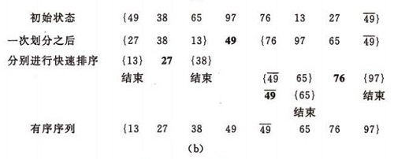
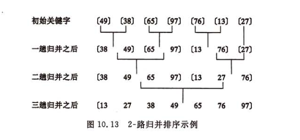

https://github.com/francistao/LearningNotes/blob/master/Part3/Algorithm/Sort/%E9%9D%A2%E8%AF%95%E4%B8%AD%E7%9A%84%2010%20%E5%A4%A7%E6%8E%92%E5%BA%8F%E7%AE%97%E6%B3%95%E6%80%BB%E7%BB%93.md

http://jsdo.it/norahiko/oxIy/fullscreen

http://bubkoo.com/2014/01/17/sort-algorithm/archives/

排序算法一般分为：

1. 内部排序(In-place sort)  
   不占用额外内存或者占用常数内存，如：插入排序、选择排序、冒泡排序、堆排序、快速排序。

2. 外部排序(Out-place sort)  
   因为排序数据大，可用内存一次不能容纳所有排序记录，排序过程中需要访问外存，如：归并排序、计数排序、基数排序、桶排序。

也分为

1. 稳定的排序(stable sort)  
   插入排序、冒泡排序、归并排序、计数排序、基数排序、桶排序。
2. 不稳定的排序(unstable sort)  
   择排序、快速排序、堆排序

算法时间复杂度  


### 直接插入排序

原理是在已排序序列从后往前扫描，找到相应的位置并插入


> 如果排序时碰到相等的元素，比较后会把相等的元素放在后面，所以这两个相等的元素之间的前后顺序没有改变，排序是稳定的。

> 如果比较操作的代价比交换操作大的话，可以采用二分查找法来减少比较操作的数目。直接插入排序算法的优化算法有：二分插入排序，2-路插入排序。

```javascript
function insertionSort(array) {
  var length = array.length,
    i,
    j,
    temp
  for (i = 1; i < length; i++) {
    temp = array[i]
    for (j = i; j >= 0; j--) {
      if (array[j - 1] > temp) {
        array[j] = array[j - 1]
      } else {
        array[j] = temp
        break
      }
    }
  }
  return array
}
```

### 选择排序

基本原理是在要排序的一组数中，选出最小（或者最大）的一个数与第 1 个位置的数交换；然后在剩下的数当中再找最小（或者最大）的与第 2 个位置的数交换，依次类推，直到第 n-1 个元素（倒数第二个数）和第 n 个元素（最后一个数）比较为止。


```JavaScript
function selectionSort(array) {
  var length = array.length,
      i,
      j,
      minIndex,
      minValue,
      temp;
  for (i = 0; i < length - 1; i++) {
    minIndex = i;
    minValue = array[minIndex];
    for (j = i + 1; j < length; j++) {
      if (array[j] < minValue) {
        minIndex = j;
        minValue = array[minIndex];
      }
    }
    // 交换位置
    temp = array[i];
    array[i] = minValue;
    array[minIndex] = temp;
  }
  return array
}
```

#### 简单排序的改进——二元选择排序

简单选择排序，每趟循环只能确定一个元素排序后的定位。我们可以考虑改进为每趟循环确定两个元素（当前趟最大和最小记录）的位置,从而减少排序所需的循环次数。改进后对 n 个数据进行排序，最多只需进行[n/2]趟循环即可。

### 堆排序（Heap Sort）

堆排序是借助堆来实现的选择排序，思想同简单的选择排序，以下以大顶堆为例。注意：如果想升序排序就使用大顶堆，反之使用小顶堆。原因是堆顶元素需要交换到序列尾部。
首先，实现堆排序需要解决两个问题：

1. 如何由一个无序序列键成一个堆？

2. 如何在输出堆顶元素之后，调整剩余元素成为一个新的堆？

第一个问题，可以直接使用线性数组来表示一个堆，由初始的无序序列建成一个堆就需要自底向上从第一个非叶元素开始挨个调整成一个堆。

第二个问题，怎么调整成堆？首先是将堆顶元素和最后一个元素交换。然后比较当前堆顶元素的左右孩子节点，因为除了当前的堆顶元素，左右孩子堆均满足条件，这时需要选择当前堆顶元素与左右孩子节点的较大者（大顶堆）交换，直至叶子节点。我们称这个自堆顶自叶子的调整成为筛选。

从一个无序序列建堆的过程就是一个反复筛选的过程。若将此序列看成是一个完全二叉树，则最后一个非终端节点是 n/2 取底个元素，由此筛选即可。举个栗子：

49,38,65,97,76,13,27,49 序列的堆排序建初始堆和调整的过程如下：


```JavaScript
function heapSort(array) {
  function swap(array, i, j) {
    var temp = array[i];
    array[i] = array[j];
    array[j] = temp;
  }
  function maxHeapify(array, index, heapSize) {
    var iMax,
      iLeft,
      iRight;
    while (true) {
      iMax = index;
      iLeft = 2 * index + 1;
      iRight = 2 * (index + 1);
      if (iLeft < heapSize && array[index] < array[iLeft]) {
        iMax = iLeft;
      }
      if (iRight < heapSize && array[iMax] < array[iRight]) {
        iMax = iRight;
      }
      if (iMax != index) {
        swap(array, iMax, index);
        index = iMax;
      } else {
        break;
      }
    }
  }
  function buildMaxHeap(array) {
    var i,
      iParent = Math.floor(array.length / 2) - 1;
    for (i = iParent; i >= 0; i--) {
      maxHeapify(array, i, array.length);
    }
  }
  function sort(array) {
    buildMaxHeap(array);
    for (var i = array.length - 1; i > 0; i--) {
      swap(array, 0, i);
      maxHeapify(array, 0, i);
    }
    return array;
  }
  return sort(array);
}
```

### 冒泡排序（Bubble Sort）

大体思想就是通过与相邻元素的比较和交换来把小的数交换到最前面。
冒泡排序（Bubble Sort，台湾译为：泡沫排序或气泡排序）是一种简单的排序算法。它重复地走访过要排序的数列，一次比较两个元素，如果他们的顺序错误就把他们交换过来。走访数列的工作是重复地进行直到没有再需要交换，也就是说该数列已经排序完成。这个算法的名字由来是因为越小的元素会经由交换慢慢“浮”到数列的顶端。

以数组 arr = [5, 1, 4, 2, 8] 为例说明，加粗的数字表示每次循环要比较的两个数字：

第一次外循环

( 5 1 4 2 8 ) → ( 1 5 4 2 8 )， 5 > 1 交换位置  
( 1 5 4 2 8 ) → ( 1 4 5 2 8 )， 5 > 4 交换位置  
( 1 4 5 2 8 ) → ( 1 4 2 5 8 )， 5 > 2 交换位置  
( 1 4 2 5 8 ) → ( 1 4 2 5 8 )， 5 < 8 位置不变

第二次外循环（除开最后一个元素 8，对剩余的序列）

( 1 4 2 5 8 ) → ( 1 4 2 5 8 )， 1 < 4 位置不变  
( 1 4 2 5 8 ) → ( 1 2 4 5 8 )， 4 > 2 交换位置  
( 1 2 4 5 8 ) → ( 1 2 4 5 8 )， 4 < 5 位置不变

第三次外循环（除开已经排序好的最后两个元素，可以注意到上面的数组其实已经排序完成，但是程序本身并不知道，所以还要进行后续的循环，直到剩余的序列为 1）

( 1 2 4 5 8 ) → ( 1 2 4 5 8 )  
( 1 2 4 5 8 ) → ( 1 2 4 5 8 )

第四次外循环（最后一次）  
( 1 2 4 5 8 ) → ( 1 2 4 5 8 )

```javascript
function bubbleSort(array) {
  var length = array.length,
    i,
    j,
    temp
  for (i = length - 1; 0 < i; i--) {
    for (j = 0; j < i; j++) {
      if (array[j] > array[j + 1]) {
        temp = array[j]
        array[j] = array[j + 1]
        array[j + 1] = temp
      }
    }
  }
  return array
}
```

### 快速排序

快速排序又称划分交换排序（partition-exchange sort），使用分治法（Divide and conquer）策略来把一个序列（list）分为两个子序列（sub-lists）。其算法描述为：

1. 从数列中挑出一个元素，称为"基准"（pivot）。
2. 重新排序数列，所有比基准值小的元素摆放在基准前面，所有比基准值大的元素摆在基准后面（相同的数可以到任一边）。在这个分区结束之后，该基准就处于数列的中间位置。这个称为分区（partition）操作。
3. 递归地（recursively）把小于基准值元素的子数列和大于基准值元素的子数列排序。




```JavaScript
function quickSort(arr) {　　
    if (arr.length <= 1) {
        return arr;
    }　　
    var pivotIndex = Math.floor(arr.length / 2);　　
    var pivot = arr.splice(pivotIndex, 1)[0];　　
    var left = [];　　
    var right = [];　　
    for (var i = 0; i < arr.length; i++) {　　　　
        if (arr[i] < pivot) {　　　　　　
            left.push(arr[i]);　　　　
        } else {　　　　　　
            right.push(arr[i]);　　　　
        }　　
    }　　
    return quickSort(left).concat([pivot], quickSort(right));
}
```

### 归并排序（Merge Sort）

归并（Merge）排序法是将两个（或两个以上）有序表合并成一个新的有序表，即把待排序序列分为若干个子序列，每个子序列是有序的。然后再把有序子序列合并为整体有序序列。

1. 将序列每相邻两个数字进行归并操作，形成 floor(n/2)个序列，排序后每个序列包含两个元素
2. 将上述序列再次归并，形成 floor(n/4)个序列，每个序列包含四个元素
3. 重复步骤 2，直到所有元素排序完毕



```javascript
function mergeSort(array) {
  function sort(array, first, last) {
    first = first === undefined ? 0 : first
    last = last === undefined ? array.length - 1 : last
    if (last - first < 1) {
      return
    }
    var middle = Math.floor((first + last) / 2)
    sort(array, first, middle)
    sort(array, middle + 1, last)
    var f = first,
      m = middle,
      i,
      temp
    while (f <= m && m + 1 <= last) {
      if (array[f] >= array[m + 1]) {
        // 这里使用了插入排序的思想
        temp = array[m + 1]
        for (i = m; i >= f; i--) {
          array[i + 1] = array[i]
        }
        array[f] = temp
        m++
      } else {
        f++
      }
    }
    return array
  }
  return sort(array)
}
```
