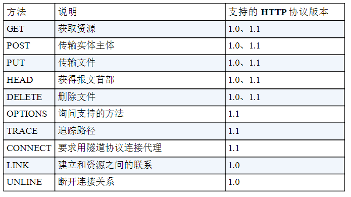
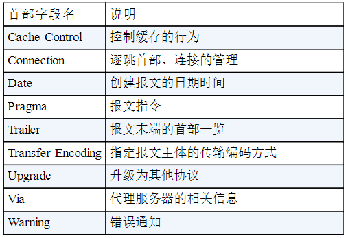
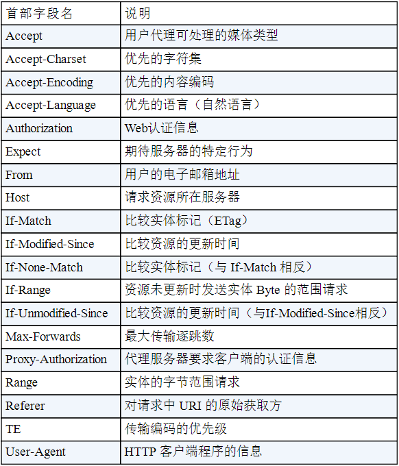
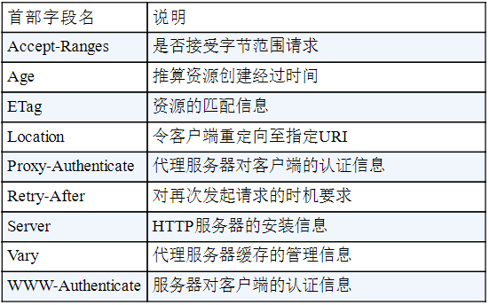
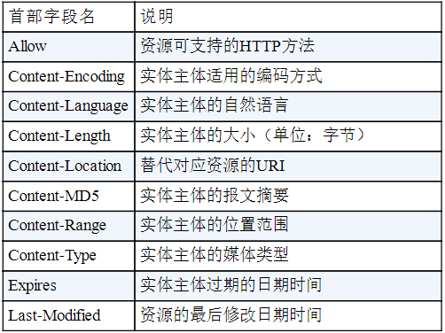
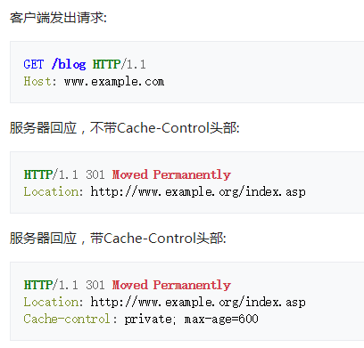
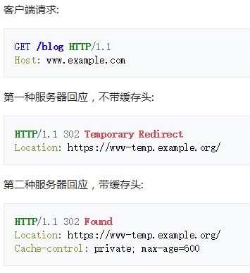
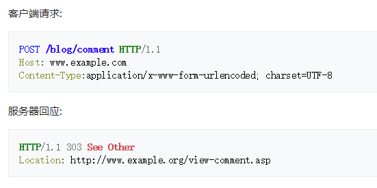
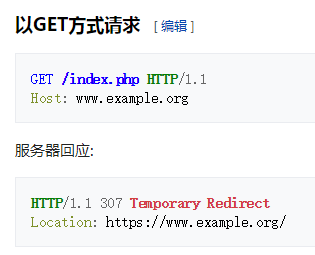
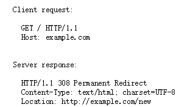

# HTTP

HTTP 是 Hyper Text Transfer Protocol（超文本传输协议）的缩写。它是一个应用层协议，由请求和响应构成，是一个标准的客户端服务器模型。HTTP 是一个无状态的协议。

### HTTP 协议的特点

- 无连接
  - 限制每次连接只处理一个请求
- 无状态
  - 协议对于事务处理没有记忆能力。
- 简单快速
  - 客户向服务器请求服务时，只需传送请求方法和路径。
- 灵活
  - HTTP 允许传输任意类型的数据对象。正在传输的类型由 Content-Type 加以标记。

### 请求报文
 - 请求行
   - 请求类型
   - 要访问的资源
   - HTTP 协议版本号
 - 请求头
   - 用来说明服务器要使用的附加信息（一些键值对）
   - 例如：User-Agent、 Accept、Content-Type、Connection
 - 空行
   - 分割请求头与请求体
 - 请求体
   - 可以添加任意的其他数据

### 响应报文
 - 状态行
   - 状态码
   - 状态消息 
   - HTTP 协议版本号
 - 消息报头
   - 说明客户端要使用的一些附加信息
   - 如：Content-Type、charset、响应的时间
 - 响应正文
   - 返回给客户端的文本信息 

### HTTP 方法

 - GET
   - 获取资源
 - POST
   - 传输资源
 - PUT
   - 更新资源
 - DELETE
   - 删除资源
 - HEAD
   - 获取报文首部

### Post 和 Get 的区别

 - GET 在浏览器回退时是无害的，而 POST 会再次提交
 - Get 请求能缓存，Post 不能
 - Post 相对 Get 相对安全一些，因为 Get 请求都包含在 URL 中，而且会被浏览器保存记录，Post 不会。但是再抓包的情况下都是一样的。
 - Post 可以通过 request body 来传输比 Get 更多的数据 
 - URL 有长度限制，会影响 Get 请求，但是这个长度限制是浏览器规定的
 - Post 支持更多的编码类型且不对数据类型限制
 - POST，浏览器先发送 header，服务器响应 100 continue，浏览器再发送 data，服务器响应 200 ok（返回数据)

先引入副作用和幂等的概念。
副作用指对服务器上的资源做改变，搜索是无副作用的，注册是副作用的。
幂等指发送 M 和 N 次请求（两者不相同且都大于 1），服务器上资源的状态一致，比如注册 10 个和 11 个帐号是不幂等的，对文章进行更改 10 次和 11 次是幂等的。
在规范的应用场景上说，Get 多用于无副作用，幂等的场景，例如搜索关键字。Post 多用于副作用，不幂等的场景，例如注册。

### 常见状态码

#### 1XX 指示信息
表示请求已接收，继续处理

#### 2XX 成功
 - **200** OK
 - 204 No content，表示请求成功，但响应报文不含实体的主体部分
 - 205 Reset Content，表示请求成功，但响应报文不含实体的主体部分，但是与 204 响应不同在于要求请求方重置内容
 - **206** Partial Content，进行范围请求

- **200 OK**：请求成功，请求所希望的响应头或数据体将随此响应返回
- **201 Created**：
- **202 Accepted**：
- **203 Non-Authoritative Information**：
- **204 No Content**：
- **205 Reset Content**：
- **206 Partial Content**：

#### 3XX 重定向
 - **301** 永久性重定向，表示资源已被分配了新的 URL
 - **302** 临时性重定向，表示资源临时被分配了新的 URL
 - 303 表示资源存在着另一个 URL，应使用 GET 方法获取资源
 - **304** 未修改，重定位到浏览器。自从上次请求后，请求的网页未修改过。服务器返回此响应时，不会返回网页内容。如果网页自请求者上次请求后再也没有更改过，您应将服务器配置为返回此响应（称为 If-Modified-Since HTTP 标头）。服务器可以告诉 Googlebot 自从上次抓取后网页没有变更，进而节省带宽和开销。
 - 307 临时重定向，和 302 含义类似，但是期望客户端保持请求方法不变向新的地址发出请求

- **300 Multiple Choices**：
- **301 Moved Permanently**：
- **302 Found**：
- **303 See Other**：
- **304 Not Modified**：
- **305 Use Proxy**：
- **306 （unused）**：
- **307 Temporary Redirect**：

#### 4XX 客户端错误
 - **404** 在服务器上没有找到请求的资源
 - **403** forbidden，表示对请求资源的访问被服务器拒绝
 - 400 请求报文存在语法错误
 - 401  表示发送的请求需要有通过 HTTP 认证的认证信息

- **400 Bad Request**:
- **401 Unauthorized**:
- **402 Payment Required**:
- **403 Forbidden**:
- **404 Not Found**:
- **405 Method Not Allowed**:
- **406 Not Acceptable**:
- **407 Proxy Authentication Required**:
- **408 Request Timeout**:
- **409 Conflict**:
- **410 Gone**:
- **411 Length Required**:
- **412 Precondition Failed**:
- **413 Request Entity Too Large**:
- **414 Request-URI Too Long**:
- **415 Unsupported Media Type**:
- **416 Requested Range Not Satisfiable**:
- **417 Expectation Failed**:

#### 5XX 服务器错误
 - **500** 表示服务器端在执行请求时发生了错误
 - 501 表示服务器不支持当前请求所需要的某个功能
 - **503** 表明服务器暂时处于超负载或正在停机维护，无法处理请求
 - **500 Internal Server Error**:
- **501 Not Implemented**:
- **502 Bad Gateway**:
- **503 Service Unavailable**:
- **504 Gateway Timeout**:
- **505 HTTP Version Not Supported**:

### 常见首部字段

**HTTP/1.1 首部字段一览**

通用首部字段：

请求首部字段：

响应首部字段：

实体首部字段：

### HTTP 持久连接（HTTP1.1 支持）

HTTP 协议采用“请求 - 应答”模式，并且 HTTP 是基于 TCP 进行连接的。普通模式（非 keep-alive）时，每个请求或应答都需要建立一个连接，完成之后立即断开。

当使用`Conection: keep-alive`模式（又称持久连接、连接重用）时，keep-alive 使客户端道服务器端连接持续有效，即不关闭底层的 TCP 连接，当出现对服务器的后继请求时，keep-alive 功能避免重新建立连接。

### HTTP 管线化 （HTTP1.1 支持）

管线化后，请求和响应不再是依次交替的了。他可以支持一次性发送多个请求，并一次性接收多个响应。

 - 只有 get 与 head 请求可以进行管线化，POST 有限制
 - 初次创建连接时不应该启动管线机制，因为服务器不一定支持该协议

### HTTP 数据协商
在客户端向服务端发送请求的时候，客户端会申明可以接受的数据格式和数据相关的一些限制是什么样的；服务端在接受到这个请求时他会根据这个信息进行判断到底返回怎样的数据。

#### 请求
 - Accept 
   - 在请求中使用 Accept 可申明想要的数据格式
 - Accept-Encoding
   - 告诉服务端使用什么的方式来进行压缩
   - 例如：gzip、deflate、br
 - Accept-Language
   - 描述语言信息
 - User-Agent
   - 用来描述客户端浏览器相关信息
   - 可以用来区分 PC 端页面和移动端页面

#### 响应
 - Content-Type
   - 对应 Accept，从请求中的 Accept 支持的数据格式中选一种来返回
 - Content-Encoding
   - 对应 Accept-Encoding，指服务端到底使用的是那种压缩方式
 - Content-Language
   - 对应 Accept-Language

#### form 表单中 enctype 数据类型
 - `application/x-www-form-urlencoded`
   - key=value&key=value 格式
 - `multipart/form-data`
   - 用于提交文件
   - multipart 表示请求是由多个部分组成（因为上传文件的时候文件不能以字符串形式提交，需要单独分出来）
   - boundary 用来分隔不同部分
 - `text/plain`

### HTTP Redirect 重定向
 - 302 暂时重定向
   - 浏览器每次访问都要先去目标网址访问，再重定向到新的网址
 - 301 永久重定向
   - 当浏览器收到的 HTTP 状态码为 301 时，下次访问对应网址就直接调整到新的网址，不会再访问原网址

### [HTTP CSP 内容安全策略](https://developer.mozilla.org/zh-CN/docs/Web/Security/CSP)

CSP Content-Security-Policy
 - 限制资源获取
 - 报告资源获取越权

例子：
 - `Content-Security-Policy: default-src http: https:` 表示只允许通过 http、https 的方式加载资源
 - `'Content-Security-Policy': 'default-src' \'self\'; form-action\'self\' '` 表示只能加载本域下的资源，只能向本域发送表单请求

#### TLS 握手过程如下图

1. 客户端发送一个随机值，需要的协议和加密方式
2. 服务端收到客户端的随机值，自己也产生一个随机值，并根据客户端需求的协议和加密方式来使用对应的方式，发送自己的证书（如果需要验证客户端证书需要说明）
3. 客户端收到服务端的证书并验证是否有效，验证通过会再生成一个随机值，通过服务端证书的公钥去加密这个随机值并发送给服务端，如果服务端需要验证客户端证书的话会附带证书
4. 服务端收到加密过的随机值并使用私钥解密获得第三个随机值，这时候两端都拥有了三个随机值，可以通过这三个随机值按照之前约定的加密方式生成密钥，接下来的通信就可以通过该密钥来加密解密。
通过以上步骤可知，在 TLS 握手阶段，两端使用非对称加密的方式来通信，但是因为非对称加密损耗的性能比对称加密大，所以在正式传输数据时，两端使用对称加密的方式通信。

## HTTP2
HTTP 2.0 相比于 HTTP 1.X，可以说是大幅度提高了 web 的性能。

在 HTTP 1.X 中，为了性能考虑，我们会引入雪碧图、将小图内联、使用多个域名等等的方式。这一切都是**因为浏览器限制了同一个域名下的请求数量**，当页面中需要请求很多资源的时候，队头阻塞（Head of line blocking）会导致在达到最大请求数量时，剩余的资源需要等待其他资源请求完成后才能发起请求。

### 二进制传输
HTTP 2.0 中所有加强性能的核心点在于此。在之前的 HTTP 版本中，我们是通过文本的方式传输数据。在 HTTP 2.0 中引入了新的编码机制，所有传输的数据都会被分割，并采用二进制格式编码。

### 多路复用
在 HTTP 2.0 中，有两个非常重要的概念，分别是帧（frame）和流（stream）。

帧代表着最小的数据单位，每个帧会标识出该帧属于哪个流，流也就是多个帧组成的数据流。

**多路复用，就是在一个 TCP 连接中可以存在多条流。**换句话说，也就是可以发送多个请求，对端可以通过帧中的标识知道属于哪个请求。通过这个技术，可以避免 HTTP 旧版本中的队头阻塞问题，极大的提高传输性能。

### Header 压缩

在 HTTP 1.X 中，我们使用文本的形式传输 header，在 header 携带 cookie 的情况下，可能每次都需要重复传输几百到几千的字节。

在 HTTP 2.0 中，使用了 HPACK 压缩格式对传输的 header 进行编码，减少了 header 的大小。并在两端维护了索引表，用于记录出现过的 header ，后面在传输过程中就可以传输已经记录过的 header 的键名，对端收到数据后就可以通过键名找到对应的值。

### 服务端 Push
在 HTTP 2.0 中，服务端可以在客户端某个请求后，主动推送其他资源。

可以想象以下情况，某些资源客户端是一定会请求的，这时就可以采取服务端 push 的技术，提前给客户端推送必要的资源，这样就可以相对减少一点延迟时间。当然在浏览器兼容的情况下你也可以使用 prefetch。

1、服务端需要配置，根据请求返回相应的资源

2、http link 头

### HTTP 首部

|     通用字段      |                       作用                       |
| :---------------: | :----------------------------------------------: |
|   Cache-Control   |                  控制缓存的行为                  |
|    Connection     | 浏览器想要优先使用的连接类型，比如  `keep-alive` |
|       Date        |                   创建报文时间                   |
|      Pragma       |                     报文指令                     |
|        Via        |                代理服务器相关信息                |
| Transfer-Encoding |                   传输编码方式                   |
|      Upgrade      |                要求客户端升级协议                |
|      Warning      |               在内容中可能存在错误               |

|      请求字段       |                作用                |
| :-----------------: | :--------------------------------: |
|       Accept        |        能正确接收的媒体类型        |
|   Accept-Charset    |         能正确接收的字符集         |
|   Accept-Encoding   |      能正确接收的编码格式列表      |
|   Accept-Language   |        能正确接收的语言列表        |
|       Expect        |        期待服务端的指定行为        |
|        From         |           请求方邮箱地址           |
|        Host         |            服务器的域名            |
|      If-Match       |          两端资源标记比较          |
|  If-Modified-Since  | 本地资源未修改返回 304（比较时间） |
|    If-None-Match    | 本地资源未修改返回 304（比较标记） |
|     User-Agent      |             客户端信息             |
|    Max-Forwards     |    限制可被代理及网关转发的次数    |
| Proxy-Authorization |      向代理服务器发送验证信息      |
|        Range        |        请求某个内容的一部分        |
|       Referer       |    表示浏览器所访问的前一个页面    |
|         TE          |            传输编码方式            |

|      响应字段      |            作用            |
| :----------------: | :------------------------: |
|   Accept-Ranges    |   是否支持某些种类的范围   |
|        Age         | 资源在代理缓存中存在的时间 |
|        ETag        |          资源标识          |
|      Location      |   客户端重定向到某个 URL   |
| Proxy-Authenticate |  向代理服务器发送验证信息  |
|       Server       |         服务器名字         |
|  WWW-Authenticate  |   获取资源需要的验证信息   |

|     实体字段     |               作用               |
| :--------------: | :------------------------------: |
|      Allow       |        资源的正确请求方式        |
| Content-Encoding |          内容的编码格式          |
| Content-Language |          内容使用的语言          |
|  Content-Length  |        request body 长度         |
| Content-Location |        返回数据的备用地址        |
|   Content-MD5    | Base64 加密格式的内容 MD5 检验值 |
|  Content-Range   |          内容的位置范围          |
|   Content-Type   |          内容的媒体类型          |
|     Expires      |          内容的过期时间          |
|  Last_modified   |        内容的最后修改时间        |

### [详解重定向（HTTP状态码301/302/303/307/408）附例子](https://www.cnblogs.com/wuguanglin/p/redirect.html)

**301 Moved Permanently（永久移动）**

被请求的资源已永久移动到新位置，并且将来任何对此资源的引用都应该使用本响应返回的若干个URI之一。如果可能，拥有链接编辑功能的客户端应当自动把请求的地址修改为从服务器反馈回来的地址。除非额外指定，否则这个响应也是可缓存的。新的永久性的URI应当在响应的Location域中返回。除非这是一个HEAD请求，否则响应的实体中应当包含指向新的URI的超链接及简短说明。如果这不是一个GET或者HEAD请求，因此浏览器禁止自动进行重定向，除非得到用户的确认，因为请求的条件可能因此发生变化。注意：对于某些使用HTTP/1.0协议的浏览器，当它们发送的POST请求得到了一个301响应的话，接下来的重定向请求将会变成GET方式。

**302 Found（发现）**

要求客户端执行临时重定向（原始描述短语为“Moved Temporarily”）。由于这样的重定向是临时的，客户端应当继续向原有地址发送以后的请求。只有在Cache-Control或Expires中进行了指定的情况下，这个响应才是可缓存的。新的临时性的URI应当在响应的Location域中返回。除非这是一个HEAD请求，否则响应的实体中应当包含指向新的URI的超链接及简短说明。如果这不是一个GET或者HEAD请求，那么浏览器禁止自动进行重定向，除非得到用户的确认，因为请求的条件可能因此发生变化。注意：虽然RFC 1945和RFC 2068规范不允许客户端在重定向时改变请求的方法，但是很多现存的浏览器将302响应视作为303响应，并且使用GET方式访问在Location中规定的URI，而无视原先请求的方法。因此状态码303和307被添加了进来，用以明确服务器期待客户端进行何种反应。

**303 See Other（查看其他）**

对应当前请求的响应可以在另一个URI上被找到，当响应于POST（或PUT / DELETE）接收到响应时，客户端应该假定服务器已经收到数据，并且应该使用单独的GET消息发出重定向。这个方法的存在主要是为了允许由脚本激活的POST请求输出重定向到一个新的资源。这个新的URI不是原始资源的替代引用。同时，303响应禁止被缓存。当然，第二个请求（重定向）可能被缓存。新的URI应当在响应的Location域中返回。除非这是一个HEAD请求，否则响应的实体中应当包含指向新的URI的超链接及简短说明。注意：许多HTTP/1.1版以前的浏览器不能正确理解303状态。如果需要考虑与这些浏览器之间的互动，302状态码应该可以胜任，因为大多数的浏览器处理302响应时的方式恰恰就是上述规范要求客户端处理303响应时应当做的。

**307 Temporary Redirect（临时重定向）**

在这种情况下，请求应该与另一个URI重复，但后续的请求应仍使用原始的URI。 与302相反，当重新发出原始请求时，不允许更改请求方法。 例如，应该使用另一个POST请求来重复POST请求

**308 Permanent Redirect （永久重定向）**

请求和所有将来的请求应该使用另一个URI重复。 307和308重复302和301的行为，但不允许HTTP方法更改。 例如，将表单提交给永久重定向的资源可能会顺利进行。

 

 

### 301/302/303/307/308的区别

301，302是http1.0的内容，303、307、308是http1.1的内容。

301和302本来在规范中是**不允许**重定向时改变请求方法的（将POST改为GET），但是许多浏览器却**允许重定向时改变请求方法**（这是一种不规范的实现）。

303的出现正是为了给上面的301，302这种行为作出个规范（将错就错吧），也就是**允许重定向时改变请求方法**。此外303响应禁止被缓存。

　　　大多数的浏览器处理302响应时的方式恰恰就是上述规范要求客户端处理303响应时应当做的，所以303基本用的很少，一般用302。

307和308的出现也是给上面的行为做个规范，不过是**不允许重定向时改变请求方法**。

 

|                                                              | Permanent | Temporary |
| ------------------------------------------------------------ | --------- | --------- |
| Allows changing the request method from POST to GET.         | 301       | 302       |
| Does not allow changing the request method from POST to GET. | 308       | 307       |

 

注：永久（Permanent）和临时（Temporary）的区别

永久是指原来访问的资源已经永久删除啦，客户端应该根据新的URI访问重定向。

临时是指访问的资源可能暂时先用location的URI访问，但旧资源还在的，下次你再来访问的时候可能就不用重定向了。

故301与302的区别：

301表示搜索引擎在抓取新内容的同时也将旧的网址交换为重定向之后的网址；302表示旧地址A的资源还在（仍然可以访问），这个重定向只是临时地从旧地址A跳转到地址B，搜索引擎会抓取新的内容而保存旧的网址。

### user-agent 作用

当浏览器连接到网站时，它的HTTP标头中包含一个User-Agent字段。用户代理字段的内容因浏览器而异。每个浏览器都有自己的独特用户代理。本质上，用户代理是浏览器向Web服务器说“嗨，我是Windows上的Mozilla Firefox”或“嗨，我是iPhone上的Safari”的一种方式。

Web服务器可以使用此信息将不同的网页提供给不同的Web浏览器和不同的操作系统。例如，一个网站可以将移动页面发送到移动浏览器，将现代页面发送到现代浏览器，并将“请升级您的浏览器”消息发送到Internet Explorer 6。

Web服务器将用户代理用于多种目的，包括：

- 将不同的网页提供给不同的Web浏览器。这可以很好地使用（例如，将较简单的网页提供给较旧的浏览器），也可以用于例如显示“必须在Internet Explorer中查看此网页”消息。
- 向不同的操作系统显示不同的内容-例如，通过在移动设备上显示缩小的页面。
- 收集统计信息，显示其用户正在使用的浏览器和操作系统。如果您看到过浏览器的市场份额统计数据，这就是它们的获取方式。

## 各个版本的对比

### HTTP缺点

主要的不足，例举如下：

- 通信使用明文（不加密），内容可能会被窃听（例如：抓包）
- 不验证通信方的身份，因此有可能遭遇伪装（例如：DoS）
- 无法证明报文的完整性，所以有可能已遭篡改（例如：中间人攻击）

**HTTP+ 加密 + 认证 + 完整性保护=HTTPS**

为了统一解决上述这些问题，需要在 HTTP 等机制。我们把添加了加密及认证机制的称为 HTTPS。

### [HTTP 1.0 和 HTTP 1.1 的一些区别](http://mingjue.online/#/bottom/http?id=http-10-和-http-11-的一些区别)

1. 缓存处理，在HTTP1.0中主要使用header里的If-Modified-Since,Expires来做为缓存判断的标准，HTTP1.1则引入了更多的缓存控制策略例如Entity tag，If-Unmodified-Since, If-Match, If-None-Match等更多可供选择的缓存头来控制缓存策略。
2. 带宽优化及网络连接的使用，HTTP1.0中，存在一些浪费带宽的现象，例如客户端只是需要某个对象的一部分，而服务器却将整个对象送过来了，并且不支持断点续传功能，HTTP1.1则在请求头引入了range头域，它允许只请求资源的某个部分，即返回码是206（Partial Content），这样就方便了开发者自由的选择以便于充分利用带宽和连接。
3. 错误通知的管理，在HTTP1.1中新增了24个错误状态响应码，如409（Conflict）表示请求的资源与资源的当前状态发生冲突；410（Gone）表示服务器上的某个资源被永久性的删除。
4. Host头处理，在HTTP1.0中认为每台服务器都绑定一个唯一的IP地址，因此，请求消息中的URL并没有传递主机名（hostname）。但随着虚拟主机技术的发展，在一台物理服务器上可以存在多个虚拟主机（Multi-homed Web Servers），并且它们共享一个IP地址。HTTP1.1的请求消息和响应消息都应支持Host头域，且请求消息中如果没有Host头域会报告一个错误（400 Bad Request）。
5. 长连接，HTTP 1.1支持长连接（PersistentConnection）和请求的流水线（Pipelining）处理，在一个TCP连接上可以传送多个HTTP请求和响应，减少了建立和关闭连接的消耗和延迟，在HTTP1.1中默认开启Connection： keep-alive，一定程度上弥补了HTTP1.0每次请求都要创建连接的缺点。

### [HTTP1.0 和 1.1 现存的一些问题](http://mingjue.online/#/bottom/http?id=http10-和-11-现存的一些问题)

1. 上面提到过的，HTTP1.x在传输数据时，每次都需要重新建立连接，无疑增加了大量的延迟时间，特别是在移动端更为突出。
2. HTTP1.x在传输数据时，所有传输的内容都是明文，客户端和服务器端都无法验证对方的身份，这在一定程度上无法保证数据的安全性。
3. HTTP1.x在使用时，header里携带的内容过大，在一定程度上增加了传输的成本，并且每次请求header基本不怎么变化，尤其在移动端增加用户流量。
4. 虽然HTTP1.x支持了keep-alive，来弥补多次创建连接产生的延迟，但是keep-alive使用多了同样会给服务端带来大量的性能压力，并且对于单个文件被不断请求的服务(例如图片存放网站)，keep-alive可能会极大的影响性能，因为它在文件被请求之后还保持了不必要的连接很长时间。
5. 浏览器限制了同一个域名下的请求数量（Chrome 下一般是限制六个连接），当页面中需要请求很多资源的时候，队头阻塞（Head of line blocking）会导致在达到最大请求数量时，剩余的资源需要等待其他资源请求完成后才能发起请求。

### [HTTP 2.0](http://mingjue.online/#/bottom/http?id=http-20)

1. 新的二进制格式（Binary Format），HTTP1.x的解析是基于文本。基于文本协议的格式解析存在天然缺陷，文本的表现形式有多样性，要做到健壮性考虑的场景必然很多，二进制则不同，只认0和1的组合。基于这种考虑HTTP2.0的协议解析决定采用二进制格式，实现方便且健壮。

2. 多路复用（MultiPlexing），即连接共享，即每一个request都是是用作连接共享机制的。在 HTTP/2 中，有两个非常重要的概念，分别是帧（frame）和流（stream）。帧代表着最小的数据单位，每个帧会标识出该帧属于哪个流，流也就是多个帧组成的数据流。

   一个request对应一个id，这样一个连接上可以有多个request，每个连接的request可以随机的混杂在一起，接收方可以根据request的 id将request再归属到各自不同的服务端请求里面

1. header压缩，如上文中所言，对前面提到过HTTP1.x的header带有大量信息，而且每次都要重复发送，HTTP2.0使用encoder来减少需要传输的header大小，通讯双方各自cache一份header fields表，既避免了重复header的传输，又减小了需要传输的大小。
2. 服务端推送（server push），同SPDY一样，HTTP2.0也具有server push功能。服务端可以在客户端某个请求后，主动推送其他资源。目前，有大多数网站已经启用HTTP2.0，例如YouTuBe，淘宝网等网站，利用chrome控制台可以查看是否启用H2。