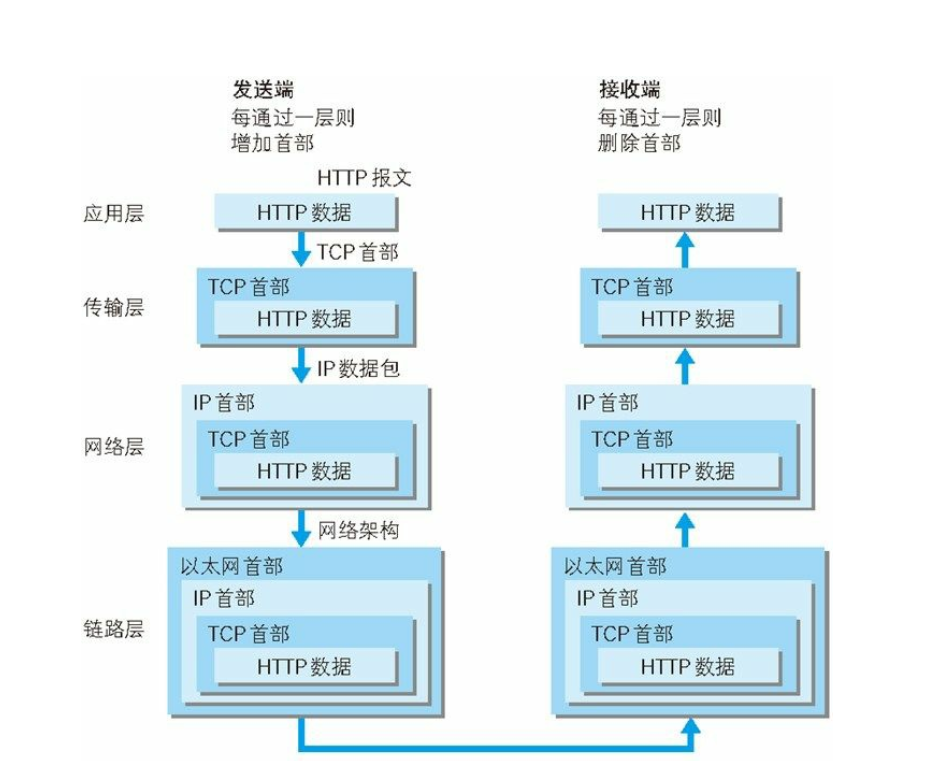

---
title： 网络知识
---

<!-- TOC -->

- [网络知识](#网络知识)
  - [[UDP](UDP.md)](#udpudpmd)
  - [[TCP](TCP.md)](#tcptcpmd)
  - [[HTTP](HTTP.md)](#httphttpmd)
  - [[跨域](./跨域.md)](#跨域跨域md)
  - [[HTTP 缓存](缓存.md)](#http-缓存缓存md)
  - [[cookie 和 session](cookie 和 session.md)](#cookie-和-sessioncookie和sessionmd)
  - [[从输入 URL 到页面加载完成的过程](从输入 URL 到页面加载完成的过程.md)](#从输入-url-到页面加载完成的过程从输入url到页面加载完成的过程md)
    - [OSI 七层协议](#osi-七层协议)
    - [DNS 解析](#dns-解析)
    - [前后端如何通信](#前后端如何通信)
    - [如何创建 Ajax](#如何创建-ajax)
    - [websocket](#websocket)

<!-- /TOC -->

# 网络知识

## [UDP](UDP.md)

## [TCP](TCP.md)

## [HTTP](HTTP.md)

## [跨域](./跨域.md)

## [HTTP 缓存](缓存.md)

## [cookie 和 session](cookie和session.md)

## [从输入 URL 到页面加载完成的过程](从输入URL到页面加载完成的过程.md)

## OSI 七层协议

- 应用层
  - 为应用提供通信服务
- 表示层
  - 定义数据格式以及加密
- 会话层
  - 定义了如何开始、控制、结束一个会话，包括对多个双向消息的控制和管理。
- 传输层
  - 选择差错恢复协议还是无差错恢复协议
  - TCP、UDP
- 网络层
  - 端到端包传输。
  - 路由选择、包分解成更小的包
- 数据链路层
  - 定义单个链路上如何传输数据
- 物理层
  - 传输介质相关



## DNS 解析

DNS 的作用就是通过域名查询到具体的 IP。

1. 操作系统会首先在本地缓存中查询
2. 没有的话会去系统配置的 DNS 服务器中查询
3. 如果这时候还没得话，会直接去 DNS 根服务器查询，这一步查询会找出负责 com 这个一级域名的服务器
4. 然后去该服务器查询 google 这个二级域名
5. 接下来三级域名的查询其实是我们配置的，你可以给 www 这个域名配置一个 IP，然后还可以给别的三级域名配置一个 IP

以上介绍的是 DNS 迭代查询，还有种是递归查询，区别就是前者是由客户端去做请求，后者是由系统配置的 DNS 服务器做请求，得到结果后将数据返回给客户端。

### 前后端如何通信

- Ajax
- WebSocket
- CORS

### 如何创建 Ajax

Ajax其核心有JavaScript、XMLHTTPRequest、DOM对象组成，通过XmlHttpRequest对象来向服务器发异步请求，从服务器获得数据，然后用JavaScript来操作DOM而更新页面。

XMLHttpRequest 对象方法描述 

| 方    法                                                   | 描    述                                                     |
| ---------------------------------------------------------- | ------------------------------------------------------------ |
| abort()                                                    | 停止当前请求                                                 |
| getAllResponseHeaders()                                    | 把HTTP请求的所有响应首部作为键/值对返回                      |
| getResponseHeader("header")                                | 返回指定首部的串值                                           |
| open("method","URL",[asyncFlag],["userName"],["password"]) | 建立对服务器的调用。method参数可以是GET、POST或PUT。url参数可以是相对URL或绝对URL。这个方法还包括3个可选的参数，是否异步，用户名，密码 |
| send(content)                                              | 向服务器发送请求                                             |
| setRequestHeader("header", "value")                        | 把指定首部设置为所提供的值。在设置任何首部之前必须先调用open()。设置header并和请求一起发送 ('post'方法一定要 ) |

XMLHttpRequest 对象属性描述

| 属  性             | 描    述                                                     |
| ------------------ | ------------------------------------------------------------ |
| onreadystatechange | 状态改变的事件触发器，每个状态改变时都会触发这个事件处理器，通常会调用一个JavaScript函数 |
| readyState         | 请求的状态。有5个可取值：0 = 未初始化，1 = 正在加载，2 = 已加载，3 = 交互中，4 = 完成 |
| responseText       | 服务器的响应，返回数据的文本。                               |
| responseXML        | 服务器的响应，返回数据的兼容DOM的XML文档对象 ，这个对象可以解析为一个DOM对象。 |
| responseBody       | 服务器返回的主题（非文本格式）                               |
| responseStream     | 服务器返回的数据流                                           |
| status             | 服务器的HTTP状态码（如：404 = "文件末找到" 、200 ="成功" ，等等） |
| statusText         | 服务器返回的状态文本信息 ，HTTP状态码的相应文本（OK或Not Found（未找到）等等） |

```js
var xhr
if (window.XMLHttpRequest) {
  xhr = new XMLHttpRequest()
} else {
  xhr = new ActiveXObject('Microsoft.XMLHTTP')
}

xhr.onreadystatechange = function() {
  if (xhr.readyState == 4 && xhr.status == 200) {
    dosome(xhr.responseText)
  }
}

xhr.open('GET', '...', '是否异步')
xhr.send()
```

原生 js 写 ajax，promise 对象 

```javascript
const ajaxPromise = param => {
  return new Promise((resovle, reject) => {
    var xhr = new XMLHttpRequest()
    xhr.open(param.type || 'get', param.url, true)
    xhr.send(param.data || null)

    xhr.onreadystatechange = () => {
      var DONE = 4 // readyState 4 代表已向服务器发送请求
      var OK = 200 // status 200 代表服务器返回成功
      if (xhr.readyState === DONE) {
        if (xhr.status === OK) {
          resovle(JSON.parse(xhr.responseText))
        } else {
          reject(JSON.parse(xhr.responseText))
        }
      }
    }
  })
}
```

AJAX的优缺点

优点：

<1>.无刷新更新数据

<2>.异步与服务器通信。

<3>.前端和后端负载平衡。

缺点

<1>.AJAX干掉了Back和History功能，即对浏览器机制的破坏。