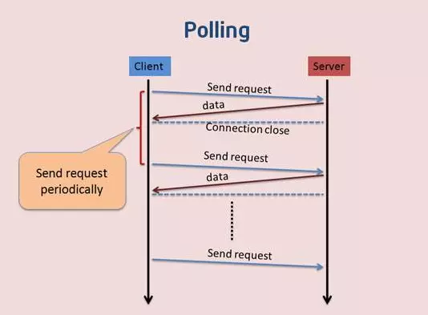

# [WebSocket](https://www.cnblogs.com/chyingp/p/websocket-deep-in.html)

websocket 是为了解决是能客服端发起单向请求而提出的解决方案，原来为了实现实时获取消息采用的是轮询的方式，但这种方式效率低效。

WebSocket 最大的特点就是服务器可以主动向客户端推送信息

1. 建立在 TCP 协议之上，服务端的实现比较容易

2. 与 HTTP 协议有着良好的兼容性。默认端口也是 80 和 443，并且握手阶段采用 HTTP 协议

3. 数据格式比较轻量，性能开销小，通信高效。

4. 可以发送文本，也可以发送二进制数据。

5. 没有同源限制，客户端可以与任意服务器通信。

6. 协议标识符是 ws（如果加密，则为 wss），服务器网址就是 URL。


http://www.ruanyifeng.com/blog/2017/05/websocket.html

在单个 TCP 连接上进行全双工通讯的协议。在 WebSocket API 中，浏览器和服务器只需要完成一次握手，两者之间就直接可以创建**持久性**的连接，并进行**双向**数据传输。

- Socket.onopen 连接建立时触发

- Socket.onmessage 客户端接收服务端数据时触发

- Socket.onerror 通信发生错误时触发

- Socket.onclose 连接关闭时触发

- ### webSocket.send() 发送数据

```
// WebSocket 对象作为一个构造函数，用于新建 WebSocket 实例
var ws = new WebSocket('ws://localhost:8080');
// 实例对象的当前状态
switch (ws.readyState) {
  case WebSocket.CONNECTING:
    // do something
    break;
  case WebSocket.OPEN:
    // do something
    break;
  case WebSocket.CLOSING:
    // do something
    break;
  case WebSocket.CLOSED:
    // do something
    break;
  default:
    // this never happens
    break;
}
```


## 服务端实时推送的通信方案

> [Web 实时推送技术的总结](https://juejin.im/post/5c20e5766fb9a049b13e387b)
>
> [web服务器端推送技术简介](https://www.w3ctech.com/topic/1754)

### 轮询（polling）

轮询是客户端和服务器之间会一直进行连接，每隔一段时间就询问一次。其缺点也很明显：连接数会很多，一个接受，一个发送。而且**每次发送请求都会有Http的Header，会很耗流量，也会消耗CPU的利用率**



- 优点：实现简单，无需做过多的更改
- 缺点：轮询的间隔过长，会导致用户不能及时接收到更新的数据；轮询的间隔过短，会导致查询请求过多，增加服务器端的负担

```js
setInterval(function() {
    $.ajax({
        url: 'http://api.3g.qq.com',
        success: function() {
            //code from here
        }
    });
}, 3000);
```

### 长轮询（long polling）


长轮询是对轮询的改进版，，在没有更新的时候不再返回空响应，而且把连接保持到有更新的时候，客户端向服务器发送Ajax请求，服务器接到请求后hold住连接，直到有新消息才返回响应信息并关闭连接，客户端处理完响应信息后再向服务器发送新的请求，通常把这种实现也叫做`comet`。

在某种程度上减小了网络带宽和CPU利用率等问题。由于http数据包的头部数据量往往很大（通常有400多个字节），但是真正被服务器需要的数据却很少（有时只有10个字节左右），这样的数据包在网络上周期性的传输，难免**对网络带宽是一种浪费**

- 优点：比 Polling 做了优化，有较好的时效性
- 缺点：保持连接会消耗资源; 服务器没有返回有效数据，程序超时。

```
function async() {
    $.ajax({
        url: 'http://api.3g.qq.com',
        success: function() {
            async();
            //code from here
        }
    });
}
```

### iframe流（streaming）

iframe流方式是在页面中插入一个隐藏的iframe，利用其src属性在服务器和客户端之间创建一条长连接，服务器向iframe传输数据（通常是HTML，内有负责插入信息的javascript），来实时更新页面。


- 优点：消息能够实时到达；浏览器兼容好
- 缺点：服务器维护一个长连接会增加开销；IE、chrome、Firefox会显示加载没有完成，图标会不停旋转。

### 长连接 ——WebSocket

`WebSocket`可以实现与客户端与服务器双向，基于消息的文本或二进制数据通信，主要包括两个部分，客户端`WebSocket API`及`WebSocket`协议。

####  HTTP的局限性

- HTTP是半双工协议，也就是说，在同一时刻数据只能单向流动，客户端向服务器发送请求(单向的)，然后服务器响应请求(单向的)。
- 服务器不能主动推送数据给浏览器。这就会导致一些高级功能难以实现，诸如聊天室场景就没法实现。

#### WebSocket的特点

- 支持双向通信，实时性更强
- 可以发送文本，也可以发送二进制数据
- 减少通信量：只要建立起WebSocket连接，就希望一直保持连接状态。和HTTP相比，不但每次连接时的总开销减少，而且由于WebSocket的首部信息很小，通信量也相应减少了

### 技术对比

| 方式               | 类型          | 技术实现                                                     | 优点                                                         | 缺点                                                         | 适用场景                     |
| ------------------ | ------------- | ------------------------------------------------------------ | ------------------------------------------------------------ | ------------------------------------------------------------ | ---------------------------- |
| 轮询Polling        | client→server | 客户端循环请求                                               | 1、实现简单 2、 支持跨域                                     | 1、浪费带宽和服务器资源 2、 一次请求信息大半是无用（完整http头信息） 3、有延迟 4、大部分无效请求 | 适于小型应用                 |
| 长轮询Long-Polling | client→server | 服务器hold住连接，一直到有数据或者超时才返回，减少重复请求次数 | 1、实现简单 2、不会频繁发请求 3、节省流量 4、延迟低          | 1、服务器hold住连接，会消耗资源 2、一次请求信息大半是无用    | WebQQ、Hi网页版、Facebook IM |
| 长连接iframe       | client→server | 在页面里嵌入一个隐蔵iframe，将这个 iframe 的 src 属性设为对一个长连接的请求，服务器端就能源源不断地往客户端输入数据。 | 1、数据实时送达 2、不发无用请求，一次链接，多次“推送”        | 1、服务器增加开销 2、无法准确知道连接状态 3、IE、chrome等一直会处于loading状态 | Gmail聊天                    |
| WebSocket          | server⇌client | new WebSocket()                                              | 1、支持双向通信，实时性更强 2、可发送二进制文件3、减少通信量 | 1、浏览器支持程度不一致 2、不支持断开重连                    | 网络游戏、银行交互和支付     |

