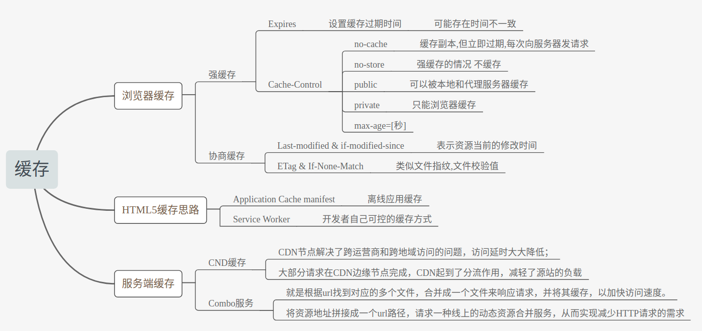
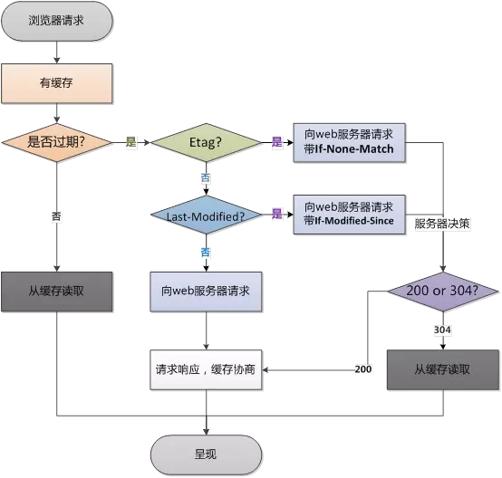

<!-- TOC -->

- [缓存](#缓存)
  - [缓存方案](#缓存方案)
  - [资源验证](#资源验证)
  - [[浏览器缓存、CacheStorage、Web Worker 与 Service Worker](https://github.com/youngwind/blog/issues/113)](#浏览器缓存cachestorageweb-worker-与-service-workerhttpsgithubcomyoungwindblogissues113)
    - [应用缓存](#应用缓存)
    - [CacheStorage](#cachestorage)
    - [Service Worker](#service-worker)
  - [HTML5 Application Cache](#html5-application-cache)
    - [HTML5 的离线储存怎么使用，工作原理能不能解释一下](#html5-的离线储存怎么使用工作原理能不能解释一下)
  - [浏览器是怎么对 HTML5 的离线储存资源进行管理和加载的呢](#浏览器是怎么对-html5-的离线储存资源进行管理和加载的呢)

<!-- /TOC -->

# 缓存

Http 的缓存主要利用 header 里的 Cache-control 和 ETag

`Cache-control`主要包含以及几个字段：

- public
  - 指 HTTP 请求返回的资源在所经过的所有路径包括一些中间代理服务器以及发出这个请求的客户端浏览器都可以进行缓存
- private
  - 代表发起请求的浏览器才可以进行缓存
- no-cache
  - 指可以存缓存，但是每次使用都需要去服务端验证
- no-store
  - 本地和代理服务器都不允许去缓存
- no-transform
  - 不允许代理/缓存服务器转换文件格式

到期

- max-age=<seconds\>
  - 缓存到期时间
- s-maxage=<seconds\>
  - 代理服务器专用
- max-stale=<seconds\>
  - 指示客户机可以使用超出 max-age 时间的响应

重新验证

- must-revalidate
  - 设置了 max-age 的资源过期后必须到源服务端验证资源是否还可用
- proxy-revalidate
  - （缓存服务器用）设置了 max-age 的资源过期后必须到源服务端验证资源是否还可用

`ETag`:即用来进行对比缓存，Etag 是服务端资源的一个标识码

当客户端发送第一次请求时服务端会下发当前请求资源的标识码 Etag，下次再请求时，客户端则会通过 header 里的 If-None-Match 将这个标识码 Etag 带上，服务端将客户端传来的 Etag 与最新的资源 Etag 做对比，如果一样，则表示资源没有更新，返回 304。

### 缓存方案

需求：
有的静态资源会设置一个较长的缓存时间，但是我们希望用户还是能使用最新的资源。

解决方案：
在打包完成的文件名上加上一串哈希码，这个哈希码是根据内容进行的哈希计算。
所以，如果你的内容文件没有变，那么这个 hash 码不会变，即这个静态资源的 url 没有变。 而如果内容有变，那么 hash 码也会变，浏览器就会去请求新的资源请求。

普通的缓存机制：


### 资源验证

如果给 Cache-Control 设置了 no-cache 后，每次要使用资源时浏览器都要到服务器验证缓存是否过期。 如果直接使用缓存，返回码：**304**

如何验证资源是否过期：

- Last-Modified（上次修改时间）

  - 配合 If-Modified-Since 或 If-Unmodified-Since 使用
  - 如果请求的资源头中有 Last-Modified 这个头，这个头指定了一个时间。那么浏览器重新访问资源时就会带上 If-Modified-Since 这个头，其时间是 Last-Modified 的时间，服务器就会拿这个时间去对比上次修改的时间，然后告诉浏览器是否可以直接使用。

- Etag （数据签名）
  - 资源会依据它的内容产生一个唯一的数据签名，如果资源有更新，那么 Etag 就会发生变化。
  - 配合 If-Match 或 If-None-Match 使用







### [浏览器缓存、CacheStorage、Web Worker 与 Service Worker](https://github.com/youngwind/blog/issues/113)

#### 应用缓存

HTML5 规范中设计了应用缓存（Application Cache）这么一个新的概念。通过它，我们可以做离线应用。然而，由于这个 API 的设计有太多的缺陷，被很多人吐槽，最终被废弃。

#### CacheStorage

为了能精细的，可编程的控制缓存，`CacheStorage`被设计出来，有了它就可以对 JS 缓存进行增删改查。

PS：CacheStorage 并非只有在 Service Worker 中才能用，它是一个全局性的 API，你在控制台中也可以访问到 caches 全局变量。

#### Service Worker

- 一个独立的 worker 线程，独立于当前网页进程，有自己独立的 worker context。
- 一旦被 install，就永远存在，除非被手动 unregister

- 用到的时候可以直接唤醒，不用的时候自动睡眠

- 可编程拦截代理请求和返回，缓存文件，缓存的文件可以被网页进程取到（包括网络离线状态）

- 离线内容开发者可控

- 能向客户端推送消息

- 不能直接操作 DOM

- 必须在 HTTPS 环境下才能工作

- 异步实现，内部大都是通过 Promise 实现

HTML5 API 主要用来做持久的离线缓存

Service Worker 与 Web Worker 相比，相同点是它们都是在常规的 js 引擎线程以外开辟的新线程。

1. Service Worker 不是服务于某个特定页面的，而是服务于多个页面的。（按照同源策略）
2. Service Worker 会常驻在浏览器中，即便注册它的页面已经关闭，Service Worker 也不会停止。本质上它是一个后台线程，只有你主动终结，或者浏览器回收，这个线程才会结束。
3. 生命周期、可调用的 API 等等也有很大的不同。

#### Service Worker 只是 Service Worker

一开始我以为 Service Worker 就是用来做离线应用的，后来渐渐研究才发现不是这样的。→ Service Worker 只是一个常驻在浏览器中的 JS 线程，它本身做不了什么。它能做什么，全看跟哪些 API 搭配使用。

1. 跟 Fetch 搭配，可以从浏览器层面拦截请求，做数据 mock；
2. 跟 Fetch 和 CacheStorage 搭配，可以做离线应用；
3. 跟 Push 和 Notification 搭配，可以做像 Native APP 那样的消息推送，这方面可以参考 villainhr 的文章：Web 推送技术
4. ……

### HTML5 Application Cache

#### HTML5 的离线储存怎么使用，工作原理能不能解释一下

在用户没有与因特网连接时，可以正常访问站点或应用，在用户与因特网连接时，更新用户机器上的缓存文件。

原理：HTML5 的离线存储是基于一个新建的。appcache 文件的缓存机制（不是存储技术)，通过这个文件上的解析清单离线存储资源，这些资源就会像 cookie 一样被存储了下来。之后当网络在处于离线状态下时，浏览器会通过被离线存储的数据进行页面展示。

如何使用：

1. 页面头部像下面一样加入一个 manifest 的属性；
2. 在 cache.manifest 文件的编写离线存储的资源

```http
CACHE MANIFEST
#v1.0

CACHE:
js/app.js
css/style.css

NETWORK:
assets/logo.png

FALLBACK:
/html5/ /404.html
```

### 浏览器是怎么对 HTML5 的离线储存资源进行管理和加载的呢

- 在线的情况下，浏览器发现 html 头部有 manifest 属性，它会请求 manifest 文件，如果是第一次访问 app，那么浏览器就会根据 manifest 文件的内容下载相应的资源并且进行离线存储。如果已经访问过 app 并且资源已经离线存储了，那么浏览器就会使用离线的资源加载页面，然后浏览器会对比新的 manifest 文件与旧的 manifest 文件，如果文件没有发生改变，就不做任何操作，如果文件改变了，那么就会重新下载文件中的资源并进行离线存储。
- 离线的情况下，浏览器就直接使用离线存储的资源。


在离线状态时，操作 window.applicationCache 进行需求实现。

参考链接：[HTML5 离线缓存 -manifest 简介](https://yanhaijing.com/html/2014/12/28/html5-manifest/)
