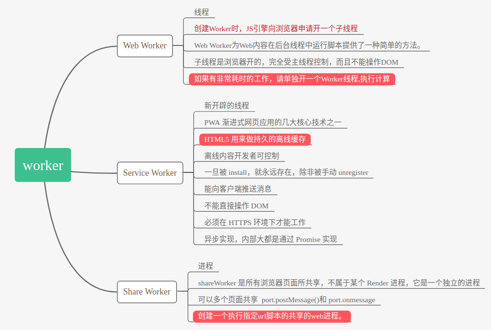

### 如何实现浏览器内多个标签页之间的通信？（阿里)

- **webSocket**  
  全双工 (full-duplex) 通信自然可以实现多个标签页之间的通信。
  WebSocket 并不是全新的协议，而是利用了 HTTP 协议来建立连接。为什么 WebSocket 连接可以实现全双工通信而 HTTP 连接不行呢？实际上 HTTP 协议是建立在 TCP 协议之上的，TCP 协议本身就实现了全双工通信，但是 HTTP 协议的请求－应答机制限制了全双工通信。
  WebSocket 连接必须由浏览器发起，  
  特点：  
  （1）建立在 TCP 协议之上，服务器端的实现比较容易。  
  （2）与 HTTP 协议有着良好的兼容性。默认端口也是 80 和 443，并且握手阶段采用 HTTP 协议，因此握手时不容易屏蔽，能通过各种 HTTP 代理服务器。  
  （3）数据格式比较轻量，性能开销小，通信高效。  
  （4）可以发送文本，也可以发送二进制数据。  
  （5）没有同源限制，客户端可以与任意服务器通信。  
  （6）协议标识符是 ws（如果加密，则为 wss），服务器网址就是 URL。

- **ShareWorker**  
  html5 浏览器的新特性 SharedWorker （同源限制）
  ShareWorker : 通过 shareWorker 我们可以创建共享线程，即不同的页面使用同一个 ShareWorkder，不同的页面中进行数据的共享和传递

  > shareWorker 是所有浏览器页面所共享，不属于某个 Render 进程，它是一个独立的进程。可以被多个进程所共享，两个脚本都会向 worker 发送消息， 然后使用 port.postMessage()和 port.onmessage 处理从 worker 发送而来的消息

- 也可以调用 **localstorge**  
  localstorage 是浏览器多个标签共用的存储空间，所以可以用来实现多标签之间的通信 (ps：session 是会话级的存储空间，每个标签页都是单独的）。
  localstorge 另一个浏览上下文里被添加、修改或删除时，它都会触发一个`storage`事件，我们通过监听事件，控制它的值来进行页面信息通信；

- **setInterval + cookie**
  在页面 A 设置一个使用 setInterval 定时器不断刷新，检查 Cookies 的值是否发生变化，如果变化就进行刷新的操作。同域可读

注意 quirks：Safari 在无痕模式下设置 localstorge 值时会抛出 QuotaExceededError 的异常；

### 各种 worker

