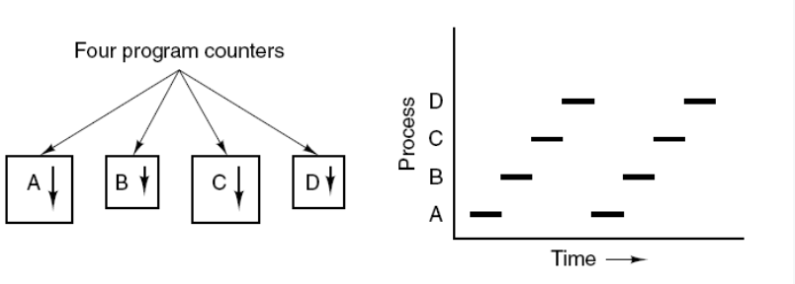
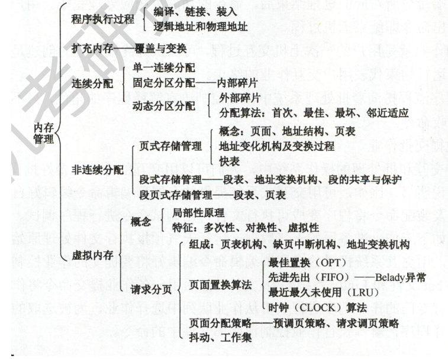

## 进程与线程

#### 1 、进程

进程是资源分配的基本单位。

进程控制块 (Process Control Block, PCB) 描述进程的基本信息和运行状态，所谓的创建进程和撤销进程，都是指对 PCB 的操作。

下图显示了 4 个程序创建了 4 个进程，这 4 个进程可以并发地执行。

#### 2. 线程

线程是独立调度的基本单位。

一个进程中可以有多个线程，它们共享进程资源。

QQ 和浏览器是两个进程，浏览器进程里面有很多线程，例如 HTTP 请求线程、事件响应线程、渲染线程等等，线程的并发执行使得在浏览器中点击一个新链接从而发起 HTTP 请求时，浏览器还可以响应用户的其它事件。

#### 3. 区别

Ⅰ 拥有资源

进程是资源分配的基本单位，但是线程不拥有资源，线程可以访问隶属进程的资源。

Ⅱ 调度

线程是独立调度的基本单位，在同一进程中，线程的切换不会引起进程切换，从一个进程中的线程切换到另一个进程中的线程时，会引起进程切换。

Ⅲ 系统开销

由于创建或撤销进程时，系统都要为之分配或回收资源，如内存空间、I/O 设备等，所付出的开销远大于创建或撤销线程时的开销。类似地，在进行进程切换时，涉及当前执行进程 CPU 环境的保存及新调度进程 CPU 环境的设置，而线程切换时只需保存和设置少量寄存器内容，开销很小。

Ⅳ 通信方面

线程间可以通过直接读写同一进程中的数据进行通信，但是进程通信需要借助 IPC。

### 进程上下文切换

进程是由操作系统来调度的，进程的上下文切换只能发生在内核态
进程需要保存的信息有：

- 用户空间的数据
  - 用户地址空间
  - 栈
  - 全局变量
- 内核空间的数据
  - 内核堆栈
  - 寄存器数据

发生时机：

- CPU时间片到了
- 资源不足
- 进程Sleep主动挂起
- 有优先级更高的进程来了
- 发生硬件中断，CPU上的进程会被挂起，转而执行内核中的中断服务程序

## 线程上下文切换

- 前后线程不属于同一个进程
  - 那么这种切换其实和进程切换是一样的
- 前后线程不于同一个进程
  - 只需要切换线程私有的数据、寄存器等
  - 相对于进程，少了用户地址空间的数据

### 内存管理

